**深度优先搜索**（**Depth First Search**，**DFS**）和**广度优先搜索**（**Breadth First Search**，**BFS**），是图论中非常重要的两种算法，在能够借助图论来描述的问题中能够发挥巨大的作用，它们使用的思想也可以在很多其他搜索算法中找到影子。


<!--more-->

## 图的部分基本概念

**图**(**graph**)是一个二元组 $G=(V,E)$。其中 $V$ 是非空集，称为**点集**(**vertex set**)，对于 $V$ 中的每个元素，我们称其为**顶点**(**vertex**)或**节点**(**node**)，简称**点**，$E$ 中的每个元素都由 $V$ 的某两个结点组合而成，称为**边集**(**edge set**)。一个图就是点集和这些点之间的关系（边）的集合。

图的**阶**(**order**)就是图的点的个数，即 $|V(G)|$。

图的边通常用节点的二元组表示，比如 $(v_1,v_2)\in E$，其中 $v_1,v_2\in V$ 称为这条边的**端点**(**endpoint**)。

图中的边可以是**无向边**(**undirected edge**)，此时二元组是无序的，这个图称为**有向图**；

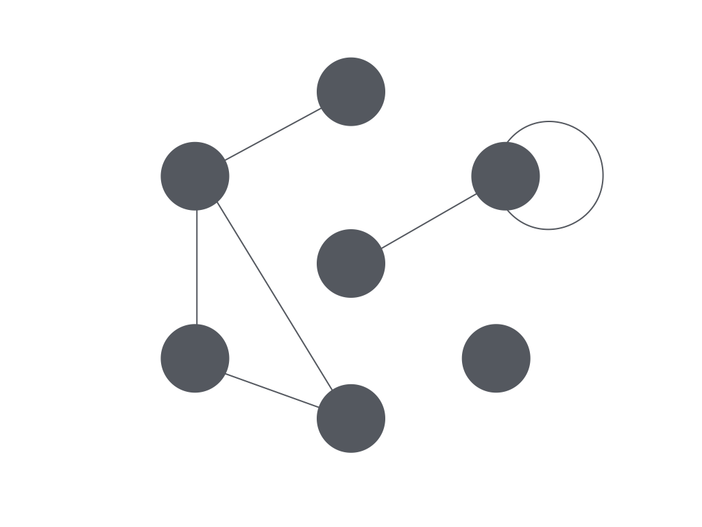

也可以是**有向边**(**directed edge**)，或称为**弧**(**arc**)，此时边是有序二元组，其二元组也常写作 $v_1\to v_2$，表示从节点 $v_1$ 指向 $v_2$，$v_1$ 称为起点（tail，箭头的「尾」），$v_2$ 称为终点（head，箭头的「头」），这个图称为**无向图**(**undirected graph**)，此时也称 $v_1$ 是 $v_2$ 的直接前驱，$v_2$ 是 $v_1$ 的直接后继。

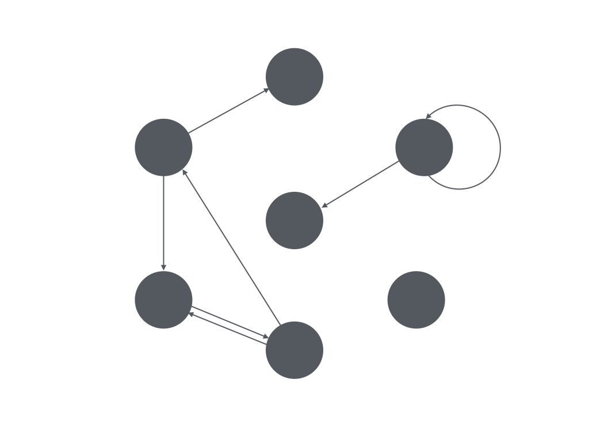

有时一张图中既有有向边又有无向边，则称之为**混合图**(**mixed graph**)。

有时这些边还会被赋予权值，这就是**赋权图**。

在一个图中可能有一个边的两个端点是同一个点，那么这条边就是一个**自环**(**loop**)；有时两条边完全重合，这两条边就称为一组**重边**(**multiple edge**)。如果一个图中存在自环或者重边，这张图就是一个**多重图** (**multigraph**)，否则就是一个**简单图**(**simple graph**)。

一个图中，若一个点是某条边的一个端点，则称这个点和这条边是**关联的**(**incident**)或**相邻的**(**adjacent**)。如果两个顶点构成这个图中的一条边，则称它们是**相邻的**(**adjacent**)。

一个点的**度**(**degree**)是指与该点关联的边的条数，记作 $d(v)$；一个点的**邻域**(**neighborhood**)是指与它关联的点的集合，即 $N(v)=\{u|(u,v)\in E, \text{or}, (v,u)\in E\},v\in V$。没有重边的无向图中，一个点的度就是邻域中点的个数，即 $d(v)=|N(v)|$。

根据度，可以简单地对点集中的点进行分类。度为0的点称为**孤立点**(**isolated point**)，度为偶数的点称为**偶点**(**even point**)，度为奇数的点称为**奇点**(**odd point**)。

**图论基本定理**（握手定理）：对于任何无向图 $G = (V, E)$，有 $\sum_{v \in V} d(v) = 2|E|$。

**途径**(**walk**)，是指一个边的序列，$e_1,e_2,\dots,e_n,\dots$，它经过适当排列后（不妨仍记作 $e_1,e_2,\dots,e_n,\dots$），能存在一个点的序列，$v_0, v_1, \dots, v_n,\dots$，满足 $e_i=(v_{i-1}, v_i)$，这样的途径还可以写作 $v_0\to v_1\to\dots\to v_n\to\dots$。

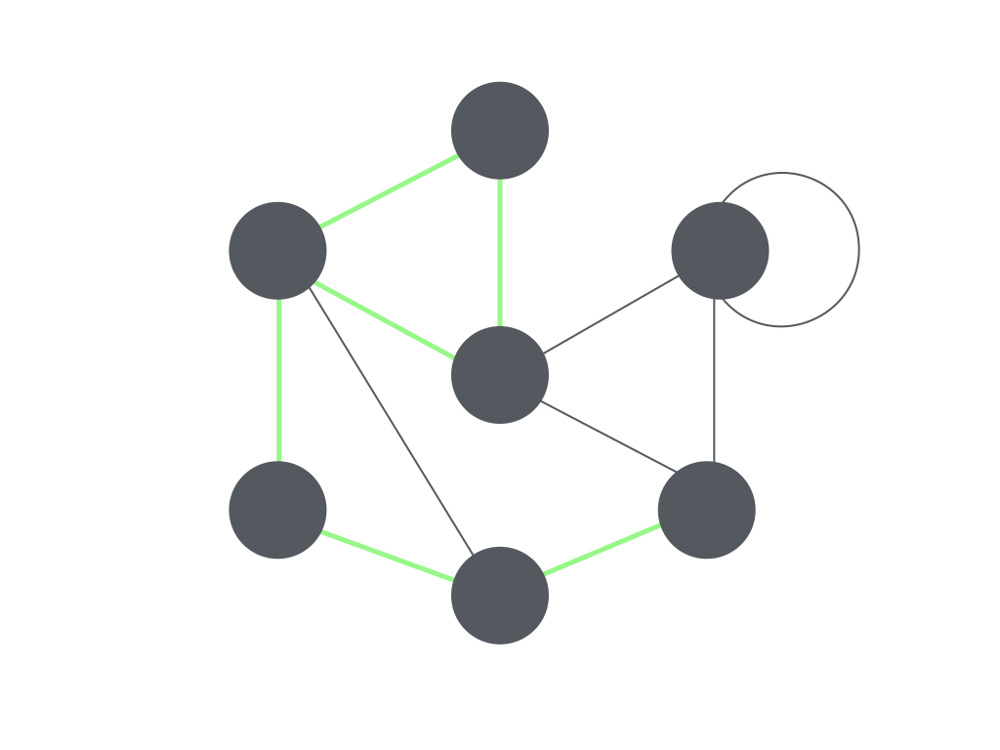

如果途径中的边两两不同，就是一个**迹**(**trail**)。一个迹中如果点两两不同，就是一个**路径**(**path**)。一个迹如果「首尾相接」，即 $v_0=v_{last}$，就是一个**回路**(**circiut**)。如果这个回路只有「首尾相接」，而其他的点两两不同，它就是一个**环**/**圈**(**cycle**)。

常见的概念还有连通图。

对于无向图，称两个点是**连通的**(**connected**)是指它们之间存在一个途径以其中一个为 $v_0$，另一个为 $v_{last}$。一个图的点如果两两连通就是一个**连通图**(**connected graph**)。

对于有向图，考虑**可达**的概念，就是说对于两个点，如果存在一个途径以其中一个点为起点另一个为终点，则称这个作为起点的点可达作为终点的点。这时回看无向图，它就像是一个有向图，任意两个节点双向可达。而对于有向图，如果它任意两个节点都双向可达，就是**强连通图**(**strongly connected graph**)。对于不是强连通的有向图，如果将它的边改为无向边就称为一个连通图，则它是一个**弱连通图**(**weakly connected graph**)。

此外，还有子图、割、连通分量等众多概念。

## 图的存储

### 按边直接存储

按照边的描述方式，直接可以想到把每一条边作为一个二元组直接存储到一个列表中，或者直接按照顺序存储，两两分组。

比如下面的图可以按照数组存储，数组的每个元素都是一个二元组：

`[(1,2),(2,3),(2,4),(3,4),(5,6),(6,6)]`

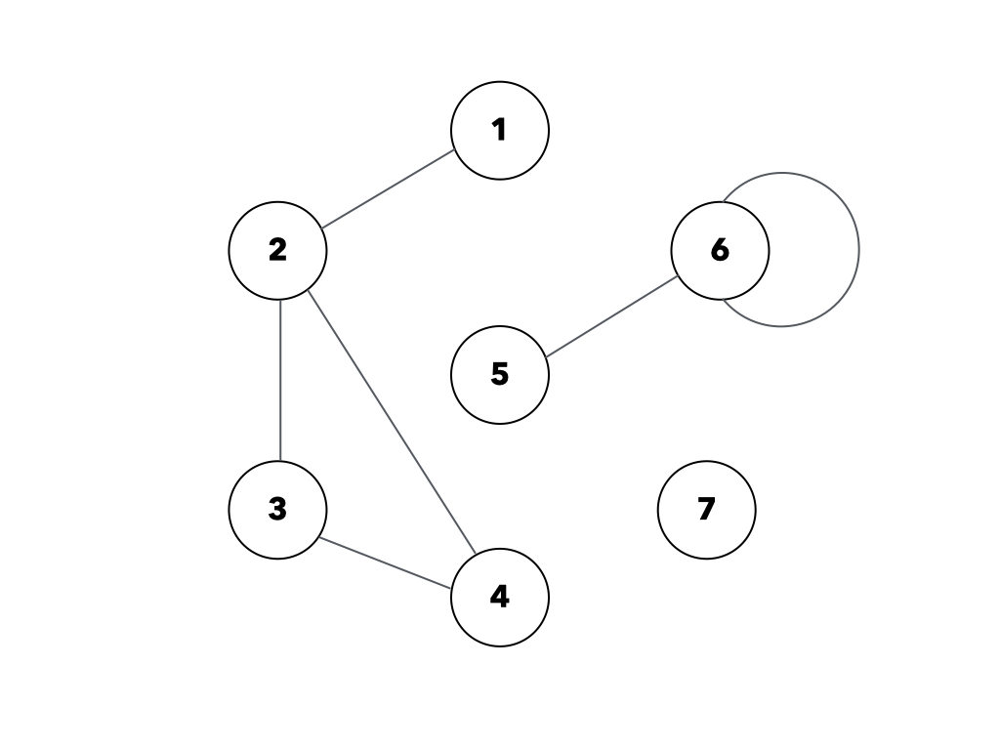

由于直接存边的遍历效率低下，一般不用于遍历图。

在 Kruskal 算法中，由于需要将边按边权排序，需要直接存边。

在有的题目中，需要多次建图（如建一遍原图，建一遍反图），此时既可以使用多个其它数据结构来同时存储多张图，也可以将边直接存下来，需要重新建图时利用直接存下的边来建图。

### 邻接矩阵

邻接矩阵的想法很简单，对于一张图，可以用一个矩阵表示，这个矩阵的第 $i$ 行第 $j$ 列元素为 $0$ 表示没有从点 $i$ 指向点 $j$ 的边，不为 $0$ 则表示有这条边，如果这条边还有对应权值，还可以直接存储权值。

邻接矩阵只适用于没有重边的情况。显然，它的空间复杂度比较高。不过它可快速查找一条边。

### 邻接表

邻接表存储的是每个节点的关联点。使用一个数组，数组的元素也是一个数组。第一个位置的数组表示与第一个点关联的点的集合，相当于邻域。对于无向图，这样没有什么问题。对于有向图，可以只存储每个点的出边，即以它为起点的边的终点的集合。这样就比邻接矩阵节省空间。

这种存储方式没有什么明显的缺点，因此很常用。除此之外还有链式前向星的方式。

### 代码实现

如上面说的，常用的描述方式就是一个一个的二元组，所以在给出数据时经常会给出一个数组表示一个图。比如上面的图用 `nums = [1,2,2,3,2,4,3,4,5,6,6,6]` 的形式给出。


使用python读入和遍历时就需要两两一组：

```python
def read_graph(nums):
    n = len(nums[0])
    graph = []
    for i in range(0, n, 2):
        graph.append((nums[i], nums[i+1])) # 存储为元组的数组
    return graph

def print_graph(graph):
    for edge in graph:
        print(edge[0], edge[1])

def if_exist(graph, a, b): # 判断某条边是否存在
    for edge in graph:
        if edge[0] == a and edge[1] == b:
            return True
    return False

def neighbors(graph, a): # 获取与a关联的点的集合
    neighbors = []
    for edge in graph:
        if edge[0] == a:
            neighbors.append(edge[1])
        elif edge[1] == a:
            neighbors.append(edge[0])
    return neighbors

def degree(graph, a): # 获取a的度
    return len(neighbors(graph, a))
```

如果使用邻接表来存储，可以使用一个二维数组直接存储对应点的邻域，也可以使用字典来存储每个点的关联点：

```python
def read_graph(nums):
    n = len(nums)
    graph = {}
    for i in range(0, n, 2):
        graph[nums[i]] = nums[i+1] # 存储为字典
    return graph

def print_graph(graph):
    for key in graph.keys():
        print(key, graph[key])

def if_exist(graph, a, b): # 判断某条边是否存在
    if a in graph and b in graph[a]:
        return True
    return False

def neighbors(graph, a): # 获取与a关联的点的集合
    return graph[a]

def degree(graph, a): # 获取a的度
    return len(graph[a])
```

还可以存储为邻接矩阵：

```python
def read_graph(nums):
    n = len(nums)
    graph = [[0] * n for _ in range(n)] # 初始化
    for i in range(0, n, 2):
        graph[nums[i]][nums[i+1]] = 1 # 存储为邻接矩阵
    return graph

def print_graph(graph):
    for tail,column in enumerate(graph):
        for head,value in column:
            if vallue == 1:
                print(tail, head)

def if_exist(graph, a, b): # 判断某条边是否存在
    return graph[a][b] == 1

def neighbors(graph, a): # 获取与a关联的点的集合
    return [i for i in range(len(graph)) if graph[a][i] == 1]

def degree(graph, a): # 获取a的度
    return len(graph[a])
```

很明显，使用邻接矩阵时的遍历时间复杂度达到 $O(n^2)$。

## 深度优先搜索（DFS）

深度优先，就是指在搜索的时候，某次对一个节点的搜索中，搜索到了另一些节点，下一次搜索就从这些节点中的某一个节点再进行同样的搜索，然后再对搜索到的节点同样地选择一个节点搜索，一直到搜索的节点无法再搜索到新的节点，此时回到上一次搜索的结果中，换一个没有搜索过的节点进行同样的搜索，同样在无法再搜索时回溯。显然这样的操作就是在每一次搜索时都先一条路走到黑，然后再回溯重新一条路走到黑，一直到走完，所以叫「深度优先」。

以下面的二叉树搜索为例：

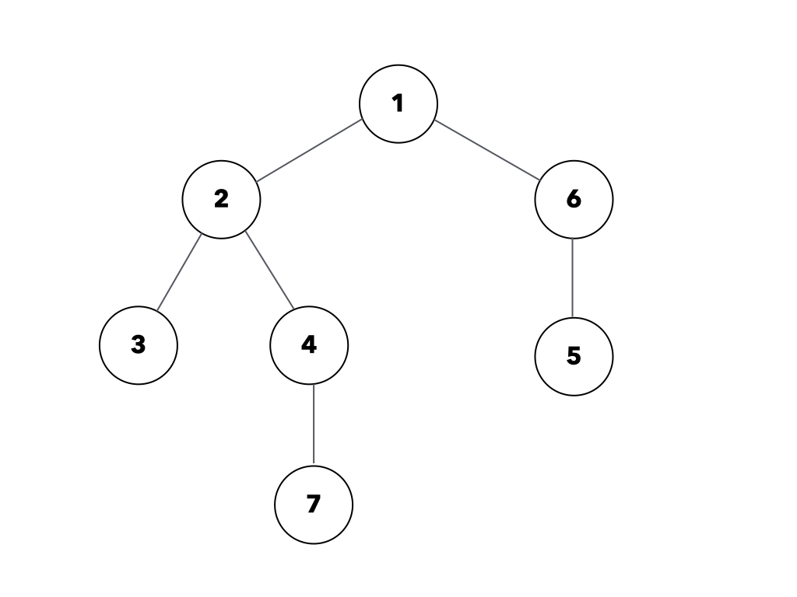

从起点1开始搜索，搜索到节点2和4

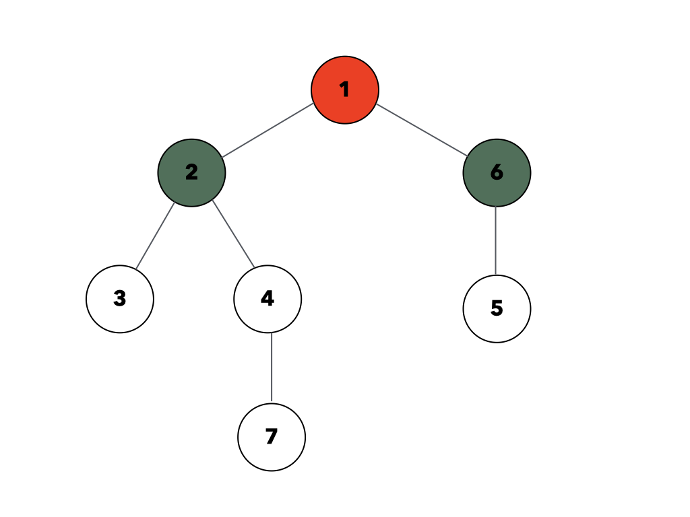

选择其中一个节点，就选择节点2进行同样的搜索，搜索到节点3和4

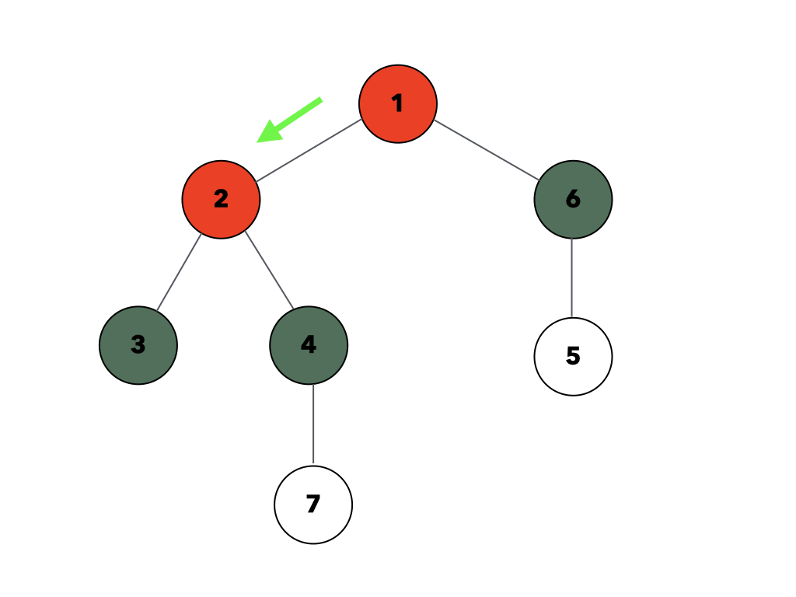

从节点3和4中选择一个，选择3搜索，没有搜索到新节点

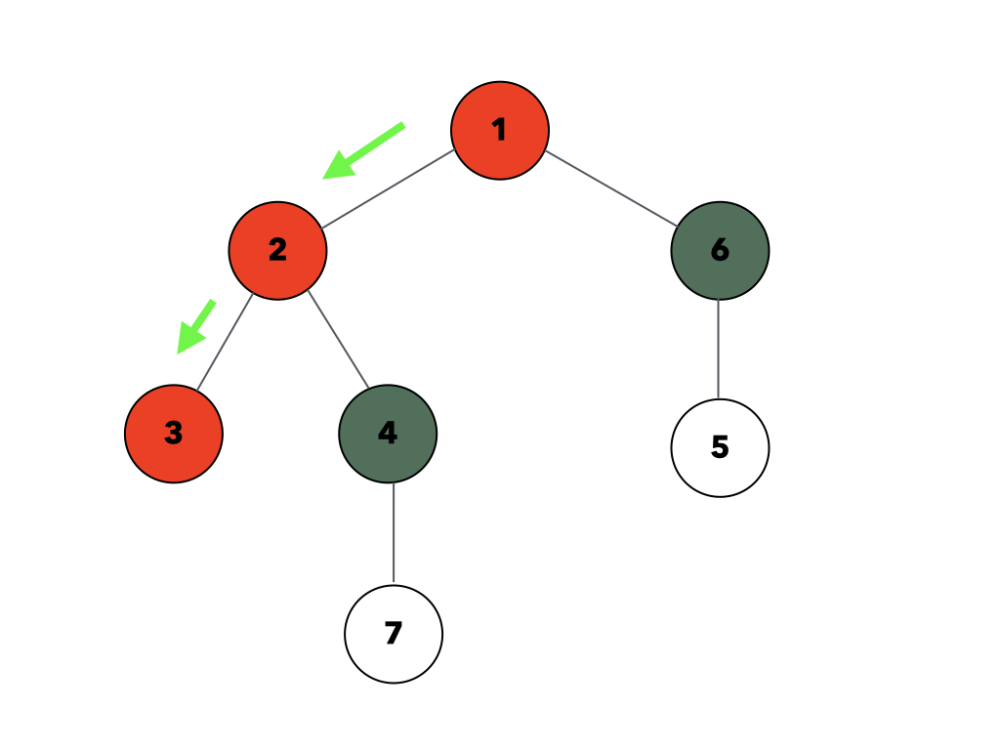

于是返回到节点2，对节点2搜索到的另一个节点，即节点4开始搜索

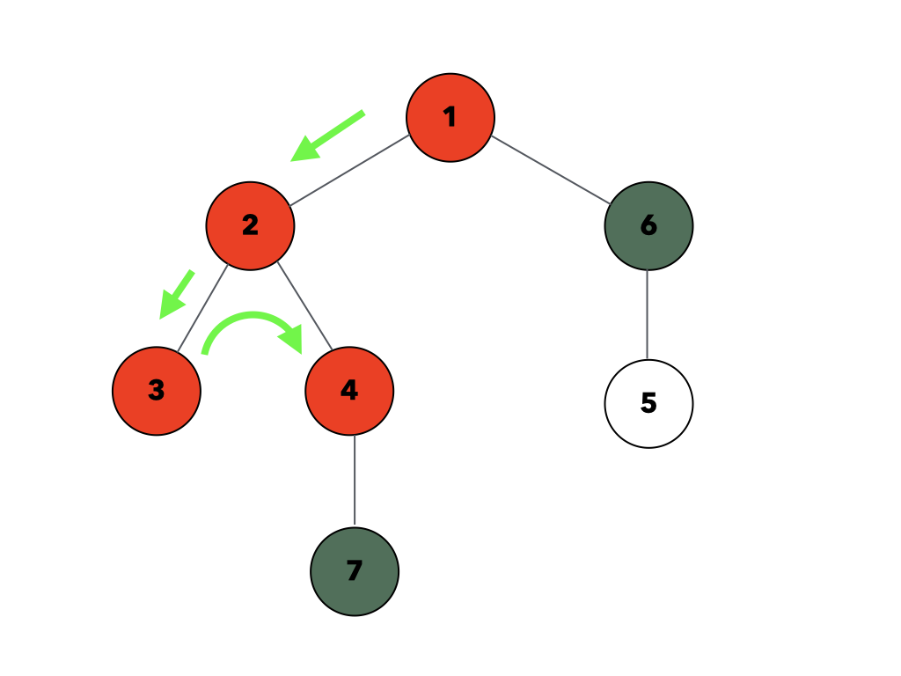

搜索到节点7，就对它进行搜索

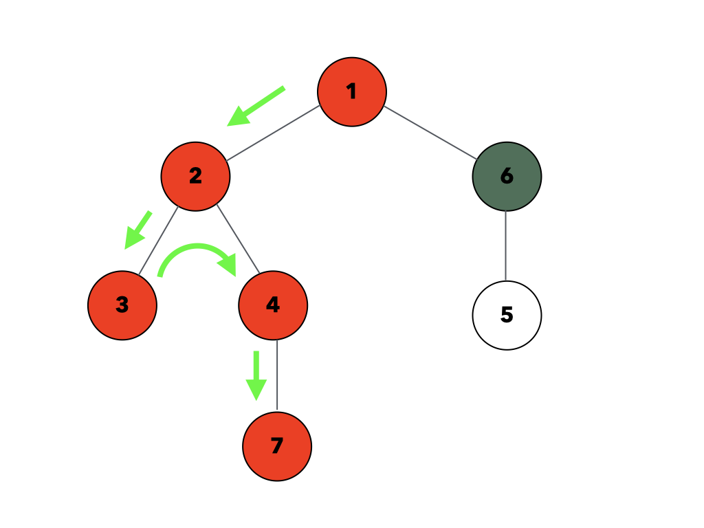

没有搜索到新节点，于是返回节点4，节点4同样没有新节点，返回节点2，节点2同样没有新节点，于是返回节点1，节点1还有一个节点6，对它进行搜索

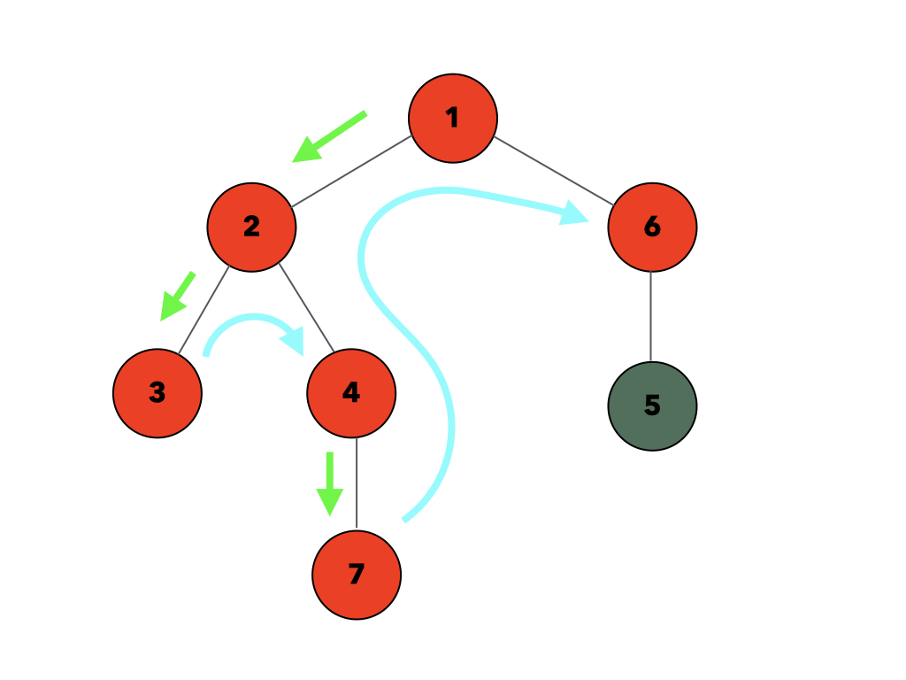

搜索到节点5，对它进行搜索


初始节点1也没有其他节点了，就搜索结束。

### 代码实现

上面说到的「新的节点」，就是搜索过的节点，通常使用一个数组 `visited` 来记录某个节点是否被访问过，没有访问过的节点就是「新的节点」，在递归实现时就是下一个递归变量。下面的代码中每个节点都是一个类，这个类有 `val` 表示节点值，`left` 表示左子节点，`right` 表示右子节点。

```python
visited = [False] * graph.size()
def dfs(graph, node):
    if node is None:
        return
    if visited[node.val] == False:
        print(node.val)
        visited[node.val] = True
        dfs(graph, node.left)
        dfs(graph, node.right)
```

还可以使用栈来实现同样的效果，利用栈的先进后出特点，最先入栈的节点最后出栈，就实现了深度优先搜索。

```python
def dfs(graph, node):
    stack = []
    stack.append(node) # 初始节点入栈
    while stack: # 当 stack 还有元素时
        node = stack.pop()
        if node.left is not None:
            stack.append(node.left)
            print(node.left.val)
        if node.right is not None:
            stack.append(node.right)
            print(node.right.val)
```

这个返回值的设置通常是很有智慧的。比如如果需要对每个遍历到的节点进行标记，相当于一个函数，函数参数是这个节点，函数值就是返回值。比如leetcode的[面试题 04.08. 首个共同祖先](https://leetcode.cn/problems/first-common-ancestor-lcci/description/)

>设计并实现一个算法，找出二叉树中某两个节点的第一个共同祖先。不得将其他的节点存储在另外的数据结构中。注意：这不一定是二叉搜索树。
>例如，给定如下二叉树: `root = [3,5,1,6,2,0,8,null,null,7,4]`
>```python
>     3
>    / \
>   5   1
>  / \ / \
> 6  2 0  8
>   / \
>  7   4
>```

题解的核心在于定义一个关于节点 $x$ 的函数 $f_x$，这个函数的定义是：如果节点的子树包含需要寻找的 $p$ 或者 $q$ 则为 `True`，否则为 `False`。这个定义的核心智慧在于，两个节点的最小公共祖先节点满足表达式 $(f_{lson} \boxed{\textrm{and}} f_{rson}) \boxed{\textrm{or}} ((x.val==p.val \boxed{\textrm{or}} x.val==q.val) \boxed{\textrm{and}} (f_{lson} \boxed{\textrm{or}} f_{rson}))$ 函数值为 `True` 的节点。

如何对于每个节点都标记这个函数值呢？其实在这里我们对于这个函数在各个节点上的值并不感兴趣，我们只是需要用它来判断某个节点是否是我们要找的节点，判断方法就是上面的表达式。不过可以看到这个表达式显然是递归的，就可以结合递归计算这个函数值，所以这时候我们在操作一个节点时的函数返回值就是这个函数值，也就是一个bool值。想到这里，也许搜索方法不限，甚至可以从每一个子节点向上迭代。当然，使用深度优先搜索是最简单的实现。

```python
self.ans=None
def dfs(root,p,q):
    if root==None: 
        return False
    lson=dfs(root.left,p,q)
    rson=dfs(root.right,p,q)
    if lson and rson or ((root.val==p.val or root.val==q.val) and (lson or rson)): # 判断是否是我们要找的节点
        self.ans=root
    return lson or rson or (root.val==p.val or root.val==q.val)
dfs(root,p,q)
```


$\bullet$**这个题给我最大的启发就是在递归时巧妙地设计返回值**。当然这里函数的抽象也很精彩，这就属于对问题的洞察和抽象能力了。


## 广度优先搜索（BFS）

广度优先，在对某一个节点进行搜索时搜索到一些节点，这时就遍历这些搜索到的节点，每个节点都先搜索一遍，搜索得到一些节点先保存起来，遍历完后再对这次每个节点找到的节点进行同样的操作，搜索之后先保存，遍历完后再搜索这些节点，直到搜索结束。

第一次搜索起点1，得到节点2和6，于是开始遍历搜索节点2，6

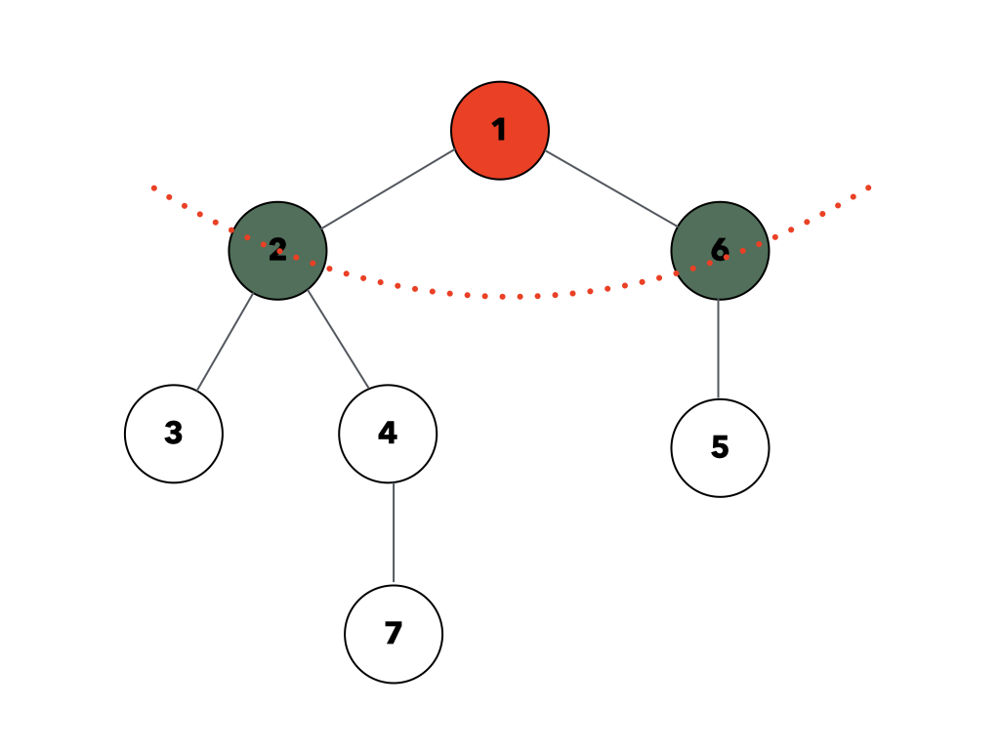

先搜索节点2，得到节点3和4，保存，继续没进行完的遍历2，6

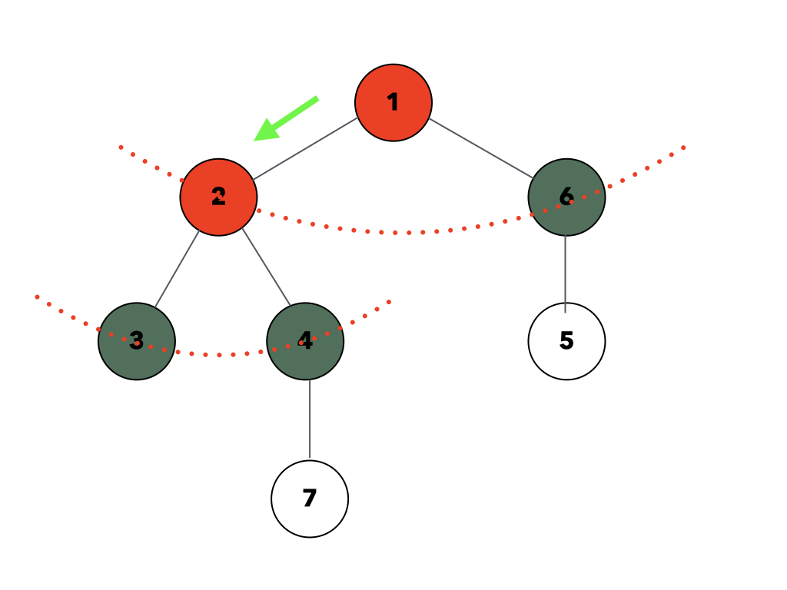

遍历到了节点6，搜索得到节点5，保存

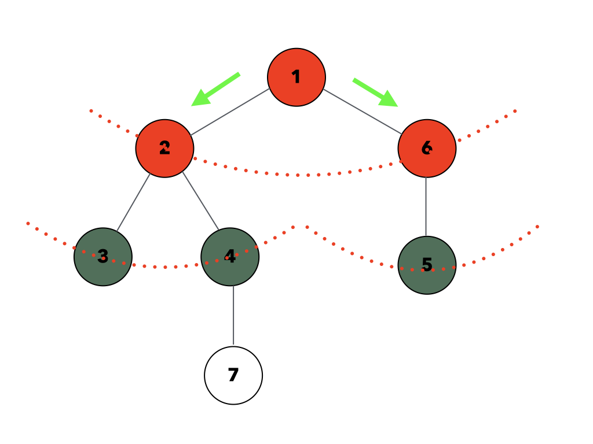

此时第一次遍历结束，于是开始遍历它的搜索结果3，4，5。先搜索节点3，没有子节点，再搜索节点4，得到节点7

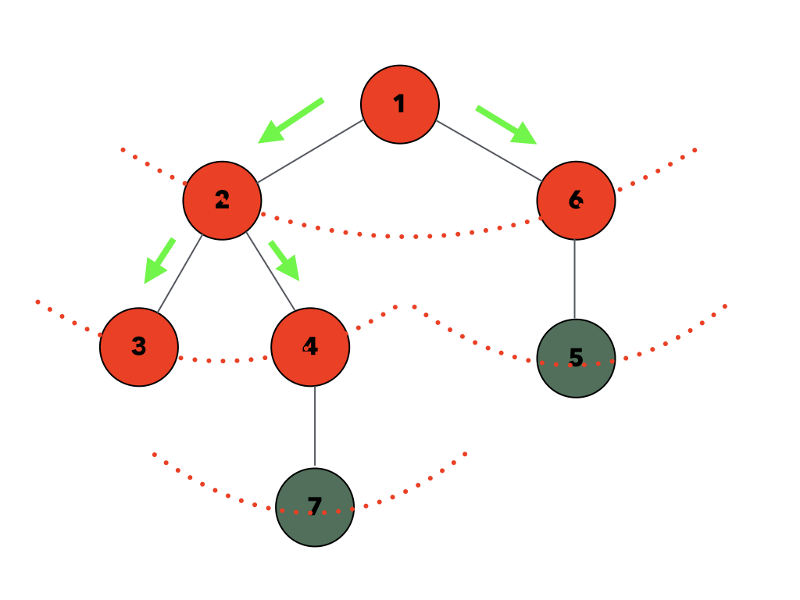

继续遍历，搜索节点5，没有子节点，于是这次遍历结束，遍历它的搜索结果，即节点7，它没有子节点，于是搜索结束

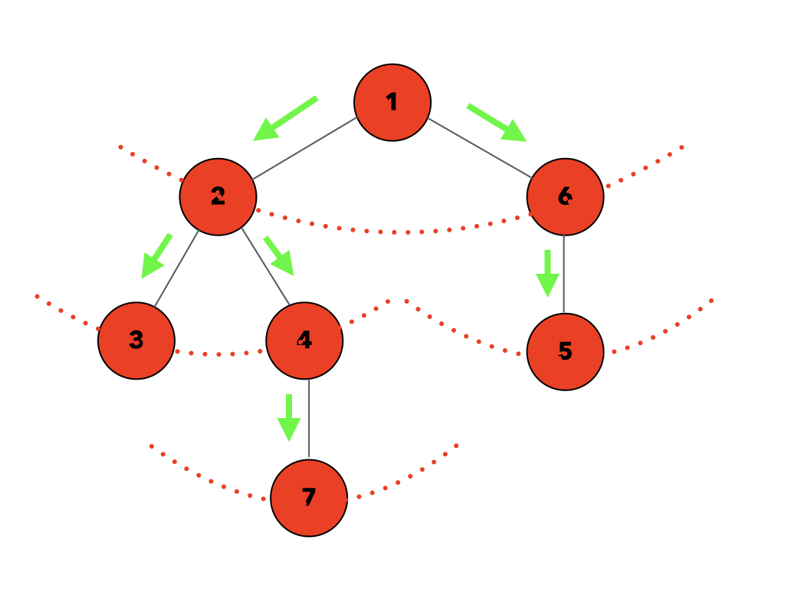

仔细思考搜索过程，可以发现每次搜索时得到的节点都是先进先出的。实际上，BFS算法的实现几乎离不开队列。

```python
def bfs(graph, node):
    q=queue()
    q.append(start_node) # 加入初始节点
    while not q.isempty():
        node=q.popleft()
        if node.left is not None:
            q.append(node.left)
            print(node.left.val)
        if node.right is not None:
            q.append(node.right)
            print(node.right.val)
```

BFS通常被用于求一些最值，比如在走迷宫时计算最小路径。为什么是最小的？结合问题具体分析，很好理解。

>一个例题：
>给定一个连通无向图，给每个节点染上黑色或者白色两种颜色，使得相邻的节点颜色不同。如果这个图可以被染色，输出染色方案，如果不可以，输出-1。
>输入：一个图，用数组表示，数组元素表示节点，从1到2n，两两相邻元素表示一个边
>输出：染成白色的节点的序号，或者-1

非常简单的一个题。

不过首先需要将图转化为邻接表。实现很简单。假设已经实现，得到邻接表 `adj`，它是一个字典，键从 1 到 n，代表每条边的一个端点，值是一个列表，表示端点的邻域。

想象一下手动染色的过程，从一个节点开始，给它染上，比如白色，然后就需要给它的邻域中的每一个没有染过色的节点都染上黑色。这样，需要遍历每次搜索到的邻域就比较方便了，而不是一条路走到黑地染色，再回头，还需要记载每个节点的染色情况，十分麻烦。到此，显然想要使用BFS而不是DFS。

用一个数组 `painted` 来表示每个节点是否染色，初始化为 1，表示没有染色，染白色用 0 表示，染黑色用 1 表示。第一个元素直接初始化为 0，表示直接将第一个元素染成白色。程序完成时，如果成功染色，它就是染色结果。

因此可以用一个整数表示下面将要染的颜色，`paint`，每次更新时就使用 `paint=(paint + 1) % 2`。


先给出这部分的实现

```python
def bfs():
    global paint, painted, adj
    q=queue()
    q.append(1) # 加入初始节点
    while not q.isempty():
        cur_node = q.popleft()
        paint = (painted[cur_node] + 1) % 2
        for ele in adj[cur_node]:
            if painted[ele] == -1:
                painted[ele] = paint
                q.append(ele)
    return 1
```

但是上面的分析是假设了图是可以被染色的。什么情况下无法成功染色呢？就是我们发现当一个节点在本次遍历中需要将一个节点染成白色，但是它的某一个相邻的节点已经被染成了白色，于是这个节点无论染什么色都会冲突，直接使得染色失败。于是加入代码判断失败的情况

```python
def bfs():
    global paint, painted, adj
    q=queue()
    q.append(1) # 加入初始节点
    while not q.isempty():
        cur_node = q.popleft()
        paint = (painted[cur_node] + 1) % 2
        for ele in adj[cur_node]:
            if painted[ele] == -1:
                for adjs in adj[ele]:
                    if painted[adjs] == paint: # 染色失败
                        return -1
                painted[ele] = paint
                q.append(ele)
    return 1
```

## 总结

算法本身不是特别难，但是算法思想十分精妙。在处理更加一般的问题时，如果我们可以将状态恰当地转化为节点，找准节点之间的转化关系，就可以根据这个转化关系确定一张图。也就是说，只要处理恰当，很多「变化」的情景都可以用图描述，然后就可以使用图相关的算法解决问题。不过这就比较考验抽象能力和洞察力了。

而算法的实现上也是十分精彩。巧妙设计函数，再巧妙利用递归和递归的返回值，实现操作每一个节点并求值，不需要重新开辟存储空间，甚至化不可能为可能，实在有太多可以学习的地方了。这次也是学习到了。