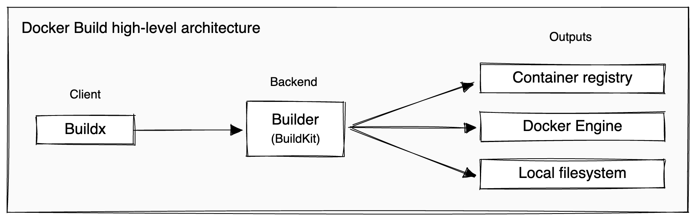

M1芯片的MacBook在部署一些生产环境时实在费了大劲。docker能够解决大部分问题，但是还不够，因为linux系统下的docker没有自动支持qemu，因此没办法夸架构运行镜像。

而说实话，在docker的使用周期中，我们大多数人大多数时候都是在“使用”镜像，很少会花心思去“构建”镜像，更不用提多平台构建了。但是我的看法是，多多了解“它是怎么来的”能够很好地帮助我们更好地使用和理解。在经过详细了解docker多平台镜像构建过程后，我对此很有感受，故写此文，也方便自己日后查看。

<!-- more -->

## 先前的做法

Docker Engine 23.0和Docker Desktop 4.19开始使用buildx作为默认的构建器。什么是构建器？先看看在buildx之前，需要构建多平台的镜像要怎么办。

思路很简单，就是在不同的平台上分别构建对应的镜像，然后全部上传，在拉取（pull）镜像时根据平台信息选择合适的镜像。怎么告诉镜像仓库平台对应的镜像是哪个呢？这就需要用户提供一个“manifest”列表。

比如在linux x86_64平台构建了一个镜像test_x8664，在arm64平台构建了一个同样内容的镜像test_arm64，就可以创建一个manifest列表：

```shell
docker manifest create username/test \
      username/test_x8664 \
      username/test_arm64
```

然后对这个列表进行设置，记录不同平台、架构分别对应的镜像：

```shell
docker manifest annotate username/test \
      username/test_x8664 \
      --os linux --arch x86_64

docker manifest annotate username/test \
      username/test_arm64 \
      --os linux --arch arm64 --variant v8
```

将manifest列表推送到仓库：

```shell
docker manifest push username/test
```

成功后，再拉取“username/test”镜像时就会根据平台自动拉取相应的镜像。这就是多平台构建的最简单方式。

但是每个镜像都需要在相应平台上分别构建，显然不够方便，因此可以使用buildx。

## Docker Build 架构了解

开始之前有一些抽象概念需要了解一下。

Docker Build实现了客户端-服务器架构，Buildx是运行和管理构建的客户端和用户界面，BuildKit是处理构建执行的服务器或构建器，如图所示：



就类似于docker本身的结构，当我们在调用buildx时其实也只是在调用客户的接口，真正执行构建操作的是后端的Builder。Builder是指构建器，是Buildkit的实例。Buildkit是指实际执行构建操作的后端守护进程。这里要涉及的多平台构建的核心就在这个buidler，因为buildx默认的builder不支持多平台构建，我们需要新建一个自己的builder。

新版的docker默认使用buildx作为构建器，也就是说`docker build`就是`docker buildx build`的别名，但是要使用`buidlx`的子命令就要显式调用了。

## 构建准备
### 多平台同时构建

调用构建时，可以设置`--platform`标志来指定构建输出的目标平台。例如，`linux/amd64`、`linux/arm64`或`darwin/amd64`。一般一次只能为单个平台构建，比如下面的命令会报错：

```shell
docker build -t test --platform=linux/arm64,linux/amd64 .
```

报错信息如下：

```shell
[+] Building 0.0s (0/0)
ERROR: Multi-platform build is not supported for the docker driver.
Switch to a different driver, or turn on the containerd image store, and try again.
Learn more at https://docs.docker.com/go/build-multi-platform/
```

想要为多个平台同时构建，有两种方式：

1. 打开容器快照器存储，即使用containerd镜像存储

 桌面版的docker开启可以打开Settings>General>Use containerd for pulling and storing images，如下图所示：

 

 勾选后点击“Apply & restart”，重启；

 Linux上面是没有Desktop的，这时可以在配置文件`/etc/docker/daemon.json`（没有就新建），添加如下内容：

 ```shell
 {
    "features": {
        "containerd-snapshotter": true
    }
 }
 ```

 举例一个完整的配置文件：

 ```shell
 {
      "registry-mirrors": [
            "https://ccr.ccs.tencentyun.com"
      ]
      "features": {
            "containerd-snapshotter": true
            }
 }
 ```

 这里还配置了镜像源，因为国内暂时无法访问Docker Hub。

 随后重启docker服务：

 ```shell
 systemctl restart docker
 ```

 可以验证一下：

 ```shell
 docker info -f '{{ .DriverStatus }}'
 ```

 输出：

 ```shell
 [[driver-type io.containerd.snapshotter.v1]]
 ```

 则说明开启成功。

2. 创建一个新Builder，且使用docker-container驱动器

 什么是驱动器？构建驱动程序是BuildKit后端如何以及在哪里运行的配置。驱动程序设置是可定制的，并允许对构建器进行控制。Buildx支持以下驱动程序：

 - `docker`：使用捆绑到Docker守护进程中的BuildKit库。
 - `docker-container`：使用Docker创建一个专用的BuildKit容器。
 - `kubernetes`：在Kubernetes集群中创建BuildKit pod。
 - `remote`：直接连接到手动管理的BuildKit守护进程。

 这里只介绍`docker-container`。

 构建时默认驱动器是`docker`，正如前面所看到的那样，它不支持多平台镜像构建。我们可以新建自己的Builder并进行相关配置：

 ```shell
 docker buildx create \
   --name container \
   --driver=docker-container \
   --driver-opt=[key=value,...]
   mybuilder
 ```

 其中`--driver=docker-container`选项如果省略则默认是`docker-container`驱动器。

 可以查看已有的的构建器以及支持的平台：

 ```shell
 docker builder ls
 ```

 输出

 ```shell
 NAME/NODE       DRIVER/ENDPOINT      STATUS   BUILDKIT PLATFORMS
 default *       docker
   default       default              running  v0.11.6  linux/arm64
 my_builder      docker-container
   my_builder0   default              running  v0.11.6  linux/arm64
 ```

 可以看到新建了`mybuilder`的构建器，它的驱动是`docker-container`，支持linux/arm64平台，可以使用：

 ```shell
 docker buildx use mybuilder
 ```

 将它设置为启用状态，或者每次在使用`docker buildx build`时制定`--builder=mybuilder`来为某一次构建指定Builder。

 值得注意的是，如果使用了mybuilder作为Builder，构建的镜像默认是不可见的，需要在构建时指定`--load`参数在本地显示，或者`--push`参数上传到Docker Hub，比如：

 ```shell
 docker buildx build --platform=linux/amd64,linux/arm64,linux/arm/v7 -t test . --load
 ```

 如果构建成功了，可以检查镜像：

 ```shell
 docker buildx imagetools inspect <username>/<image>:latest
 ```

 输出类似：
 ```shell
 Name:      docker.io/<username>/<image>:latest
 MediaType: application/vnd.docker.distribution.manifest.list.v2+json
 Digest:    sha256:f3b552e65508d9203b46db507bb121f1b644e53a22f851185d8e53d873417c48

 Manifests:
  Name:      docker.io/<username>/<image>:latest@sha256:71d7ecf3cd12d9a99e73ef448bf63ae12751fe3a436a007cb0969f0dc4184c8c
  MediaType: application/vnd.docker.distribution.manifest.v2+json
  Platform:  linux/amd64

  Name:      docker.io/<username>/<image>:latest@sha256:5ba4ceea65579fdd1181dfa103cc437d8e19d87239683cf5040e633211387ccf
  MediaType: application/vnd.docker.distribution.manifest.v2+json
  Platform:  linux/arm64

  Name:      docker.io/<username>/<image>:latest@sha256:29666fb23261b1f77ca284b69f9212d69fe5b517392dbdd4870391b7defcc116
  MediaType: application/vnd.docker.distribution.manifest.v2+json
  Platform:  linux/arm/v7
  ```
  
 可以看到docker自动维护了一张manifest列表。现在可以将镜像推送到Docker Hub，或者直接在本地运行想要的架构，docker会自动运行相应的架构，使用`--platform`命令指示：

 ```shell
 docker run --platform=linux/arm64 --rm docker.io/<username>/<image> uname -m
 ```

 但是在那之前，我们可能会发现构建镜像失败了。这是因为一个架构的机器想要构建其他架构的镜像就需要通过模拟器，Linux内核中支持qemu模拟。

### 模拟其他架构

可以使用三种不同的策略构建其他平台的映像：

- 在内核中使用QEMU仿真支持
- 在由不同架构的多个节点支持的单个构建器上构建
- 使用Dockerfile中的一个阶段来交叉编译到不同的架构

为了启用qemu支持，可以使用一个docker镜像：

```shell
docker run --privileged --rm tonistiigi/binfmt --install all
```

对于Desktop版的docker，默认是开启qemu支持的。

安装完成后，只需要再运行上面提到的`docker builder ls`命令，看到支持的平台变多了就说明启用成功。

所谓交叉编译，就是指在构建的镜像中如果使用某种语言，而且这种语言对于多平台有较好的支持，那可以使用一些docker内置的平台相关的环境变量，比如`BUILDPLATFORM`、`TARGETPLATFORM`。

至此，就实现了多平台镜像的方便构建。


