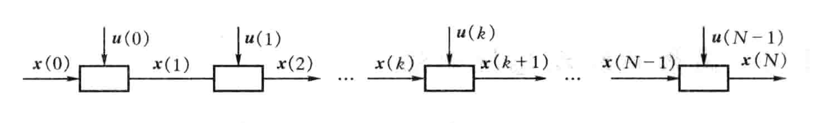

动态规划法是美国数学家 R. Bellman 等人在研究多阶段决策过程的优化问题时提出的一种方法。它常被运用在数学、管理科学、计算机科学、经济学和生物信息学等领域中，通过把原问题分解为相对简单的子问题的方式来求解复杂问题，因而适用于有重叠子问题和最优子结构性质的问题.

动态规划的核心思想就是化大为小、记住过往、逐步击破，经典特征就是 “以空间换时间”。

<!--more-->

*文章中数学公式受限于渲染器，有不标准的地方。*

## 离散系统多步决策问题

### Bellman 最优性原理

多步决策过程中的最优决策有这样的性质：**若将过程分为任意两段，则不论前半段的初始状态与决策如何，余下后半段的决策对于新的初始状态（前半段的末值状态）仍然构成一个最优决策**。这就是所谓的**无后效性**。

***证明***

设目标函数 $J$ 为最小的最优决策函数 $u^*_0$ 、相应的最优目标函数$J^*_0$分别为：

$$u^*_0=\{\mathbf{u}^*(0),\mathbf{u}^*(1),\cdots,\mathbf{u}^*(n-1)\}$$

$$J^*_0=J[\mathbf{x}(0),\mathbf{u}^*(0),\mathbf{u}^*(1),\cdots,\mathbf{u}^*(n-1)]$$

任取 $l, 0\le l\le n-1$，若 $u^*_l=\{\mathbf{u}^*(l),\cdots,\mathbf{u}^*(n-1)\}$ 在后半段，即 $l$ 到 $n-1$ 上不是最优策略，则设这一段的最优策略是 $\bar{u}_l=\{\bar{\mathbf{u}}(l),\cdots,\bar{\mathbf{u}}(n-1)\}$，使得目标函数 $J$ 满足：

$$J[\mathbf{x}(l),\bar{\mathbf{u}}(l),\cdots,\bar{\mathbf{u}}(n-1)]<J[\mathbf{x}(l),\mathbf{u}^*(l),\cdots,\mathbf{u}^*(n-1)]$$

于是得到一个新的从 $0$ 到 $n-1$ 的决策为：

$$u^{\ast\ast}_0=\{\mathbf{u}^*(0),\cdots,\mathbf{u}^*(l-1),\bar{\mathbf{u}}(l),\cdots,\bar{\mathbf{u}}(n-1)\}$$

而此时的目标函数 $J^{**}_0$ ：

$$J^{\ast\ast}_0=J[\mathbf{x}(0),\mathbf{u}^*(0),\cdots,\mathbf{u}^*(l-1),\bar{\mathbf{u}}(l),\cdots,\bar{\mathbf{u}}(n-1)]<J^*_0$$

这与假设 $u^*_0$ 是最优策略矛盾。QED。

### 一般提法

离散系统多步决策最优控制问题

- **状态转移方程**
  $$\mathbf{x}(k+1)=\mathbf{f}(\mathbf{x}(k),\mathbf{u}(k),k), k=0,1,\cdots,N-1$$
  其中 $\mathbf{x}(k) \in X \subset \mathbb{R}^n, k=0,1,\cdots,N$
- **初始条件**
  $$\mathbf{x}(0)=\mathbf{x}_0$$
- **目标集（约束）**
  $$S=\{\mathbf{x} | \mathbf{g}(\mathbf{x}(N)=0\}$$
  其中 $\mathbf{g}=(g_1,\cdots,g_p)^{\top}$
- **控制域**
  $$\mathbf{u}(k)\in U\subset \mathbb{R}^r$$
- **性能指标（目标函数）**
  $$J=K(\mathbf{x}(N),N)+\sum_{k=0}^{N-1}L(\mathbf{x}(k),\mathbf{u}(k),k)$$
- **目标**
  求控制函数 $u^*=\{\mathbf{u}^*(0),\mathbf{u}^*(1),\cdots,\mathbf{u}^*(n-1)\}$ 使得目标函数 $J$ 最小。



### 解法

 这个问题是一个 $N$ 步决策过程。
 
 我们的任务是每一步在 $U$ 中选择一个决策 $\mathbf{u}(k)$ 确定一个决策序列 $u=\{\mathbf{u}(k)\}_{k=0}^{N-1}$，即全过程的决策。

 确定好全过程的决策后，根据决策相应地可以确定相应的各步状态 $x=\{\mathbf{x}(k)\}_{k=0}^{N-1}$，称为状态轨线。

 将性能指标记为：

 $$J(\mathbf{x}(0),u)=K(\mathbf{x}(N),N)+\sum_{k=0}^{N-1}L(\mathbf{x}(k),\mathbf{u}(k),k)$$

设最优控制为 $u^*=\{\mathbf{u}^*(k)\}_{k=0}^{N-1}$，则：

$$J^*(\mathbf{x}(0))=J(\mathbf{x}(0),u^*)\le J(\mathbf{x}(0),u)$$

根据动态规划的思想，为了求解 $J^*(\mathbf{x}(0))$ 及最优控制 $u^*$ 先求 $J^*(\mathbf{x}(k)),k=N-1,\cdots,1,0$ 及相应的最优控制。为此，任意给定 $\mathbf{x}$ 且满足当 $j=k,\cdots,N-1$时有 $\mathbf{g}(\mathbf{x}(N))$，记 $u_k=\{\mathbf{u}(j)\}_{j=k}^{N-1}$，考虑如下问题：

$$J(\mathbf{x},u_k)=K(\mathbf{x}(N),N)+\sum_{j=k}^{N-1}L(\mathbf{x}(j),\mathbf{u}(j),j)$$

$$\mathbf{x}(j+1)=\mathbf{f}(\mathbf{x}(j),\mathbf{u}(j),j),j=k,\cdots,N-1$$

$$\mathbf{u}(j)\in U$$

可以推导得到：
$$J^*(\mathbf{x}(k))=\min_{\mathbf{u}(k)}\{L(\mathbf{x}(k),\mathbf{u}(k),k)+J^*(\mathbf{x}(k+1))\}$$
或者：
$$J^*(\mathbf{x}(k))=\min_{\mathbf{u}(k)}\{L(\mathbf{x}(k),\mathbf{u}(k),k)+J^*(\mathbf{f}(\mathbf{x}(k)),\mathbf{u}(k),k)\}$$
其中 $k=N-1,\cdots,1,0$。当 $k=N-1$ 时，状态 $\mathbf{x}(N)$ 满足目标集，即 $\mathbf{g}(\mathbf{x}(N))=0$，所以 $J^*(\mathbf{x}(N))$是确定的。由递推式便可以解决问题。

## 动态规划

计算机算法中的动态规划就是上面的具体实现，使用代码将上面的递推计算过程自动化。

显然，可以看到动态规划适用于解决具有以下特征的问题：


- **无后效性**
- **子问题重叠**
  如果有大量的重叠子问题，我们可以用空间将这些子问题的解存储下来，避免重复求解相同的子问题，从而提升效率。

- **最优子结构**
  具有最优子结构也可能是适合用贪心的方法求解，注意要确保我们**考察了最优解中用到的所有子问题**。
  + 证明问题最优解的第一个组成部分是做出一个选择；
  + 对于一个给定问题，在其可能的第一步选择中，假定你已经知道哪种选择才会得到最优解。你现在并不关心这种选择具体是如何得到的，只是假定已经知道了这种选择；
  + 给定可获得的最优解的选择后，确定这次选择会产生哪些子问题，以及如何最好地刻画子问题空间；
  + 证明作为构成原问题最优解的组成部分，每个子问题的解就是它本身的最优解。
  
  要保持子问题空间**尽量简单**，只在必要时扩展。最优子结构的不同体现在两个方面：
  + 原问题的最优解中涉及多少个子问题；
  + 确定最优解使用哪些子问题时，需要考察多少种选择。
  
  子问题图中每个定点对应一个子问题，而需要考察的选择对应关联至子问题顶点的边。

### 基本思路

对于一个能用动态规划解决的问题，一般采用如下思路解决：

1. 将原问题划分为若干**阶段**，每个阶段对应若干个子问题，提取这些子问题的特征（称之为**状态**）；
2. 寻找每一个状态的可能**决策**，或者说是各状态间的相互转移方式（用数学的语言描述就是**状态转移方程**）。
3. 按顺序求解每一个阶段的问题。

## 实现方式

### 记忆化搜索
记忆化搜索，也叫递归树剪枝，是一种通过记录已经遍历过的状态的信息，从而避免对同一状态重复遍历的搜索实现方式。

因为记忆化搜索确保了每个状态只访问一次，它也是一种常见的动态规划实现方式。由于保存了遍历过的状态的信息，因此内存开销会增大，这是典型的“空间换时间”策略。

### DP 优化

## 例子

更好地理解建立在实践的基础之上。

### 最长递增子列 $\star$

>给定一个长度为 $n$ 的序列 $A(n \leq 5000)$，求出一个最长的 $A$ 的子序列，满足该子序列的后一个元素不小于前一个元素。

最简单也是最容易想到的思路就是暴力穷举所有可能子列，判断是不是递增的，然后找到长度最大的那个。时间复杂度极高，所有子列共有 $2^n$ 个，每个子列判断递增要遍历 $n$ 次，时间复杂度为 $O(n2^n)$。

另一种容易想到的办法是找到以 $A_i$ 为结尾的最长不下降子序列的长度，则所求为 $\max_{1 \leq i \leq n} f(i)$。计算 $f(i)$ 时，尝试将 $A_i$ 接到其他的最长不下降子序列后面，以更新答案。于是可以写出这样的状态转移方程：$f(i)=\max_{1 \leq j < i, A_j \leq A_i} (f(j)+1)$。最差情况下它的时间复杂度为 $O(n^2)$。

观察上面的第二种算法，例如取 $A=[1,5,2,4,3]$，可以画出一棵查找树：


可以看到当末尾节点为 4 或 3 时都有重复查找，这造成了额外的时间开销。我们可以维护一个额外的变量来记录查找过的节点，这样下次要用到这个值时就不需要再查找了，提高了查找效率。相关 python 代码如下：

```python
memo={}
def L(A, i):
    global memo
    if i in memo:
        return memo[i]
    
    if i == len(A)-1:
        return 1
    
    max_len=1
    for j in range(len(A)):
        if A[j] > A[i]:
            max_len = max(max_len, L(A, j) + 1)
    
    memo[i]=max_len

    return max_len

def len_LIS(A):
    return max(L(A, i) for i in range(len(A))

A = [1, 4, 3, 2, 5]
print(len_LIS(A))
```

其中 `memo` 变量就在每次遍历时记录下当前节点的最大值。一般它使用哈希表存储。这就是**记忆化搜索**。

也可以借助 DP 不使用递归来解决这一问题，这样可以更加方便地分析算法的时间复杂度。

```python
def len_LIS(A):
    n = len(A)
    L = [1] * n

    for i in reversed(range(n)):
        for j in range(i+1,n):
            if A[j] > A[i]:
                L[i] = max(L[i], L[j] + 1)
    return max(L)

A = [1, 4, 3, 2, 5]
print(len_LIS(A))
```

算法时间复杂度为 $O(n^2)$。

#### 再优化

当 $n$ 的范围扩大到 $n \leq 10^5$ 时，第一种做法就不够快了，下面给出了一个 $O(n \log n)$ 的做法。

回顾一下之前的状态：$(i, l)$。但这次，我们不是要按照相同的 $i$ 处理状态，而是直接判断合法的 $(i, l)$。

再看一下之前的转移：$(j, l - 1) \rightarrow (i, l)$，就可以判断某个 $(i, l)$ 是否合法。初始时 $(1, 1)$ 肯定合法，只需要找到一个 $l$ 最大的合法的 $(i, l)$，就可以得到最终最长不下降子序列的长度了。

那么，根据上面的方法，我们就需要维护一个可能的转移列表，并逐个处理转移。所以可以定义 $a_1 \dots a_n$ 为原始序列，$d_i$ 为所有的长度为 $i$ 的不下降子序列的末尾元素的最小值，$len$ 为子序列的长度。

初始化：$d_1=a_1,len=1$。

现在我们已知最长的不下降子序列长度为 $1$，那么我们让 $i$ 从 $2$ 到 $n$ 循环，依次求出前 $i$ 个元素的最长不下降子序列的长度，循环的时候我们只需要维护好 $d$ 这个数组还有 $len$ 就可以了。关键在于如何维护。

考虑进来一个元素 4a_i$：

- 元素大于等于 $d_{len}$，直接将该元素插入到 $d$ 序列的末尾。
- 元素小于 $d_{len}$，找到 第一个大于它的元素，用 $a_i$ 替换它。

对于步骤 1：

由于我们是从前往后扫，所以说当元素大于等于 $d_{len}$ 时一定会有一个不下降子序列使得这个不下降子序列的末项后面可以再接这个元素。如果 $d$ 不接这个元素，可以发现既不符合定义，又不是最优解。

对于步骤 2：

同步骤 1，如果插在 $d$ 的末尾，那么由于前面的元素大于要插入的元素，所以不符合 $d$ 的定义，因此必须先找到第一个大于它的元素，再用 $a_i$ 替换。

步骤 2 如果采用暴力查找，则时间复杂度仍然是 $O(n^2)$ 的。但是根据 $d$ 数组的定义，又由于本题要求不下降子序列，所以 $d$ 一定是单调不减的，因此可以用二分查找将时间复杂度降至 $O(n\log n)$.

参考代码如下：

```python
dp = [0x1f1f1f1f] * MAXN
mx = dp[0]
for i in range(0, n):
    bisect.insort_left(dp, a[i], 0, len(dp))
ans = 0
while dp[ans] != mx:
    ans += 1
```
### 接雨水 $\star\star\star\star\star$

>给定 n 个非负整数表示每个宽度为 1 的柱子的高度图，计算按此排列的柱子，下雨之后能接多少雨水。
>例如给定数组`height = [0,1,0,2,1,0,1,3,2,1,2,1]`，柱子排列如下图黑色区域，能接雨水为蓝色区域。所以输出6.
>
>题目来自[leetcode](https://leetcode.cn/problems/trapping-rain-water/description/?envType=study-plan-v2&envId=top-interview-150)，难度为困难。
>>这个题可以不用动态规划做，但是使用动态规划可以锻炼思维，而且很好地说明了动态规划问题的重点在于寻找**最优子结构**。

#### 动态规划

对于下标 `i`，下雨后水能到达的最大高度等于下标 `i` 两边的最大高度的最小值，下标 `i` 处能接的雨水量等于下标 `i` 处的水能到达的最大高度减去 `height[i]`。

朴素的做法是对于数组 `height` 中的每个元素，分别向左和向右扫描并记录左边和右边的最大高度，然后计算每个下标位置能接的雨水量。假设数组 `height` 的长度为 `n`，该做法需要对每个下标位置使用 `O(n)` 的时间向两边扫描并得到最大高度，因此总时间复杂度是 `O(n^2)`。

上述做法的时间复杂度较高是因为需要对每个下标位置都向两边扫描。如果已经知道每个位置两边的最大高度，则可以在 `O(n)` 的时间内得到能接的雨水总量。使用动态规划的方法，可以在 `O(n)` 的时间内预处理得到每个位置两边的最大高度。

创建两个长度为 `n` 的数组 `leftMax` 和 `rightMax`。对于 $0 \le i<n$，`leftMax[i]` 表示下标 `i` 及其左边的位置中，`height` 的最大高度，`rightMax[i]` 表示下标 `i` 及其右边的位置中，`height` 的最大高度。

显然，`leftMax[0]=height[0]`，`rightMax[n−1]=height[n−1]`。两个数组的其余元素的计算如下：

- 当 $1 \le i \le n-1$ 时，`leftMax[i]=max(leftMax[i−1],height[i])`；

- 当 $0 \le i \le n-2$ 时，`rightMax[i]=max(rightMax[i+1],height[i])`。

因此可以正向遍历数组 `height` 得到数组 `leftMax` 的每个元素值，反向遍历数组 `height` 得到数组 `rightMax` 的每个元素值。

在得到数组 `leftMax` 和 `rightMax` 的每个元素值之后，对于 $0 \le i<n$，下标 `i` 处能接的雨水量等于 `min(leftMax[i],rightMax[i])−height[i]`。遍历每个下标位置即可得到能接的雨水总量。

动态规划主要体现在计算数组 `leftMax` 和 `rightMax` 时。时间复杂度为 $O(n)$，空间复杂度为 $O(n)$。

```python
def trap(self, height: List[int]) -> int:
  if not height:
    return 0
  
  n = len(height)
  leftMax = [height[0]] + [0] * (n - 1)
  for i in range(1, n):
    # 子结构，leftMax[i]=max(leftMax[i−1],height[i])
    leftMax[i] = max(leftMax[i - 1], height[i])

  rightMax = [0] * (n - 1) + [height[n - 1]]
  for i in range(n - 2, -1, -1):
    # 子结构，rightMax[i]=max(rightMax[i+1],height[i])
    rightMax[i] = max(rightMax[i + 1], height[i])

  ans = sum(min(leftMax[i], rightMax[i]) - height[i] for i in range(n))
  return ans
```

#### 单调栈

除了计算并存储每个位置两边的最大高度以外，也可以用单调栈计算能接的雨水总量。

维护一个单调栈，单调栈存储的是下标，满足从栈底到栈顶的下标对应的数组 `height` 中的元素递减。

从左到右遍历数组，遍历到下标 `i` 时，如果栈内至少有两个元素，记栈顶元素为 `top`，`top` 的下面一个元素是 `left`，则一定有 `height[left]`$\ge$`height[top]`。如果 `height[i]`>`height[top]`，则得到一个可以接雨水的区域，该区域的宽度是 `i−left−1`，高度是 `min(height[left],height[i])−height[top]`，根据宽度和高度即可计算得到该区域能接的雨水量。

为了得到 `left`，需要将 `top` 出栈。在对 `top` 计算能接的雨水量之后，`left` 变成新的 `top`，重复上述操作，直到栈变为空，或者栈顶下标对应的 `height` 中的元素大于或等于 `height[i]`。

在对下标 `i` 处计算能接的雨水量之后，将 `i` 入栈，继续遍历后面的下标，计算能接的雨水量。遍历结束之后即可得到能接的雨水总量。

时间复杂度$O(n)$，空间复杂度主要取决于维护的栈的大小，它不会超过$n$，所以是$O(n)$。

```python
def trap(self, height: List[int]) -> int:
  ans = 0
  stack = list()
  n = len(height)
  
  for i, h in enumerate(height):
      while stack and h > height[stack[-1]]:
          top = stack.pop()
          if not stack:
              break
          left = stack[-1]
          currWidth = i - left - 1
          currHeight = min(height[left], height[i]) - height[top]
          ans += currWidth * currHeight
      stack.append(i)
  
  return ans
```


