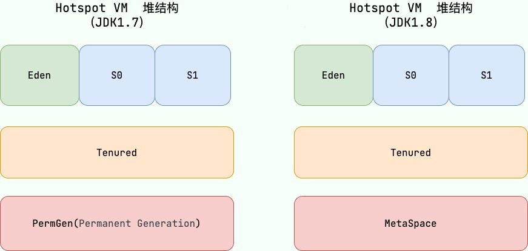
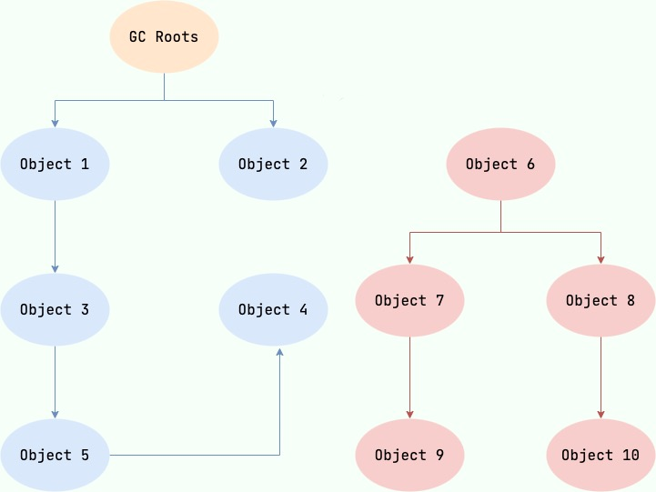
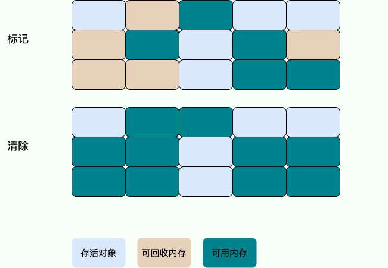
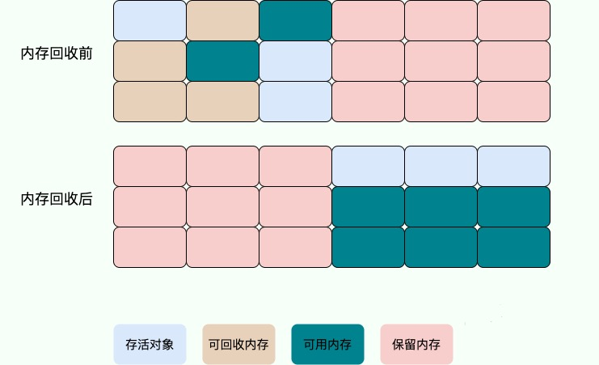
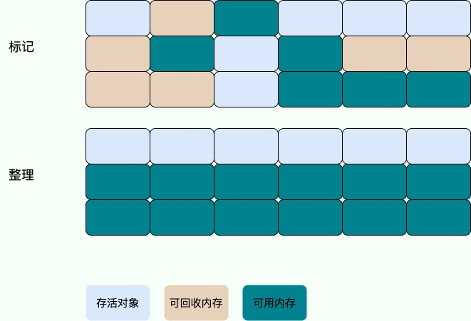
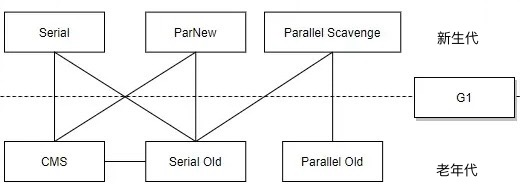

Java 中的垃圾回收机制是一个值得仔细学习的话题，因为它直接关系到代码的运行效率和内存溢出等问题，在大数据、高并发的场景中有很广泛的应用。当需要排查各种内存溢出问题，或者垃圾收集成为系统达到更高并发的瓶颈时，我们就需要对这些“自动化”的技术实施必要的监控和调节。

<!--more-->

## 堆空间的基本结构

Java 的垃圾回收主要是针对对象内存的回收和对象内存的分配。同时，Java 自动内存管理最核心的功能是**堆**内存中对象的分配与回收。

Java 堆是垃圾收集器管理的主要区域，因此也被称作 GC 堆（Garbage Collected Heap）。从垃圾回收的角度来说，由于现在收集器基本都采用分代垃圾收集算法，所以 Java 堆被划分为了几个不同的区域，这样我们就可以根据各个区域的特点选择合适的垃圾收集算法。

在 JDK 1.7 及之前的版本中，堆内存被通常分为三部分：

- 新生代内存(Young Generation)
- 老生代(Old Generation)
- 永久代(Permanent Generation)

下图所示的 Eden 区、两个 Survivor 区 S0 和 S1 都属于新生代，中间一层属于老年代，最下面一层属于永久代：

JDK 8 之后 PermGen（永生代）就已经被 MetaSpace（元空间）取代，MetaSpace 使用直接内存。（详情可以参考[我的博文]()）

## 内存分配和回收原则

### 对象优先在Eden区分配

大多数情况下，对象在新生代中 Eden 区分配。当 Eden 区没有足够空间进行分配时，虚拟机将发起一次 *Minor GC*。若新对象仍然无法存入 Survivor 空间，就只好通过**分配担保机制**把新生代的对象提前转移到老年代中去。如果老年代上的空间足够存放就不会出现 *Full GC*。

### 大对象直接进入老年代

大对象就是需要大量连续内存空间的对象（比如：字符串、数组）。

大对象直接进入老年代的行为是由虚拟机动态决定的，它与具体使用的垃圾回收器和相关参数有关。大对象直接进入老年代是一种优化策略，旨在避免将大对象放入新生代，从而减少新生代的垃圾回收频率和成本。

回收器分为两种：

- G1 垃圾回收器会根据 `-XX:G1HeapRegionSize` 参数设置的堆区域大小和 `-XX:G1MixedGCLiveThresholdPercent` 参数设置的阈值，来决定哪些对象会直接进入老年代。
- Parallel Scavenge 垃圾回收器中，默认情况下，并没有一个固定的阈值(`XX:ThresholdTolerance`是动态调整的)来决定何时直接在老年代分配大对象。而是由虚拟机根据当前的堆内存情况和历史数据动态决定。

### 长期存活的对象将进入老年代

既然虚拟机采用了分代收集的思想来管理内存，那么内存回收时就必须能识别哪些对象应放在新生代，哪些对象应放在老年代中。

为了做到这一点，虚拟机给每个对象一个对象年龄（Age）计数器。大部分情况，对象都会首先在 Eden 区域分配。如果对象在 Eden 出生并经过第一次 *Minor GC* 后仍然能够存活，并且能被 Survivor 容纳的话，将被移动到 Survivor 空间（s0 或者 s1）中，并将对象年龄设为 1(Eden 区->Survivor 区后对象的初始年龄变为 1)。对象在 Survivor 中每熬过一次 *Minor GC*,年龄就增加 1 岁，当它的年龄增加到某个默认值（根据回收器的不同这个默认值也会不同，可能是 15 岁，如G1回收器；有可能是6岁，如CMS回收器），就会被晋升到老年代中。

对象晋升到老年代的年龄阈值，可以通过参数 `-XX:MaxTenuringThreshold` 来设置。

### 主要进行GC的区域

针对 HotSpot VM 的实现，它里面的 GC 其实准确分类只有两大种：

1. 部分收集 (Partial GC)：
   - 新生代收集（Minor GC / Young GC）：只对新生代进行垃圾收集。
   - 老年代收集（Major GC / Old GC）：只对老年代进行垃圾收集。需要注意的是 Major GC 在有的语境中也用于指代整堆收集。只有 CMS 的 Concurrent Collection 是这个模式。
   - 混合收集（Mixed GC）：对整个新生代和部分老年代进行垃圾收集。只有 G1 有这个模式。
2. 整堆收集 (Full GC)：
   - 收集整个 Java 堆和方法区，包括 YoungGen、OldGen、PermGen（如果存在的话）等所有部分的模式。

### 空间分配担保

空间分配担保是为了确保在 *Minor GC* 之前老年代本身还有容纳新生代所有对象的剩余空间。

相关规则在 JDK 1.6 之后有所变化，在 JDK 1.6 之后的版本中，规则变为只要老年代的连续空间大于新生代对象总大小或者历次晋升的平均大小，就会进行 *Minor GC*，否则将进行 *Full GC*。

## 死亡对象判断方法

### 2种算法
主要的算法有：

- 引用计数法
- 可达性分析法

#### 引用计数法

给对象中添加一个引用计数器，它按如下规则维护对象的一个整数：

- 每当有一个地方引用它，计数器就加 1；
- 当引用失效，计数器就减 1；
- 任何时候计数器为 0 的对象就是不可能再被使用的。

这个方法实现简单，效率高，但是目前主流的虚拟机中并没有选择这个算法来管理内存，其最主要的原因是它很难解决对象之间循环引用的问题，比如：

这样，即便我们已经无法对 Object1 或者 Object2 再做任何操作，回收器也无法回收它们，因为它们各自的引用数都至少为 1。

#### 可达性分析法

这个算法的基本思想就是通过一系列的称为 “GC Roots” 的对象作为起点，从这些节点开始向下搜索，节点所走过的路径称为引用链，当一个对象到 GC Roots 没有任何引用链相连的话，则证明此对象是不可用的，需要被回收。

下图中的 Object 6 ~ Object 10 之间虽有引用关系，但它们到 GC Roots 不可达，因此为需要被回收的对象：

哪些对象可以作为 GC Roots 呢？主要包含：

- 虚拟机栈（栈帧中的局部变量表）、本地方法栈（Native 方法）中引用的对象；
- 方法区中类静态属性、常量引用的对象；
- 所有被同步锁持有的对象；
- JNI（Java Native Interface）引用的对象。

#### 注意
要注意的是，**被标记为可回收并不意味着一定会被回收**。在真正宣判一个对象“死刑”之前至少要经历两次标记为“不可达对象”的过程。

### 引用类型

无论是通过引用计数法判断对象引用数量，还是通过可达性分析法判断对象的引用链是否可达，判定对象是否被回收都与“引用”有关。

Java 中的引用分为强引用、软引用、弱引用、虚引用四种。

1. 强引用（StrongReference）
以前我们使用的大部分引用实际上都是强引用，这是使用最普遍的引用。如果一个对象具有强引用，那就类似于必不可少的生活用品，垃圾回收器绝不会回收它。当内存空间不足，Java 虚拟机宁愿抛出 `OutOfMemoryError` 错误，使程序异常终止，也不会靠随意回收具有强引用的对象来解决内存不足问题。

2. 软引用（SoftReference）
如果一个对象只具有软引用，那就类似于可有可无的生活用品。如果内存空间足够，垃圾回收器就不会回收它，如果内存空间不足了，就会回收这些对象的内存。只要垃圾回收器没有回收它，该对象就可以被程序使用。软引用可用来实现内存敏感的高速缓存。
软引用可以和一个引用队列（ReferenceQueue）联合使用，如果软引用所引用的对象被垃圾回收，JAVA 虚拟机就会把这个软引用加入到与之关联的引用队列中。

3. 弱引用（WeakReference）
如果一个对象只具有弱引用，那就类似于可有可无的生活用品。弱引用与软引用的区别在于：只具有弱引用的对象拥有更短暂的生命周期。在垃圾回收器线程扫描它所管辖的内存区域的过程中，一旦发现了只具有弱引用的对象，不管当前内存空间足够与否，都会回收它的内存。不过，由于垃圾回收器是一个优先级很低的线程， 因此不一定会很快发现那些只具有弱引用的对象。
弱引用可以和一个引用队列（ReferenceQueue）联合使用，如果弱引用所引用的对象被垃圾回收，Java 虚拟机就会把这个弱引用加入到与之关联的引用队列中。

4. 虚引用（PhantomReference）
"虚引用"顾名思义，就是形同虚设，与其他几种引用都不同，虚引用并不会决定对象的生命周期。如果一个对象仅持有虚引用，那么它就和没有任何引用一样，在任何时候都可能被垃圾回收。

**虚引用主要用来跟踪对象被垃圾回收的活动**。虚引用与软引用和弱引用的一个区别在于： 虚引用必须和引用队列（ReferenceQueue）联合使用。当垃圾回收器准备回收一个对象时，如果发现它还有虚引用，就会在回收对象的内存之前，把这个虚引用加入到与之关联的引用队列中。程序可以通过判断引用队列中是否已经加入了虚引用，来了解被引用的对象是否将要被垃圾回收。程序如果发现某个虚引用已经被加入到引用队列，那么就可以在所引用的对象的内存被回收之前采取必要的行动。

**特别注意，在程序设计中一般很少使用弱引用与虚引用，使用软引用的情况较多**，这是因为软引用可以加速 JVM 对垃圾内存的回收速度，可以维护系统的运行安全，防止内存溢出（OutOfMemory）等问题的产生。
## 垃圾回收算法

在明确了内存分配策略和回收原则后，就要开始设计真正要落实的回收算法。包含四种算法：

- 标记-清除算法
- 复制算法 
- 标记-整理算法
- 分代收集算法

### 标记-清除算法

标记-清除（Mark-and-Sweep）算法分为“标记（Mark）”和“清除（Sweep）”阶段：首先标记出所有不需要回收的对象，在标记完成后统一回收掉所有没有被标记的对象。

它是最基础的收集算法，后续的算法都是对其不足进行改进得到的。

但是这种垃圾收集算法会带来两个明显的问题：
- 效率问题：标记和清除两个过程效率都不高；
- 空间问题：标记清除后会产生大量不连续的内存碎片。

### 复制算法
复制（Copying）收集算法的出现就是为了解决标记-清除算法的效率和内存碎片问题。它将内存分为两块，每次使用其中的一块。当这一块的内存使用完后，就将还存活的对象复制到另一块去，然后再把使用的空间一次清理掉。这样就使每次的内存回收都是对内存区间的一半进行回收。

它可以有效解决标记-清除法的内存碎片问题，但依然存在下面这些问题：

- 可用内存变小：由于存在保留区，可用内存缩小为原来的一半，内存使用率低。
- 不适合老年代：如果存活对象数量比较大，复制性能会变得很差。

### 标记-整理算法

标记-整理（Mark-and-Compact）算法是根据老年代的特点提出的一种标记算法，标记过程仍然与“标记-清除”算法一样，但后续步骤不是直接对可回收对象回收，而是让所有存活的对象向一端移动，然后直接清理掉端边界以外的内存。

相较于复制算法，标记-整理算法在解决内存碎片问题的前提下提高了内存的利用率，但是整理的步骤相对耗时较长，因此不适用于新生代这种需要高频率垃圾回收的场景。

### 分代收集算法

分代收集算法结合了复制算法和标记-整理算法，将 Java 堆分为新生代和老年代，根据各个年代的特点选择合适的垃圾收集算法。

比如在新生代中，每次收集都会有大量对象死去，所以可以选择复制算法，只需要付出少量对象的复制成本就可以完成每次垃圾收集。而老年代的对象存活几率是比较高的，而且没有额外的空间对它进行分配担保，所以我们必须选择“标记-清除”或“标记-整理”算法进行垃圾收集。

JDK 9 之后的默认垃圾回收器 G1 在新生代区的回收算法就是复制算法，它将新生代区分为两部分，Eden:Survivor = 8:2；而其中的 Survivor 区又被分为 1:1 的 S1 和 S2 区。而在老年区就使用的是标记-整理算法。

## 垃圾回收器

如果说收集算法是内存回收的方法论，那么垃圾收集器就是内存回收的具体实现。

虽然我们对各个收集器进行比较，但**并非要挑选出一个最好的收集器**。因为直到现在为止还没有最好的垃圾收集器出现，更加没有万能的垃圾收集器，我们能做的就是根据具体应用场景选择适合自己的垃圾收集器。试想一下：如果有一种四海之内、任何场景下都适用的完美收集器存在，那么我们的 HotSpot 虚拟机就不会实现那么多不同的垃圾收集器了。

JDK 默认垃圾收集器（使用 `java -XX:+PrintCommandLineFlags -version` 命令查看）：
- JDK 8：Parallel Scavenge（新生代）+ Parallel Old（老年代）
- JDK 9 ~ JDK20: G1

其大致分工如下图：

总结一下：

- 新生代可以使用的垃圾回收器：Serial、ParNew、Parallel Scavenge

- 老年代可以适用的垃圾回收器：CMS、Serial Old、Parallel Old

- G1回收器适用于新生代和老年代

关于G1回收器再多了解一下。

G1 (Garbage-First) 是一款面向服务器的垃圾收集器，主要针对配备多颗处理器及大容量内存的机器。以极高概率满足 GC 停顿时间要求的同时，还具备高吞吐量性能特征。

- 并行与并发：G1 能充分利用 CPU、多核环境下的硬件优势，使用多个 CPU（CPU 或者 CPU 核心）来缩短 Stop-The-World 停顿时间。部分其他收集器原本需要停顿 Java 线程执行的 GC 动作，G1 收集器仍然可以通过并发的方式让 Java 程序继续执行。
- 分代收集：分代的概念依然在 G1 保留，不过它不需要和其他垃圾收集器配合使用，可以独立管理整个堆内存。
- 空间的整合：G1 整体上采用的是标记-整理算法，从局部（Region）采用的是复制算法，这两种算法都意味着 G1 不需要进行内存碎片整理
- 可预测的停顿：这是 G1 相对于 CMS 的另一个大优势，降低停顿时间是 G1 和 CMS 共同的关注点，但 G1 除了追求低停顿外，还能建立可预测的停顿时间模型，能让使用者明确指定在一个长度为 M 毫秒的时间片段内，消耗在垃圾收集上的时间不得超过 N 毫秒。

G1 收集器的运作大致分为：初始标记>并发标记>最终标记>筛选回收。G1 收集器在后台维护了一个优先列表，每次根据允许的收集时间，优先选择回收价值最大的 Region(这也就是它的名字 Garbage-First 的由来) 。这种使用 Region 划分内存空间以及有优先级的区域回收方式，保证了 G1 收集器在有限时间内可以尽可能高的收集效率（把内存化整为零）。

