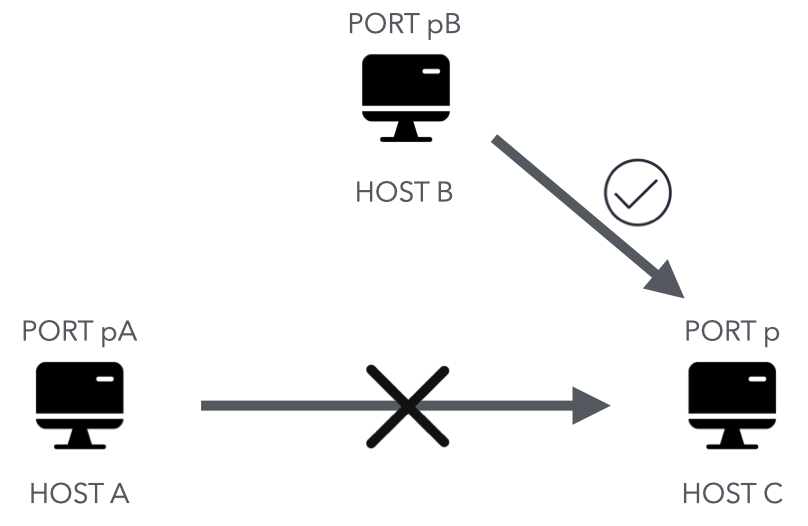
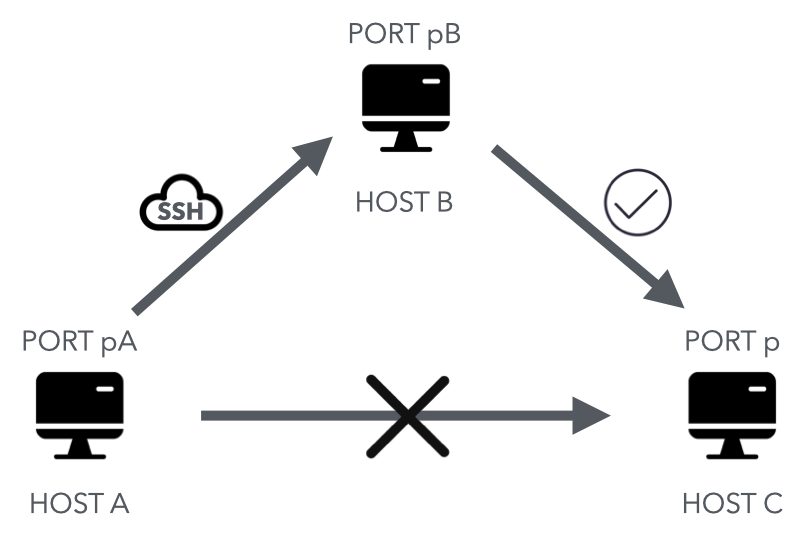
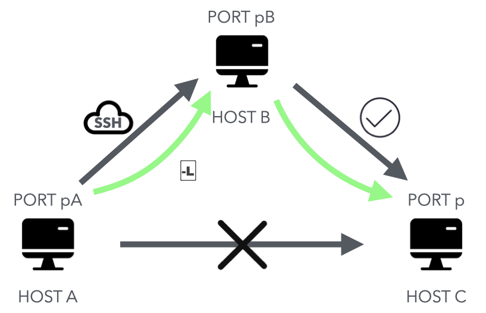
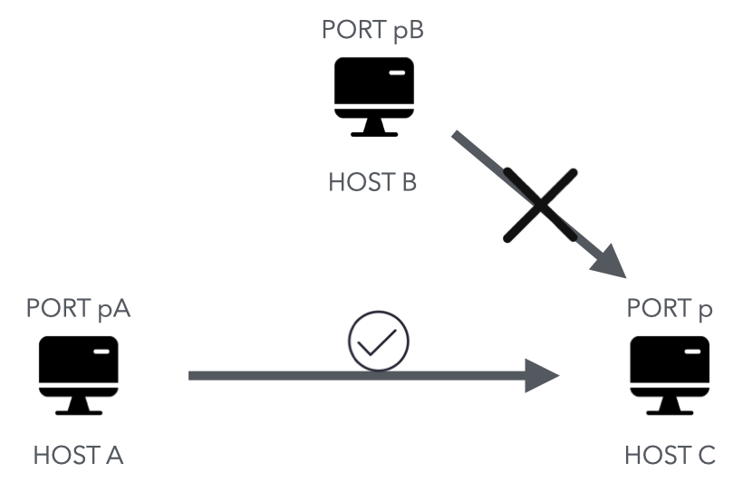
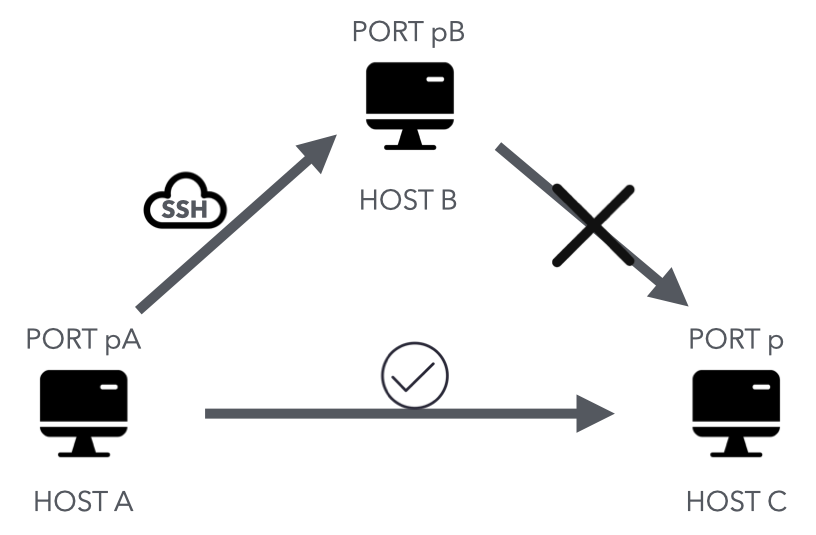
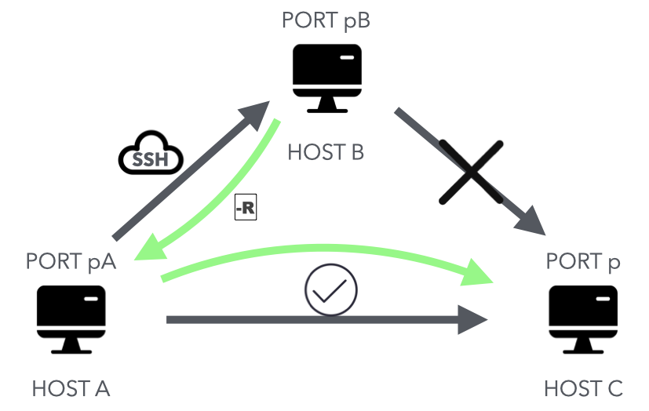

SSH 除了登录服务器，还有一大用途，就是作为加密通信的中介，充当两台服务器之间的通信加密跳板，使得原本不加密的通信变成加密通信。这个功能称为端口转发（port forwarding），又称 SSH 隧道（tunnel）。


本文简单整理了一下 SSH 端口转发的三种基本模式，算是对计算机网络知识的一个小应用。

<!--more-->

SSH端口转发（隧道）功能强大、用途广泛，仅仅一行代码便可以将两台主机联系起来，对特定的访问请求进行代理。

端口转发有两个主要作用：

1. 将不加密的数据放在 SSH 安全连接里面传输，使得原本不安全的网络服务增加了安全性，比如通过端口转发访问 Telnet、FTP 等明文服务，数据传输就都会加密。

2. 作为数据通信的加密跳板，绕过网络防火墙。

端口转发有三种使用方法：本地转发，远程转发，动态转发。

## 本地转发

本地端口转发：将某些应用对于本地主机（ssh 客户端所在主机）某端口的访问请求，转发给另一个可以与它建立 ssh 连接的主机，交由这台主机对目标主机的指定端口发起访问。

一个典型场景是：主机 A 要访问主机 C 的 `p` 端口，但是由于主机 C 的安全策略等因素，A 无法访问 C；而主机 B 可以访问主机 C 的 `p` 端口。如图：



而恰好可以建立起主机 A 到主机 B 的 SSH 通信。此时，A 想要访问主机 C 的 p 端口，就可以先与 B 建立 SSH 通信，借由主机 B 来访问主机 C 的 p 端口。如图：



主机 A 与 B 建立 SSH 通信来访问 C 的 p 端口的过程，可以在主机 A 上使用如下命令：

```bash
ssh -L port_A:address_C:port_C user_from_B@address_B
```



这个命令其实首先还需要建立 A 到 B 的 SSH 连接，即 `ssh user_from_B@address_B`，普通我们会写作 `ssh username@hostname`。运行此命令后，任何对于主机 A 的 `port_A` 的访问都会经由 SSH 转发到 主机 B，再有主机 B 访问 主机 C 的 `port_C` 端口。

命令中的 `port_*` 表示端口，`address_*` 表示主机地址，可以是 IP 地址也可以是同一网段内的主机名。

这个命令的完整形式为：`ssh -L [收听接口:]收听端口:目标主机:目标端口 username@hostname`。命令中方括号内的部分，即第一个参数可以不写；它的默认值一般是 `0.0.0.0`（OpenSSH客户端配置文件 `ssh_config` 中 `GatewayPorts` 选项的值一般为 `yes`），意味着 SSH 隧道会收听所有接口，接受来自任何地址的应用访问请求并进行转发。而如果在此处填写了绑定地址（bind address），SSH 隧道连接就会只处理来自绑定地址的应用请求，而对其他地址发来的请求置之不理；如同在（真实世界的）隧道入口设立哨卡，只对白名单牌号的车辆放行。例如在此处填写 `127.0.0.1`，即可实现只有来自主机A本机的应用请求才被 SSH 隧道转发的效果。

值得注意的是，上文中为了更好地理解转发过程将参与方分为三个主机 A、B、C，实际上，主机 C 与主机 B 可以是同一台主机，而它的端口可能处于某些原因不希望暴露，为了方便外界测试，就可以使用 SSH 端口转发，此时只需要将 `目标主机` 填为 `localhost` 即可。这个 `localhost` 是对于主机 B 来说的。

当设置完成后，就可以通过访问主机 A 的 `port_A` 端口来实现对主机 C 的访问。在主机 A 上，就可以访问 `localhost` 的 `port_A` 端口来完成这一过程。

## 远程端口转发

另外一个场景是：主机 B 需要访问主机 C 的 `p` 端口，但是主机 C 处于某写因素限制了其访问；而主机 A 可以访问 C 的 `p` 端口。如图：



而恰好可以建立主机 A 起到主机 B 的 SSH 通信：



此时，在主机 B 上想要访问主机 C 的 `p` 端口，就可以利用这条 SSH 隧道，这就是远程端口转发。如图：



理解到这一步就没什么问题了。

同样的，这需要在主机 A 上运行下面的命令：

```bash
ssh -R 主机B端口Y:主机C:主机C端口Z username@主机B
```

这个命令同样也会有 `[收听接口:]` 的可选项，与上面的含义相同。同样的，主机 A 与 主机 C 也可以是同一台主机，只需要将上面的 `主机C` 换成 `localhost` 就行。

运行结束后，只需要访问主机 B 的端口 `Y` 就可以实现对主机 C 端口 `Z` 的访问。

## 动态端口转发

动态端口转发可以把本地主机 A 上运行的 SSH 客户端转变成一个 SOCKS 代理服务器；实际上它是一种特殊的本地端口转发，或者说叫它「动态本地端口转发」更科学。这个动态，就动在这种转发不规定目标地址（主机 C）和目标端口（端口 Z），而是去读取应用发起的请求，从请求中获取目标信息。

命令格式如下：

```bash
ssh -D 本机端口X username@hostname
```

这个命令的实际效果就是所有对本机（SSH 客户端）的 `X` 端口的访问都会经由 SSH 隧道转发到主机 `hostname` 上，转发到 `hostname` 后到请求会访问哪里完全取决于这个请求自己。就好像把这个 SSH 客户端变成了一个中转站。

举例来说，主机 A 与主机 B 可以建立一个 SSH 通信，在主机 A 上实现端口 `n` 的转发，即在主机 A 上运行下面的命令：

 ```bash
 ssh -D n username@B
 ```

注意，这种转发采用了 SOCKS5 协议。访问外部网站时，需要把 HTTP 请求转成 SOCKS5 协议，才能把本地端口的请求转发出去。所以在主机 A 上可以有如下对于相应端口的访问：

```bash
curl -x socks5://localhost:n http://www.example.com
```

这个 HTTP 请求会使用 SOCKS5 协议被转发到主机 B 上，然后使用主机 B 实现对 `http://www.example.com` 的访问。

## `-N` 参数

上面使用到的命令首先都会建立起 SSH 通信，默认这个通信隧道建立后是会登录 Shell 的，这样可以执行远程命令。但是使用端口转发时我们一般不需要登录 Shell，这时可以使用 `-N` 参数，表示这个 SSH 连接只进行端口转发，不登录远程 Shell，不能执行远程命令，只能充当隧道。

## 端口转发的停止

SSH 端口转发完全基于基本的 SSH 连接，因此，通过在远程终端上执行 `exit` 命令、暴力关闭本地终端窗口、远程主机 B 关机、本地主机 A 关机等可以切断 SSH 连接的方式，即可停止 SSH 端口转发。

## 实例

下面看两个端口转发的实例。

### 简易 VPN

VPN 用来在外网与内网之间建立一条加密通道。内网的服务器不能从外网直接访问，必须通过一个跳板机，如果本机可以访问跳板机，就可以使用 SSH 本地转发，简单实现一个 VPN。

```shell
ssh -L 2080:corp-server:80 -L 2443:corp-server:443 tunnel-host -N
```

上面命令通过 SSH 跳板机，将本机的 `2080` 端口绑定内网服务器的 `80` 端口，本机的 `2443` 端口绑定内网服务器的 `443` 端口。

### 两级跳板

端口转发可以有多级，比如新建两个 SSH 隧道，第一个隧道转发给第二个隧道，第二个隧道才能访问目标服务器。

首先，在本机新建第一级隧道。

```bash
ssh -L 7999:localhost:2999 tunnel1-host
```

上面命令在本地 `7999` 端口与 `tunnel1-host` 之间建立一条隧道，隧道的出口是 `tunnel1-host` 的 ` localhost:2999`，也就是 `tunnel1-host` 收到本机的请求以后，转发给自己的 `2999` 端口。

然后，在第一台跳板机（`tunnel1-host`）执行下面的命令，新建第二级隧道。

```bash
ssh -L 2999:target-host:7999 tunnel2-host -N
```

上面命令将第一台跳板机 `tunnel1-host` 的 `2999` 端口，通过第二台跳板机 `tunnel2-host`，连接到目标服务器 `target-host` 的 `7999` 端口。

最终效果就是，访问本机的 `7999` 端口，就会转发到 `target-host` 的 `7999` 端口。

### 访问虚拟机

在我的mac上创建了一些ubuntu虚拟机，最开始用来学习 k8s，但是当我在这些虚拟机上提供了一些服务后，却发现无法通过外网测试访问这些服务。

虚拟机默认的网络模式是共享模式，mac相当于网关，虚拟机是mac的内网，外网是无法访问这些虚拟机的。

为什么不把虚拟机网络设置为桥接模式呢？主要是为了方便管理。

为了访问这些虚拟机，我使用SSH端口转发，在mac上执行下面的命令：

```bash
ssh -L 7999:172.17.0.1:80 root@172.17.0.1
```

上面命令将本机的 `7999` 端口绑定到虚拟机提供服务的 `80` 端口，这样就可以通过 `http://localhost:7999` 访问虚拟机了。当然事先要让ssh服务器监听 `80` 端口。

## 参考资料

知乎上[这篇文章](https://zhuanlan.zhihu.com/p/148825449)写得很好，举了更多例子。阮一峰老师的[SSH 教程](https://wangdoc.com/ssh/)也有相关讲解，非常通俗易懂。