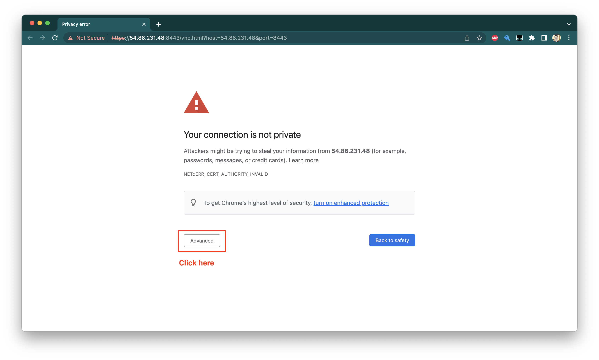
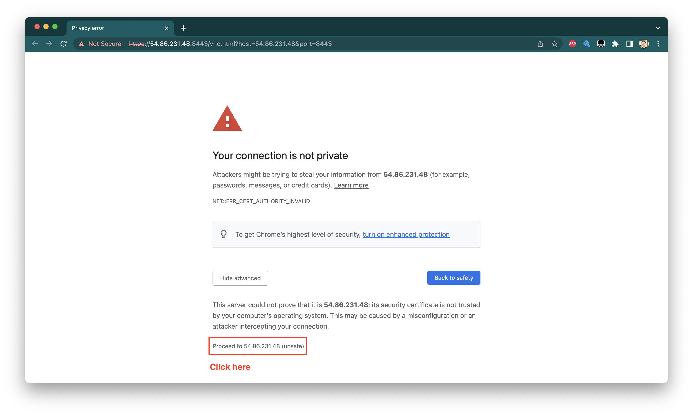
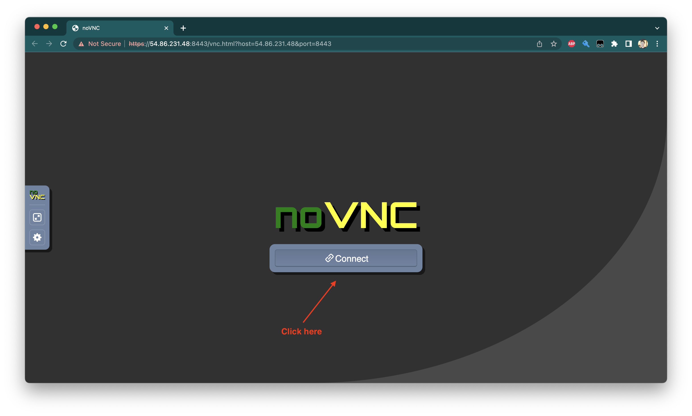
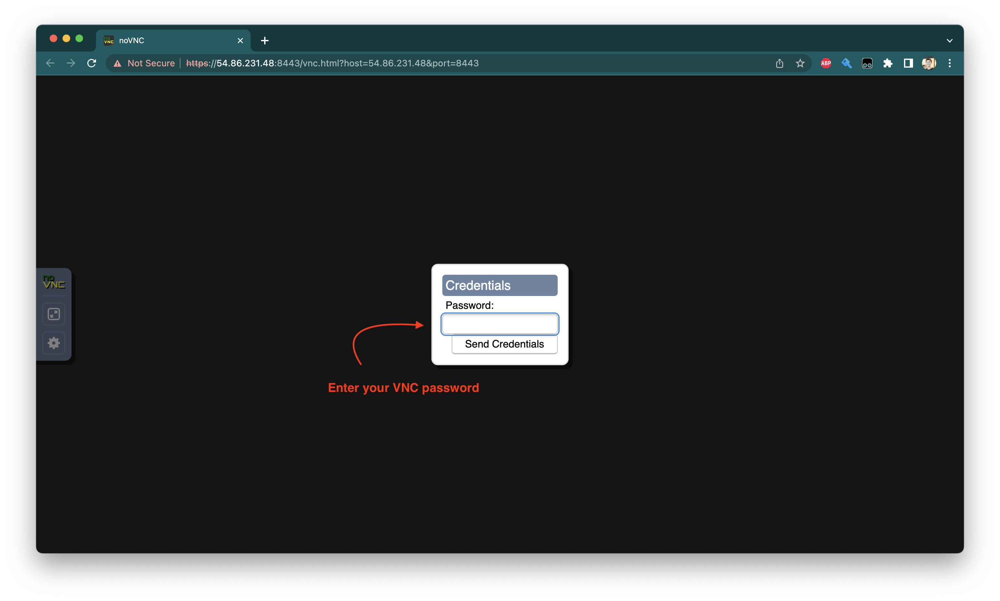
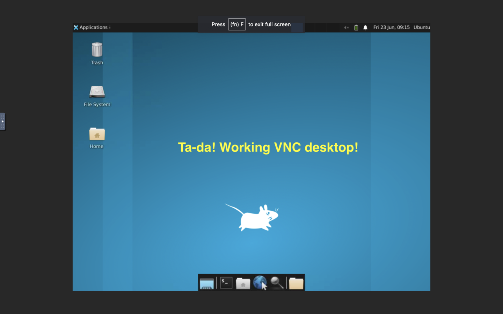

这个指南将向您展示如何设置一个运行 VNC 服务器和 noVNC 代理的 Ubuntu 22.04 EC2 实例。该代理允许您通过 Web 浏览器（或其他端口）访问 VNC 会话，同时也允许使用 SSL 证书加密会话！

<!--more-->

## 初始设置

创建 VPC，设置安全组，启动带有 Ubuntu 22.04 的 EC2 实例，并确保你将实例设置为公共 IP，因为稍后需要它来测试 noVNC。

以上操作完成后，将开始安装所需工具。

## 运行更新

更新 Ubuntu：

```shell
sudo apt-get update
sudo apt-get -y upgrade
```

## 安装桌面环境

我们会为每个用户在显示器上安装轻量级的 XFCE 桌面环境（不推荐像 gdm 这样沉重的显示管理器）：

```shell
sudo apt-get install -y xfce4 xfce4-goodies
```

## 安装一个 VNC 服务器

获取 VNC 服务器：
```shell
sudo apt-get install -y tightvncserver
```

运行 VNC 服务器并设置登录密码：

```shell
vncserver
```

运行过程案例展示（为了不与他人共享 VNC 会话，因此不创建只读密码）：

```shell
~$ vncserver

You will require a password to access your desktops.

Password:
Warning: password truncated to the length of 8.
Verify:
Would you like to enter a view-only password (y/n)? n
xauth:  file /home/ubuntu/.Xauthority does not exist

New 'X' desktop is ip-172-31-28-185:1

Creating default startup script /home/ubuntu/.vnc/xstartup
Starting applications specified in /home/ubuntu/.vnc/xstartup
Log file is /home/ubuntu/.vnc/ip-172-31-28-185:1.log
```

## 更新你的 `xstartup` 文件

默认的 `xstartup` 文件在 vncserver 启动时不会运行 XFCE，所以需提前备份现有文件：

```shell
cd .vnc
cp xstartup xstartup.bak
```

使用文本编辑器（如 vim）打开 `xstartup` 文件：

```shell
vim xstartup
```

>**注意**：我们现在还在 `.vnc` 目录下。

现在，清除文件的现有内容，并粘贴以下三行：

```shell
#!/bin/bash
xrdb $HOME/Xresources
startxfce4 &
```

以上操作完成后，在 VNC 服务器启动时将自动启动 XFCE。

## 安装 noVNC

网页浏览器访问 VNC 需要 noVNC 代理。获取 noVNC 的最佳方式是直接从 noVNC GitHub 仓库获取，而不是通过 Ubuntu 的 package repository。在获取仓库之前，先回到 ubuntu 用户的主目录：

```shell
cd ~/
git clone https://github.com/novnc/noVNC.git
```

在 `noVNC` 文件夹内创建一个新的自签名证书，以便通过 HTTPS 连接：

```shell
cd noVNC
openssl req -new -x509 -days 365 -nodes -out self.pem -keyout self.pem
```

可以忽略 openssl 要求我们填写的字段（因为这里仅为测试目的生成自签名证书）。如果想将桌面公开，可以用证书颁发机构（CA）如 letsencrypt 颁发的证书来替换。

```shell
~/noVNC$ openssl req -new -x509 -days 365 -nodes -out self.pem -keyout self.pem
..........+......+......+.....+...............+.......+...+..+...+.......+++++++++++++++++++++++++++++++++++++++++++++++++++++++++++++++++*...+..+...+...+.+...+......+..+...+....+..+......+....+.........+.....+....+...+..+.............+...+...............+.....+.+.....+...+...+....+......+.....+.......+.....+...+............+...+...+.+...........+.......+...........+......+.+...+..+...+....+..+.+.....+.......+...+...+..+...+....+...+............+.....+...+...+++++++++++++++++++++++++++++++++++++++++++++++++++++++++++++++++*.........................+.+......+..+...+....+......+.....+.......+...+..+................+..+..........+..+...+.........+...+.......+......+..+.+.....+.+......+.........+...........+.......+....................+.+............+..+.+...........+...+.+......+...........+...+.........+...+...........................+.......+...+......+............+.....+...+....+..+.+........+.+.....+.+.....+...+....+..+...+......+......+.........+.........+.+.........+..+....+..+....+....................+.+..............+......+...+.+...+.....+............+.+.....+.......+..+.+...+..+....+...+..+....+..+...+..........+...............+.....+.+........+.+...........+......+...+....+......+.....+......+..........+...+.....+..........+...+............+..+...+.+.....+..........+.................+.......+..+.+...+...........+.....................+....+...+...+.........+...+..+.........+......+.+..+...+...+......+......+.............+..+..........+...+.........+...........+.+......+..+......+....+.....+.+......+.........+..+...+.......+..+............+.+...+.....+....+..+...+.+.........+..+....+..+...+.+...+............+...+.....+.+.....+.........+...+.......+...+.....+.........+....+.....+.....................+...+.......+.........+..+.........+.+..+......+...............................+......+..................+...........+..........+...+............+...+....................+.+.....+.+..............+.+..................+.....+.+..+....+........+...+............+..........+............+......+..+.+..+....+...+.....+......+.+.........+.........+........+.......+..+...+.......+++++++++++++++++++++++++++++++++++++++++++++++++++++++++++++++++
...+.+........+.......+..+.+..+............+++++++++++++++++++++++++++++++++++++++++++++++++++++++++++++++++*...+....+...........+.......+...+..+...+...+....+..+.........+.+.....+.+..+.+.....+.+.....+.+....................+...+..........+......+...............+...+++++++++++++++++++++++++++++++++++++++++++++++++++++++++++++++++*....+.........+............+..+...+...+....+..+....+......+.....+...+.......+...+..+.+.............................+...+...+.......+..+....+.....+.+........+.+.....+...............+......+....+......+...........+....+..................+......+..+...............+...+.+...........+....+........+......+......+.........+.+...+..+......+...+.+...+..+.........+....+..+.............+.....+.............+...+......+++++++++++++++++++++++++++++++++++++++++++++++++++++++++++++++++
-----
You are about to be asked to enter information that will be incorporated
into your certificate request.
What you are about to enter is what is called a Distinguished Name or a DN.
There are quite a few fields but you can leave some blank
For some fields there will be a default value,
If you enter '.', the field will be left blank.
-----
Country Name (2 letter code) [AU]:
State or Province Name (full name) [Some-State]:
Locality Name (eg, city) []:
Organization Name (eg, company) [Internet Widgits Pty Ltd]:
Organizational Unit Name (eg, section) []:
Common Name (e.g. server FQDN or YOUR name) []:
Email Address []:
```

## 让 VNC 更易于使用

为了方便，需要创建 `start.sh` 脚本。此脚本的目标是：

在显示器 1（端口 `5901`）上启动我们的 vncserver。
启动 noVNC 并告诉它将端口 `8443` 的流量转发到端口 `5901`。
等待启动脚本被终止（使用 `Ctrl+C`），之后再关闭 vnc 服务器。
**为什么使用 `8443`？**因为它是一个高端口号，因此使用此端口无需根权限。

`start.sh` 脚本如下:

```shell
#!/bin/bash
IP=$(curl -s http://169.254.169.254/latest/meta-data/public-ipv4)
echo "Connect with https://$IP:8443/vnc.html?host=$IP&port=8443"
vncserver :1
~/noVNC/utils/novnc_proxy --vnc localhost:5901 --listen 8443
vncserver -kill :1
```

主目录中保存该脚本，然后运行：

```shell
chmod u+x start.sh
```

现在，无论何时启动 VNC 会话，只需运行：

```shell
screen
./start.sh
```

我们首先输入`screen`来启动一个 screen 会话，这将允许我们在后台保持脚本运行，即使我们退出了当前的 shell。

可获得类似如下输出:

```shell
~$ ./start.sh
Connect with https://54.86.231.48:8443vnc.html?host=54.86.231.48&port=8443

New 'X' desktop is ip-172-31-28-185:1

Starting applications specified in /home/ubuntu/.vnc/xstartup
Log file is /home/ubuntu/.vnc/ip-172-31-28-185:1.log

Using local websockify at /home/ubuntu/noVNC/utils/websockify/run
Starting webserver and WebSockets proxy on port 8443
/home/ubuntu/noVNC/utils/websockify/websockify/websocket.py:31: UserWarning: no 'numpy' module, HyBi protocol will be slower
  warnings.warn("no 'numpy' module, HyBi protocol will be slower")
WebSocket server settings:
  - Listen on :8443
  - Web server. Web root: /home/ubuntu/noVNC
  - SSL/TLS support
  - proxying from :8443 to localhost:5901


Navigate to this URL:

    http://ip-172-31-28-185:8443vnc.html?host=ip-172-31-28-185&port=8443

Press Ctrl-C to exit
```

>**忽略底部的那一行**。vncserver 和 noVNC 不知道 EC2 实例的公共 IP，所以尝试自动生成使用私有 IP 签署 URL。这不影响。相反，**使用脚本输出开头的 URL**，里面有“Connect with https://$IP:8443/vnc.html?host=$IP&port=8443″。

在 EC2 实例连接和本地 SSH 会话中，单击左键或 `Ctrl`+`单击`该 URL 在浏览器中直接打开它。

## 样例展示

因该样例使用的是自签名证书，所以访问 VNC 会话时会收到一些警告。下面是来自 Google Chrome 的样例：




点击“**Advanced**”，即可进入下一步：





点击如图所示的链接，并用之前设置的 VNC 密码登录：



输入完成后，即可访问运行 VNC 桌面：



## 可选的增强功能

按需选择增强功能，可使 noVNC 更快。

### 加速 noVNC

noVNC 的一部分依赖 Python 的 numpy 包加速，建议安装软件包：

```shell
sudo apt-get install -y python3-pip
pip3 install numpy
```

### 安装网页浏览器

Ubuntu Server 不包含 Web 浏览器，而 XFCE 也不会自动安装。若想在 XFCE 会话中浏览网页或查看文档，需通过安装 Firefox 来解决，然而，默认情况下，Ubuntu 22 会使用 snap 包来安装 Firefox，而一些权限问题会阻止 `snap` 包在 VNC 会话中正常工作。我们需要从 `apt` 包中安装 Firefox。解决方案请参考如下操作（该操作步骤取自这篇博客）。

```shell
sudo snap remove firefox
```

然后：

```shell
sudo add-apt-repository ppa:mozillateam/ppa
```

确保新的包优先于默认的 `snap` 包，使用：

```shell
echo '
Package: *
Pin: release o=LP-PPA-mozillateam
Pin-Priority: 1001
' | sudo tee /etc/apt/preferences.d/mozilla-firefox
```

确保无人值守的升级可以工作：

```shell
echo 'Unattended-Upgrade::Allowed-Origins:: "LP-PPA-mozillateam:${distro_codename}";' | sudo tee /etc/apt/apt.conf.d/51unattended-upgrades-firefox
```

最后，我们可以运行安装：

```shell
sudo apt-get install -y --allow-downgrades firefox
```

命令中的 `--allow-downgrades` 是因为如果在此之前已经安装了 Firefox `snap` 包，`apt` 可能将其视为试图进行降级操作。

操作完成后，便可使用 EC2 桌面，可以通过 `8843` 端口的网页浏览器访问。

## 后记

>原文链接：[使用 noVNC 通过浏览器访问 Ubuntu 22 桌面的构建方法](https://aws.amazon.com/cn/blogs/china/how-to-build-access-to-the-ubuntu-22-desktop-through-a-browser-using-novnc/)
