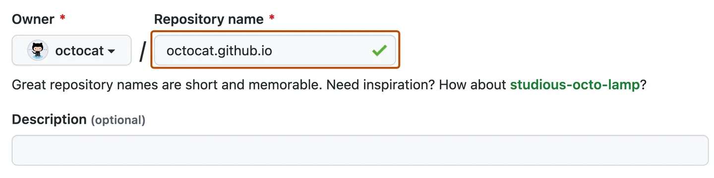
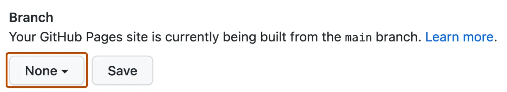

为什么写这篇看起来很小众的文章? 其实也只是想着记录一下自己的操作过程. 这个过程说实话还是很繁琐的, 因为碰到任何不懂的地方都要从头开始查起, 在查资料的过程中又会遇到不懂的名词, 又会再去查, 活像人肉递归. 不过总体而言, 折腾linux的过程还是很欢乐的, 真的能学到不少的东西, 而且学到的东西也能很快得到检验, 正负反馈都很及时, 能清楚地感到自己在进步.

几年前的我还没想过要深耕计算机领域. 那时的我只是喜欢“理论研究”. 不得不说, 我的确很享受站在高层理论指导实践, 而对这种应用性过强的技能曾经看不上眼. 我怎么一步一步踏进计算机技术的世界的呢? 我自己说不清, 但感觉上是被信息时代推着走进的. 不过如今我其实也很享受现在的学习, 对自己掌握的技术保持骄傲, 对不了解的技术、理论保持好奇.

apple刚发布m1芯片的macbook的时候, 我刚好在那种对计算机不感兴趣的阶段. 网络上铺天盖地地夸macbook的优秀, 我并没有被骗, 我认识到了m1的不足, 那就是软件生态差. 但是我当时作为数学系的学生, 我的需求就只是它可以跑matlab、mathematica, 平时写论文, 查资料. 而这些它都能满足. 我就高兴地下单了. 在相当长的时间内, 它的确没有辜负我, 用起来很舒适. 但是现在我开始了解计算机技术了, 尤其是专注学习深度学习领域后, 我才清楚地看到" 软件生态差 "的真正含义. 于是在折腾的过程中受了不少苦. 虽然也学到了不少, 但是的确苦.

文章的几个系列就记录一下在我的这台arm(arrch) mac上折腾的各种应用过程吧. 技术都是从网上学来的, 现在我来回馈一下网络.

<!-- more -->

## hexo简介

会阅读这篇文章的大概是不需要这种介绍的, 因为来阅读的目的性都很强. 直接贴一个官网介绍: 

> Hexo 是一个快速、简洁且高效的博客框架。Hexo 使用 Markdown（或其他标记语言）解析文章，在几秒内，即可利用靓丽的主题生成静态网页。

官网: [hexo中文](https://cn.bing.com/search?q=hexo&qs=n&form=QBRE&sp=-1&lq=0&pq=hexo&sc=10-4&sk=&cvid=7D78F1704A3740C4B6E1442A88131A99&ghsh=0&ghacc=0&ghpl=#)

除了hexo, 还有很多可以用于搭建个人博客的网站, 各有长短. hexo最大的优点就是操作简单, 学习成本低(对于没有web开发经验的人来说, 只要稍微了解markdown就可以). 缺点是只能生成静态网站.

## 安装

其实没有什么坑. 对于我们国内arm用户来说, 最大的困难其实依然是网络问题(需要设置镜像), 其次才是arm架构兼容问题. 就hexo的安装来说, arm架构不成问题.

常规安装一样, 要用到apt或者yum等管理软件前先更新(以ubuntu apt 为例):

```shell
sudo apt update -y && sudo apt upgrade -y
```

### 环境搭建 ::参考[https://github.com/nodesource/distributions/blob/master/README.md](https://github.com/nodesource/distributions/blob/master/README.md)使用PPA安装最新版

1. node.js
   
   仅需要一行:

   ```shell
   sudo apt install nodejs -y
   ```

   一般`-y`参数只是为了不用确认直接安装. 

   但是默认安装的版本（v12.x.x）都比较旧，跟最新稳定版都差了好几代。待会再来更新它。

2. npm

   如果上面使用的是命令行直接包管理器安装的话，还需要单独安装npm.
   
   先安装:

   ```shell
   sudo apt install npm
   ```

   可以加上`-y`. 国内要配镜像源:

   ```shell
   npm config set registry https://registry.npmmirror.com
   ```

   用的是淘宝的源, 速度非常快.

   现在可以安装npm的n模块。n模块是专门用来管理nodejs的版本，通过它可以升级node的版本。

   ```shell
   npm cache clean -f # 已弃用
   npm install npm -g
   npm install n -g
   ```

   n模块升级node有不同的选择：

   ```shell
   n lts       # 长期支持版
   n latest    # 最新版
   n 14.17.0   # 指定版本
   n stable    # 最新稳定版
   ```

   大费周章升级node主要是为了更好在博客中支持不同的内容，比如数学公式。如果博客仅仅需要展示文字、代码、图片之类的基本markdown内容就不必费功夫了。

3. git
   
   一般linux发行版都自带git. 验证一下:

   ```shell
   git --version
   ```

   输出:

   ```shell
   git version 2.34.1
   ```

   就没有问题. 要是不能识别git, 就有问题. 安装也很简单: 

   ```shell
   sudo apt install git-all
   ```
   
4. css  ::无效
    
   如果不需要安装主题，那么就可以直接使用了，新建文件就可以显示出来。但是默认主题观感是在一般。我自己在使用时就想要换个主题看看，但是安装好主题之后不能直接运行，提示缺少css模块，所以这里一并安装了：

   ```shell
   sudo apt install css
   ```

### hexo安装
   
   最后安装hexo. 对于新手来说, 只要使用下面的命令:

   ```shell
   npm install -g hexo-cli
   ```

   按照官网的说法，如果是进阶用户可以局部安装：

   ```shell 
   npm i hexo
   ```

   一般用户还是老老实实用`-g`吧。
   
   一般启动hexo格式是

   ```shell
   # npx hexo <command>
   ```

   这多少有点麻烦. 可以写入环境变量:

   ```shell
   echo 'PATH="$PATH:./node_modules/.bin"' >> ~/.profile
   ```

   那么就可以直接启动hexo了:

   ```shell
   # hexo <command>
   ```

   我们还希望能够使用工具方便地部署到github,所以安装：

   ```shell
   npm install hexo-deployer-git --save
   ```

   ### 版本问题

   | Hexo 版本 |	最低版本 (Node.js 版本) |	最高版本 (Node.js 版本)|
   | :--:   | :--:       | :--:   |
   |7.0+    | 14.0.0     | latest |
   |6.2+ 	| 12.13.0    | latest |
   |6.0+    | 12.13.0    | 18.5.0 |
   |5.0+    | 10.13.0    | 12.0.0 |
   |4.1 - 4.2 	| 8.10   | 10.0.0 |

## hexo的使用

hexo的操作非常简单，除开初始化的1条命令，只要知道4个基本命令就，分别是：

```shell
hexo i  # 初始化，完整命令hexo init
hexo cl # 清楚缓存，完整命令hexo clean
hexo g  # 生成配置，完整命令hexo generate
hexo s  # 本地调试，完整命令hexo server
hexo n <title> # 新建文章，完整命令hexo new <titile>
```
几个命令构成了完整的工作流程。

下面是具体操作：

### 初始化

hexo搭建个人博客网站所需要的全部资源与内容都在同一个文件夹下。初始化时需要在一个空文件夹下进行，后续的操作也都要在同一个文件夹下。这样的好处是如果不小心把环境搞坏了只要删掉文件夹重新建一个就行，互不影响。比如，下面我在用户根目录新建了一个`blog`文件夹，并初始化：

```shell
mkdir ~/blog
cd ~/blog
hexo init
```

一步一步做到这里应该不会有问题。此时我们可以验证一下，输入命令：

```shell
hexo g && hexo s
```

在浏览器中输入`localhost:4000`应该就可以看到初始化的界面了。

### 编写博客

首先展示在上一步中生成的大致的文件目录结构：

```shell
├── _config.yml
├── package.json
├── scaffolds
├── source
|   └── _posts
└── themes
```

当想要新建一篇文章时，就可以使用：

```shell
hexo n 'my article'
```

这样会在`source/_posts`目录下生成一个`my article.md`文件，这个文件的内容就是博客内容。文件中需要展示图片，可以在`source`文件夹下新建`image`文件夹，在文章中的索引路径改为`image/...`即可。

编辑内容可以使用任意的编辑器，只要符合markdown语法即可。要注意的是hexo默认支持的语法十分初级。如果有高级需求可以尝试更换渲染引擎。不再赘述。

文件开头有几个常用的属性，列举如下：

```json
title: text       # 文章标题
date: time        # 文章发表时间
tags: text        # 标签
description: text # 内容简介
```

具体使用例如：

```markdown
---
title: 在arm mac上搭建hexo并部署
date: 2023-06-06 23:08:52
tags: hexo
---
```

### 美化

现在回看博客所在文件夹的结构，有一个`_config.yml`文件，负责hexo全局配置，就称之为“全局配置文件”。有这么几个选项值得关注一下：

```yml
title: Hexo       # 网站标题 
subtitle: ''      # 子标题
description: ''   # 网站描述
keywords:
author: John Doe  # 网站所有者，版权声明相关
language: en      # 中文改为zh-CN
timezone: ''

...

theme: landscape  # 主题

...

deploy:           # 部署
  type: ''
```

各个名称基本都是见名知意。默认主题比较一般，hexo有很多第三方主题，可以在[官网](https://hexo.io/themes/)查看。可以进入相中的主题的github页面，根据提示安装配置。一般来说是下面的命令：

```shell
git clone https://github.com/<themerepo>/<theme>.git themes/<theme> --depth=1
```

其中`depth`参数的意思是设置克隆历史为1，节省内存。比如我使用的next主题：

```shell
git clone https://github.com/next-theme/hexo-theme-next themes/next --depth=1
```

以防止第一次使用git,记得设置：

```shell
git config --global user.name "yourname"
git config --global user.email "youremail@example.com"
```

github可能访问比较慢，这不是你的问题。等待下载完成后，就会在`themes`目录下看到`next`文件夹，它的大致结构是：

```shell
next
├── _config.yml
├── package.json
├── source
|   ├── css
|   ├── images
|   └── js
└── test
```

这里的`_config.yml`主要控制主题的行为，它有几个值得注意的属性：

```yml
# Schemes
#scheme: Muse
#scheme: Mist
scheme: Pisces
#scheme: Gemini

...

menu: 
  about: /about/ || fa fa-user
  home: / || fa fa-home
  archives: /archives/ || fa fa-archive

...

avatar:
  url: images/avatar.png
  rounded: true
  rotated: true

...

social:
  GitHub: https://gitee.com/aakashi || fab fa-github
  E-Mail: mailto:yourname@gmail.com || fa fa-envelope
  ...

...

footer:
  ...
  # Powered by Hexo & NexT
  powered: false

```

应该不难懂，这里直接放了我的一些配置。但是值得注意的是，一些图片资源比如头像最好放在主题目录下的`source/images`里，方便管理。在文章中也可以直接使用`images`表示主题目录下的文件，`iamge`表示根目录下的文件资源。

运行检验：

```shell
hexo cl
hexo g
hexo s
```

## 部署到github

在github上创建一个仓库，这个仓库名称必须是`<yourname>.github.io`，比如：



名字里的大些字母全部换成小写。

创建好后在本地运行部署，首先在全局配置的 `_config.yml` 中添加以下配置：

```yml
deploy:
  type: git
  repo: https://github.com/<username>/<username>.github.io
  # example, https://github.com/hexojs/hexojs.github.io
  branch: main
```

然后安装部署工具：

```shell
npm install hexo-deployer-git --save
```

随后运行:

```shell
hexo cl && hexo d
```

第一次部署可能需要输入github的账号密码。部署成功后在仓库设置页面找到"Pages"，找到“Build and deployment"中的“Branch”：



选择“main”后点击“save”，此时可以访问`<username>.github.io`，应该可以成功，如果看不到页面，可也等十分钟再试。如果仍然失败，可以参阅[github官方指南:About Jekyll build errors for GitHub Pages sites](https://docs.github.com/en/pages/setting-up-a-github-pages-site-with-jekyll/about-jekyll-build-errors-for-github-pages-sites)。

## 后记

关于个人博客的搭建, 网上的教程是饱和的. 我的这篇文章不优秀, 但也算是合格的实操文，该有的原理介绍也都有. 目前没有能力产出顶级水平的教程文, 但是我想一步一个脚印, 提升自己, 展望未来.

## 转移

个人因为用的是虚拟机，而且常常出于学习目的折腾很多东西，会把虚拟机环境折腾得一团遭（这也是为什么我想用虚拟机而不是直接在主机上）。这时候需要重装系统。转移自己的博客需要的资料是：

- blog所在文件夹整体。至少需要`./source/_post`下的文章，`./source/image`的图片，`./source/about`的主页。
- `~/.ssh/`下的密钥文件`github`、`github.pub`，和`known_hosts`，`config`文件。属于git配置，为了不要重新搞一遍的麻烦。
- `npm install hexo-deployer-git --save`

## in Docker

20241103折腾了一周算是成功将hexo所需的所有程序转移到了docker中。其实完全可以直接用官方的hexo镜像来着，但还是自己写了Dockerfile自己做了，也不知道自己怎么想的。

主要了解了[Docker容器数据持久化存储](/2024/10/28/Docker容器数据持久化存储-volume/index.html)和[linux用户权限管理之uid&user namespace](/2023/10/06/Linux不基础用法/index.html)两个主题。最终遇到的问题还是出在了git或者说是ssh上。主要是因为自己不想重新生成密钥，因此想复用原有的密钥文件，结果这样的话在容器中git push不能自动使用原本有用的config文件，也就是没用我给的密钥文件，所以一直push不了。很奇怪，即便是用了uid映射也不行。

[好在最后解决了。](/2024/11/03/将hexo转移到docker中/index.html)


## 评论功能

[depreated]