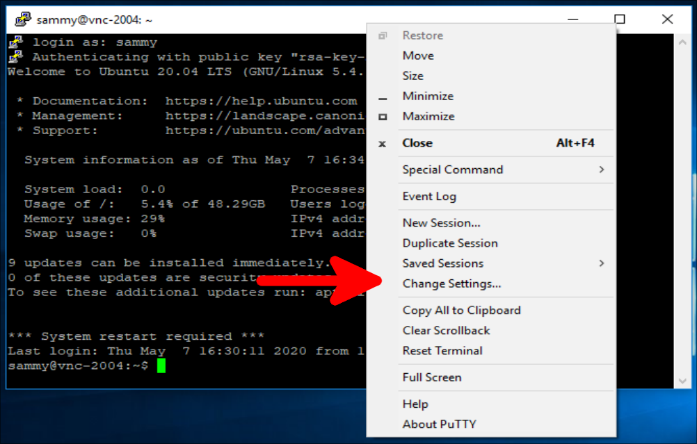
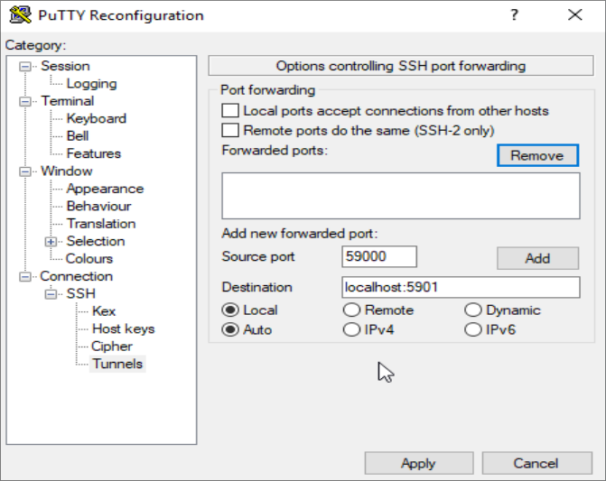
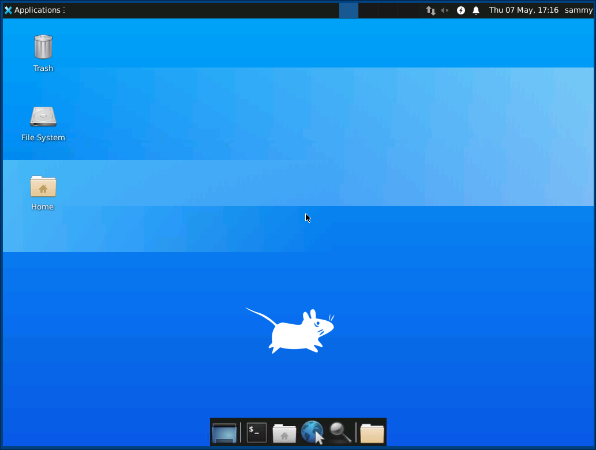
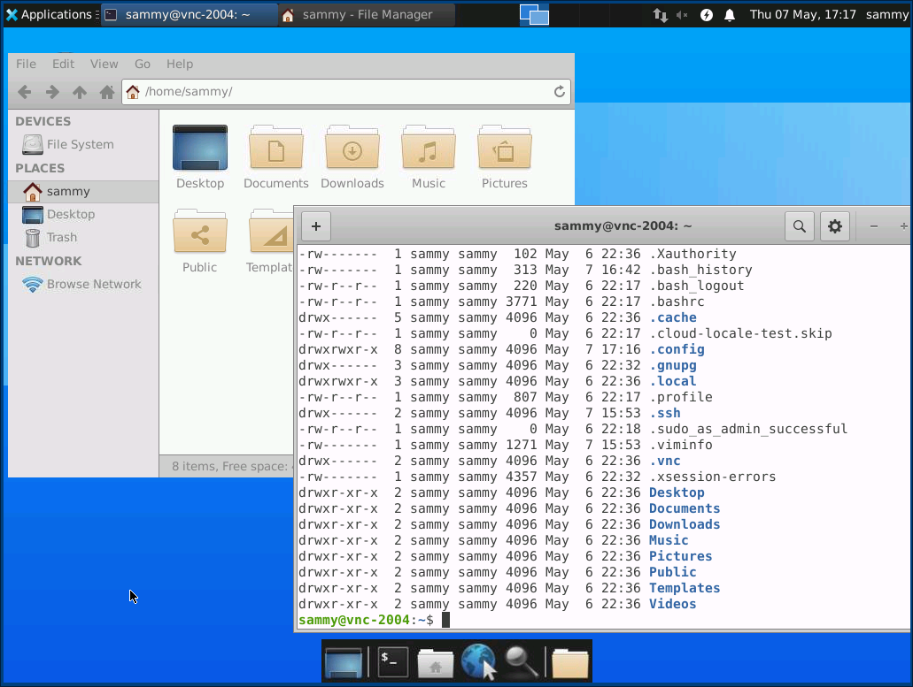

*虚拟网络计算* 或 **VNC** 是一种连接系统，允许您使用键盘和鼠标与远程服务器上的图形桌面环境进行交互。对于还不熟悉命令行的用户，它可以更轻松地管理远程服务器上的文件、软件和设置。

在本指南中，您将在 Ubuntu 22.04 服务器上使用[TightVNC](https://www.tightvnc.com/) 设置 VNC 服务器，并通过 SSH 隧道安全地连接到它。然后，您将在本地计算机上使用 VNC 客户端程序通过图形桌面环境与您的服务器进行交互。

<!--more-->

## 准备
要完成本教程，您需要：

- 一台 Ubuntu 22.04 服务器，具有非 root 管理用户和配置了 UFW 的防火墙。要进行设置，请按照我们的 [Ubuntu 22.04 初始服务器设置指南](https://www.digitalocean.com/community/tutorials/initial-server-setup-with-ubuntu-22-04)进行操作。
- 安装了 VNC 客户端的本地计算机。您使用的 VNC 客户端必须支持通过 SSH 隧道的连接：
- 在 Windows 上，您可以使用 [TightVNC](https://www.tightvnc.com/)，[RealVNC](https://www.realvnc.com/)，或者[UltraVNC](https://www.uvnc.com/)。
- 在 macOS 上，您可以使用内置的 [Screen Sharing](https://support.apple.com/guide/mac-help/screen-sharing-overview-mh14066/mac)功能，或者使用跨平台的app，比如 [RealVNC](https://www.realvnc.com/)。
- 在 Linux 上，您可以从许多选项中进行选择，包括 `vinagre`，`krdc`，[RealVNC](https://www.realvnc.com/)，或者[TightVNC](https://www.tightvnc.com/)。

## Step 1 — 安装桌面环境和 VNC 服务器
默认情况下，Ubuntu 22.04 服务器没有安装图形桌面环境或 VNC 服务器，因此您将从安装它们开始。

当涉及到您选择哪个VNC服务器和桌面环境时，您有很多选择。在本教程中，您将安装最新 [Xfce](https://xfce.org/) 桌面环境的软件包和官方Ubuntu存储库提供的TightVNC软件包。Xfce和TightVNC都以轻量级和快速而闻名，这将有助于确保即使在较慢的互联网连接上，VNC连接也将保持平稳和稳定。

使用 SSH 连接到您的服务器后，更新您的软件包列表：

```shell
sudo apt update
```

现在安装 `Xfce`，和包含一些针对桌面环境的增强功能的 `xfce4-goodies`：

```shell
sudo apt install xfce4 xfce4-goodies
```

安装期间，系统可能会提示您为 Xfce 选择默认显示管理器。显示管理器是一个允许您通过图形界面选择和登录桌面环境的程序。当您连接到 VNC 客户端时，您只会使用 Xfce，并且在这些 Xfce 会话中，您已经以非 root Ubuntu 用户身份登录。因此，就本教程而言，您选择的显示管理器并不重要。选择其中一个，然后按 `ENTER`。

安装完成后，安装 TightVNC 服务器：

```shell
sudo apt install tightvncserver
```

接下来，运行 vncserver 命令设置 VNC 访问密码，创建初始配置文件，并启动 VNC 服务器实例：

```shell
vncserver
```

系统将提示您输入并验证密码以远程访问您的机器：

```shell
OutputYou will require a password to access your desktops.

Password:
Verify:
```

密码的长度必须介于六到八个字符之间。超过 8 个字符的密码将被自动截断。

验证密码后，您可以选择创建仅供查看的密码。使用仅查看密码登录的用户将无法使用鼠标或键盘控制 VNC 实例。如果您想向使用您的 VNC 服务器的其他人演示某些内容，这是一个有用的选项，但这不是必需的。

该过程然后为服务器创建必要的默认配置文件和连接信息。此外，它还会在端口 `5901` 上启动一个默认服务器实例。此端口称为显示端口，VNC 将其称为`:1`。 VNC 可以在其他显示端口上启动多个实例，其中 `:2` 引用端口 `5902`，`:3` 引用 `5903`，依此类推：

```shell
Output
Would you like to enter a view-only password (y/n)? n
xauth:  file /home/sammy/.Xauthority does not exist

New 'X' desktop is your_hostname:1

Creating default startup script /home/sammy/.vnc/xstartup
Starting applications specified in /home/sammy/.vnc/xstartup
Log file is /home/sammy/.vnc/your_hostname:1.log
```

请注意，如果您想要更改密码或添加仅供查看的密码，您可以使用 `vncpasswd` 命令执行此操作：

```shell
vncpasswd
```

此时，VNC 服务器已安装并运行。现在让我们配置它来启动 Xfce 并让我们通过图形界面访问服务器。

## Step 2 — 配置 VNC 服务器

VNC 服务器需要知道在启动时要执行哪些命令。具体来说，VNC 需要知道它应该连接到哪个图形桌面环境。

VNC 服务器在启动时运行的命令位于您的主目录下 `.vnc` 文件夹中名为 `xstartup` 的配置文件中。启动脚本是在上一步运行 `vncserver` 命令时创建的，但您将创建自己的脚本来启动 Xfce 桌面。

因为您要更改 VNC 服务器的配置方式，所以首先使用以下命令停止在端口 `5901` 上运行的 VNC 服务器实例：

```shell
vncserver -kill :1
```

输出将如下所示，但您可能会看到不同的 PID：

```shell
OutputKilling Xtightvnc process ID 17648
```

在修改 `xstartup` 文件之前，请备份原始文件：

```shell
mv ~/.vnc/xstartup ~/.vnc/xstartup.bak
```

现在创建一个新的 `xstartup` 文件并在文本编辑器中打开它，例如 `nano`：

```shell
nano ~/.vnc/xstartup
```

然后将以下行添加到文件中：

```shell
#!/bin/bash
xrdb $HOME/.Xresources
startxfce4 &
```

第一行是 [shebang](https://en.wikipedia.org/wiki/Shebang_(Unix))。在 \*nix 平台上的可执行纯文本文件中，shebang 告诉系统将该文件传递给哪个解释器以供执行。在这种情况下，您将文件传递给 Bash 解释器。这将允许每个连续的行按顺序作为命令执行。

文件中的第一个命令 `xrdb $HOME/.Xresources` 告诉 VNC 的 GUI 框架读取服务器用户的 `.Xresources` 文件。 `.Xresources` 是用户可以更改图形桌面的某些设置的地方，例如终端颜色、光标主题和字体渲染。第二个命令告诉服务器启动 Xfce。每当您启动或重新启动 VNC 服务器时，这些命令都会自动执行。

添加这些行后保存并关闭文件。如果您使用了 `nano`，请按 `CTRL + X`、`Y`，然后按 `ENTER`。

为确保 VNC 服务器能够正确使用这个新的启动文件，您需要使其可执行：

```shell
chmod +x ~/.vnc/xstartup
```

然后重启VNC服务器：

```shell
vncserver -localhost
```

请注意，这次命令包含 `-localhost` 选项，它将 VNC 服务器绑定到服务器的环回接口。这将导致 VNC 只允许来自安装它的服务器的连接。

在下一步中，您将在本地计算机和服务器之间建立 SSH 隧道，实质上是诱使 VNC 认为来自本地计算机的连接源自您的服务器。此策略将围绕 VNC 添加额外的安全层，因为唯一能够访问它的用户是那些已经可以通过 SSH 访问您的服务器的用户。

你会看到类似这样的输出：

```shell
OutputNew 'X' desktop is your_hostname:1

Starting applications specified in /home/sammy/.vnc/xstartup
Log file is /home/sammy/.vnc/your_hostname:1.log
```
配置就绪后，您就可以从本地计算机连接到 VNC 服务器了。

## Step 3 - 安全连接到 VNC 桌面

VNC 本身在连接时不使用安全协议。为了安全地连接到您的服务器，您将建立一个 SSH 隧道，然后告诉您的 VNC 客户端使用该隧道进行连接，而不是建立直接连接。

在您的本地计算机上创建 SSH 连接，安全地转发到 VNC 的 `localhost` 连接。您可以通过 Linux 或 macOS 上的终端使用以下 `ssh` 命令执行此操作：

```shell
ssh -L 59000:localhost:5901 -C -N -l sammy your_server_ip
```

以下是此 `ssh` 命令选项的含义：

- `-L 59000:localhost:5901`：`-L `开关指定给定端口本地计算机 (59000) 将被转发到目标服务器上的给定主机和端口（`localhost:5901`，表示目标服务器上的端口 5901目标服务器，定义为 `your_server_ip`）。请注意，您指定的本地端口有些随意；只要该端口尚未绑定到其他服务，您就可以将其用作隧道的转发端口。
- `-C`：此标志启用压缩，有助于最大限度地减少资源消耗并加快速度。
- `-N`：这个选项告诉`ssh`你不想执行任何远程命令。当您只想转发端口时，此设置很有用。
- `-l sammy your_server_ip`：`-l` 开关让您指定要登录的用户就像您连接到服务器一样。确保将 `sammy` 和 `your_server_ip` 替换为您的非根用户的名称和您的服务器的 IP 地址。

>注意：此命令建立一个 SSH 隧道，将信息从 VNC 服务器上的端口 5901 通过端口 22 转发到本地计算机上的端口 59000每台机器，SSH 的默认端口。假设您遵循了 Ubuntu 22.04 的先决条件初始服务器设置指南，您将添加一个 UFW 规则以允许通过 OpenSSH 连接到您的服务器。
>这比简单地打开服务器的防火墙以允许连接到端口 5901 更安全，因为这将允许任何人通过 VNC 访问您的服务器。通过 SSH 隧道连接，您将 VNC 访问限制在已经具有服务器 SSH 访问权限的机器上。

如果您使用 PuTTY 连接到您的服务器，您可以通过右键单击终端窗口的顶部栏，然后单击 **Change Settings…** 选项来创建 SSH 隧道：



在 PuTTY Reconfiguration 窗口左侧的树形菜单中找到 **Connection** 分支。展开 **SSH** 分支并单击 **Tunnels**。在 **Options controlling SSH port forwarding** 屏幕上，输入 `59000` 作为 **Source Port**，输入 `localhost:5901` 作为 **Destination**，如下所示：



然后单击 **Add** ，然后单击 **Apply** 按钮以实现隧道。

隧道运行后，使用 VNC 客户端连接到 `localhost:59000`。系统将提示您使用在Step 1 中设置的密码进行身份验证。

连接后，您将看到默认的 Xfce 桌面。它应该看起来像这样：



您可以使用文件管理器或从命令行访问主目录中的文件，如下所示：



在您的本地终端中按 `CTRL+C` 停止 SSH 隧道并返回到您的提示符。这也会断开您的 VNC 会话。

现在您可以将 VNC 服务器配置为作为 systemd 服务运行。

## Step 4 - 将 VNC 作为系统服务运行

通过将 VNC 服务器设置为作为 systemd 服务运行，您可以根据需要启动、停止和重新启动它，就像任何其他服务一样。您还可以使用 systemd 的管理命令来确保 VNC 在服务器启动时启动。

首先，创建一个名为 `/etc/systemd/system/vncserver@.service` 的新单元文件：

```shell
sudo nano /etc/systemd/system/vncserver@.service
```

名称末尾的 `@` 符号将让我们传递一个您可以在服务配置中使用的参数。您将使用它来指定管理服务时要使用的 VNC 显示端口。

将以下行添加到文件中。请务必更改 **User**、**Group**、**WorkingDirectory** 的值以及 **PIDFILE** 值中的用户名以匹配您的用户名：

```shell
~$ cat /etc/systemd/system/vncserver@.service

[Unit]
Description=Start TightVNC server at startup
After=syslog.target network.target

[Service]
Type=forking
User=sammy
Group=sammy
WorkingDirectory=/home/sammy

PIDFile=/home/sammy/.vnc/%H:%i.pid
ExecStartPre=-/usr/bin/vncserver -kill :%i > /dev/null 2>&1
ExecStart=/usr/bin/vncserver -depth 24 -geometry 1280x800 -localhost :%i
ExecStop=/usr/bin/vncserver -kill :%i

[Install]
WantedBy=multi-user.target
```

如果 VNC 已经在运行，`ExecStartPre` 命令会停止它。 `ExecStart` 命令启动 VNC 并将颜色深度设置为 24 位颜色，分辨率为 1280x800。您也可以修改这些启动选项以满足您的需要。另请注意，`ExecStart` 命令再次包含 `-localhost` 选项。

保存并关闭文件。

接下来，让系统知道新的单元文件：

```shell
sudo systemctl daemon-reload
```

启用单元文件：

```shell
sudo systemctl enable vncserver@1.service
```

`@` 符号后的 `1` 表示服务应显示在哪个显示编号上，在本例中为默认 `:1`，如 Step 2 中所述.

如果 VNC 服务器的当前实例仍在运行，则停止它：

```shell
vncserver -kill :1
```

然后像启动任何其他 systemd 服务一样启动它：

```shell
sudo systemctl start vncserver@1
```

您可以验证它是否使用此命令启动：

```shell
sudo systemctl status vncserver@1
```

如果启动正确，输出应该如下所示：

```shell
~$ sudo systemctl status vncserver@1
● vncserver@1.service - Start TightVNC server at startup
     Loaded: loaded (/etc/systemd/system/vncserver@.service; enabled; vendor preset: enabled)
     Active: active (running) since Mon 2022-04-18 16:57:26 UTC; 20s ago
    Process: 97088 ExecStartPre=/usr/bin/vncserver -kill :1 > /dev/null 2>&1 (code=exited, status=2)
    Process: 97092 ExecStart=/usr/bin/vncserver -depth 24 -geometry 1280x800 -localhost :1 (code=exited, status=0/SUCCESS)
   Main PID: 97103 (Xtightvnc)
      Tasks: 77 (limit: 4665)
     Memory: 146.7M
        CPU: 4.459s
     CGroup: /system.slice/system-vncserver.slice/vncserver@1.service
. . .
```

您的 VNC 服务器现在可以在服务器启动时随时使用，您可以像任何其他 systemd 服务一样使用 [systemctl commands](https://www.digitalocean.com/community/tutorials/how-to-use-systemctl-to-manage-systemd-services-and-units) 管理它。

但是，客户端不会有任何区别。要重新连接，请再次启动 SSH 隧道：

```shell
ssh -L 59000:localhost:5901 -C -N -l sammy your_server_ip
```

然后使用您的 VNC 客户端软件与 `localhost:59000` 建立新连接以连接到您的服务器。

## 结束语

您现在已经在 Ubuntu 22.04 服务器上启动并运行了一个安全的 VNC 服务器。现在您将能够使用用户友好的图形界面管理您的文件、软件和设置，并且您将能够远程运行网络浏览器等图形软件。

>翻译自：[How to Install and Configure VNC on Ubuntu 22.04](https://www.digitalocean.com/community/tutorials/how-to-install-and-configure-vnc-on-ubuntu-22-04)


