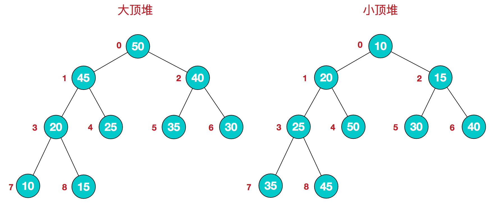
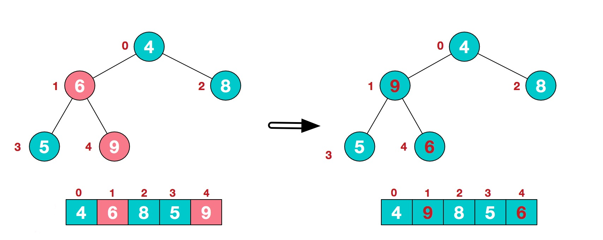
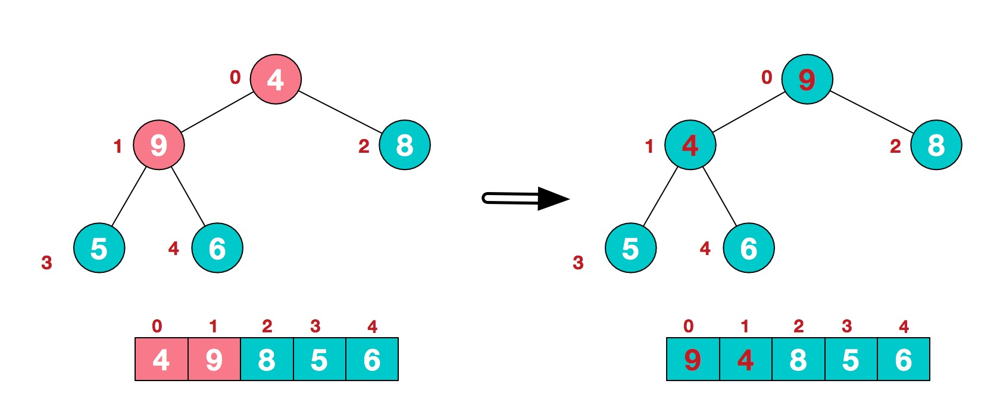
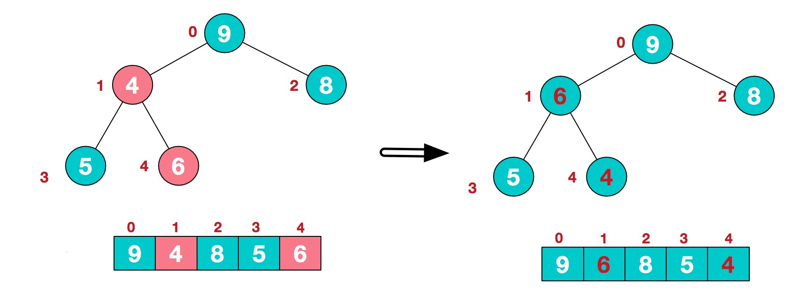
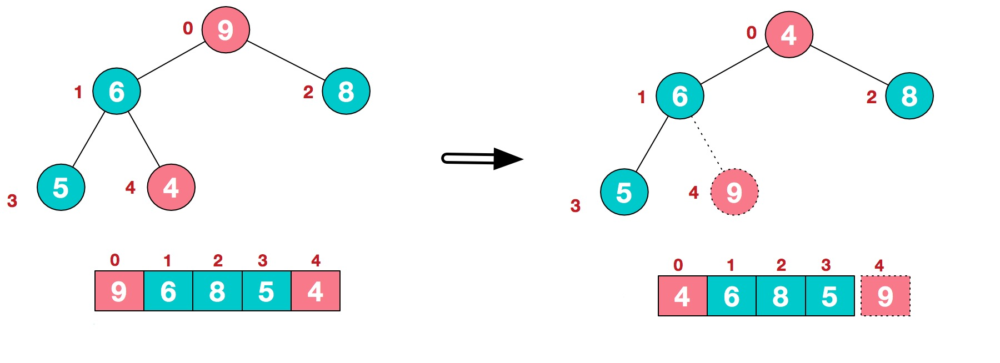
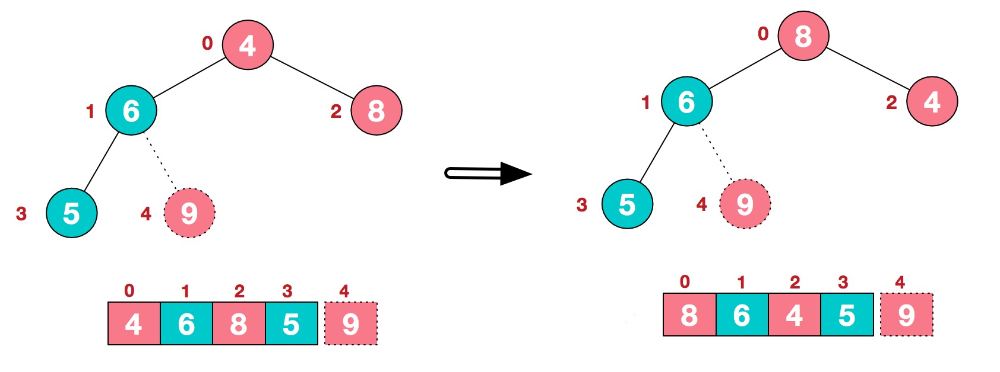
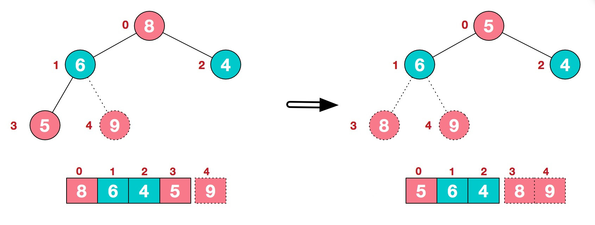

集中整理了经典的排序算法，主要关注算法的原理、时间和空间复杂度、python实现。

想整理这个主要是发现很多业务场景都需要对大量数据进行处理，在遍历数组、列表时的策略就显得很重要。

<!--more-->
## 符号约定

|符号|含义|
|:-:|:-:|
$n$|数据规模，要被排序的记录数量
$k$|不同键值的数量，“桶”的数量
$in-place$|占用常数内存，不占用额外内存
$out-place$|占用额外内存


## 衡量性质

### 稳定性

**稳定性**是指相等的元素经过排序之后相对顺序是否发生了改变。

拥有稳定性这一特性的算法会让原本有相等键值的纪录维持相对次序，即如果一个排序算法是稳定的，当有两个相等键值的纪录 R 和 S，且在原本的列表中 R 出现在 S 之前，在排序过的列表中 R 也将会是在 S 之前。

- 基数排序、计数排序、插入排序、冒泡排序、归并排序是稳定排序。

- 选择排序、堆排序、快速排序、希尔排序不是稳定排序。

### 时间复杂度

**时间复杂度**用来衡量一个算法的运行时间和输入规模的关系，通常用 O 表示。

简单计算复杂度的方法一般是统计「简单操作」的执行次数，有时候也可以直接数循环的层数来近似估计。

时间复杂度分为最优时间复杂度、平均时间复杂度和最坏时间复杂度。OI 竞赛中要考虑的一般是最坏时间复杂度，因为它代表的是算法运行水平的下界，在评测中不会出现更差的结果了。

基于比较的排序算法的时间复杂度下限是 $O(n\log n)$ 的。

当然也有不是 $O(n\log n)$ 的。例如，计数排序 的时间复杂度是 $O(n+w)$，其中 $w$ 代表输入数据的值域大小。

### 空间复杂度

指算法排序算法过程中所需要的内存大小，用以描述算法内存消耗的规模。

## 算法概述

### 分类

排序算法可以按照数据记录的位置分为：

- 内部排序：数据记录在内存中进行排序。
  
  如：插入排序、希尔排序、选择排序、冒泡排序、归并排序、快速排序、堆排序、基数排序等。
- 外部排序：因排序的数据很大，一次不能容纳全部的排序记录，在排序过程中需要访问外存。

内部排序有经典的十大算法，在下文有详细介绍。

还可以按照排序时的是否要比较分类，如下图：


排序算法也经常按照稳定性分类，若被排序对象中有 $n$ 个记录，$k$ 个不同键值，各个算法的分类与时间复杂度如下表：

- 稳定排序

    |算法名|时间复杂度|备注|
    |:-:|:-:|:-:|
    冒泡排序|$O(n^2)$||
    插入排序|$O(n^2)$|
    桶排序|$O(n)$|需要 $O(k)$ 额外空间
    计数排序|$O(n+k)$|需要 $O(n+k)$ 额外空间
    归并排序|$O(n \log n)$|需要 $O(n)$ 额外空间
    原地归并排序|$O(n \log^2 n)$|（最佳版本）
    二叉树排序|期望 $O(n \log n)$，最坏 $O(n^2)$|需要 $O(n)$ 额外空间
    鸽巢排序|$O(n+k)$|需要 $O(k)$ 额外空间
    基数排序|$O(nk)$|需要 $O(n)$ 额外空间
    Tim 排序|期望和最坏 $O(n \log n)$，最优 $O(n)$|需要 $O(n)$ 额外空间，目前最快算法，Python、Swift、Rust等语言内置排序函数的默认算法

- 不稳定排序

    |算法名|时间复杂度|备注|
    |:-:|:-:|:-:|
    选择排序|$O(n^2)$||
    希尔排序|$O(n \log n)$|（最佳）
    堆排序|$O(n \log n)$|
    快速排序|期望 $O(n \log n)$，最坏 $O(n^2)$ |
    内省排序|$O(n \log n)$|

## 内容

### 冒泡排序
**冒泡排序**（**Bubble Sort**）也是一种简单直观的排序算法。遍历要排序的数列，一次比较两个元素，如果顺序错误就交换二者位置。重复地进行直到不再需要交换则排序完成。这个算法的名字由来是因为越小的元素会经由交换慢慢"浮"到数列的顶端。

我开始学习计算机算法后第一个接触到的排序算法就是冒泡排序了。在当时没有培养起任何算法概念的我看来，这个算法直观又简单，当时我使用的是 C++，所以排序的效率也十分可观，当时天真地感觉自己无敌了。

现在略加思考就能意识到这个算法的时间复杂度比较高，在对效率要求较高时不太实用。但是它作为计算机初学者打开算法思想的脚手架也值得被认真分析对待。

#### 算法描述

每次遍历时逐个比较相邻的两个元素，调整位置，遍历 $n$ 次，所有元素排列完毕。

#### 伪代码

```python
def bubbleSort(nums):
  n=lengthOf(nums)
  for i in 1 ... n:
    for j in 1 ... n - 1:
      if nums[j] > nums[j + 1]:
        Swap(nums[i], nums[j])
```

#### 原理

算法很简单，就不必使用过于死板的数学证明了。稍加思考可以想到，第 $i$ 次遍历过后，最后的 $i$ 个元素一定是排列好的。而这也可以作为一种优化策略。

#### 性质

**时间复杂度**

在最好情况下，即序列完全有序时，冒泡排序只需遍历一遍数组，不用执行任何交换操作，时间复杂度为 $O(n)$。

在最坏情况下，冒泡排序要执行 $\frac{(n-1)n}{2}$ 次交换操作，时间复杂度为 $O(n^2)$。

平均时间复杂度为 $O(n^2)$。

**稳定性**

稳定。

### 选择排序

**选择排序**（**Selection Sort**）是一种简单直观的排序算法。它的工作原理是，每次遍历都找到当前未排序数组中的最小元素，将其排列到正确的位置，直到所有元素位置正确。

#### 算法描述

第$i$次遍历找出第 $i$ 小的元素，然后将这个元素与数组第 $i$ 个位置上的元素交换，遍历 $n$ 次，所有元素位置正确。

#### 伪代码

```python
def selectionSort(nums):
  n=lengthOf(nums)
  for i in 1 ... n:
    ith = i
    for j in i ... n:
      if nums[j] < nums[ith]:
        ith = j
    Swap(nums[i], nums[ith])
```

#### 原理

直观且明了，无须多言。第 $i$ 次循环过后，数组中第 $i$ 小的元素一定被放置正确的位置。

#### 性质

**时间复杂度**

第 $i$ 次循环需要遍历 $n-i$ 个元素，总共需要遍历 $\frac{(n-1+1)(n-1)}{2}=\frac{n^2}{2}-\frac{n}{2}$次，时间复杂度为 $O(n^2)$，且与数组本身没有关系，因此最好、最坏情况都是一样。

**稳定性**

不稳定。

### 插入排序

**插入排序**(**Insertion Sort**)，一般也被称为直接插入排序。插入排序也是一种最简单直观的排序算法，它的工作原理是通过构建有序序列，对于未排序数据，在已排序序列中从后向前扫描，找到相应位置并插入。

#### 算法描述

我们递归地描述算法，在第 $i$ 次排序中，假设前 $i$ 个数是排好序的，得到第 $i+1$ 个数后，扫描前面排好序的部分，找到这个数的正确位置，将其插入到这个正确位置中。总共循环 $n-2$ 次。

#### 伪代码

```python
def insertionSort(nums):
  n=lengthOf(nums)
  for i in 2 ... n:
    temp = nums[i]
    j = i - 1
    while j > 0 and nums[j] > temp:
      nums[j+1] = nums[j]
      j = j - 1
    nums[j+1]=temp  
```

#### 原理

直观明了，算法保证了第 $i$ 次排序前，前 $i$ 个数据是排好序的，而第 $i+1$ 个数据也可以确保放入正确位置。

#### 性质

**时间复杂度**

插入排序的最优时间复杂度为 $O(n)$，在数列几乎有序时效率很高。

插入排序的最坏时间复杂度和平均时间复杂度都为 $O(n^2)$。

**稳定性**

稳定。

### 希尔排序

**希尔排序**（**Shell Sort**），也称**递减增量排序算法**（**Diminishing Increment Sort**），是*插入排序*的一种改进版本，以它的发明者希尔（英语：Donald Shell）命名。

希尔排序是基于插入排序的以下两点性质而提出改进方法的：

- 对几乎已经排好序的数据操作时，效率高，即可以达到线性排序的效率；
- 一般来说是低效的，因为插入排序每次只能将数据移动一位；

希尔排序的基本思想是：先将整个待排序的记录序列分割成为若干子序列分别进行直接插入排序，待整个序列中的记录"基本有序"时，再对全体记录进行依次直接插入排序。

#### 算法描述

将数组按“增量（gap）”分组，就是说，比如增量是3，数组有10个元素，那么分组就将第1、4、7、10个元素为一组，第2、5、8个元素为一组，第3、6、9个元素为一组，对这样分好的每个组进行插入排序，每次循环缩短这个增量，直到增量缩小为1，排序完成。

整个排序过程下来可以得到一个增量的序列，成为增量序列。增量序列的选取是一个数学难题。希尔排序的提出者希尔建议选择 $\{\frac{n}{2},\frac{n}{2^2},\dots,1\}$，但是这个序列并不见得是最优的。更一般的提法是：选择一个增量序列 $\{t_1,t_2,\dots,t_k\}$ ，其中 $t_k=1$；按增量序列个数 $k$，对序列进行 $k$ 次排序。演示时常使用希尔增量序列。

在最后一次排序前这个数组已经变成一个“基本有序”的序列了，就是说较小的数都在前面，较大的数都在后面，此时使用插入排序效率就比较可观。

#### 原理

方法的正确性是显然的，因为至少在最后一次排序中使用了插入排序，这足以保证算法能狗得到正确结果。

但是算法复杂度的分析就比较复杂了。

#### 伪代码

**有很多可以选择的增量序列**，以希尔增量为例：

```python
def shellSort(nums):
  n=lengthOf(nums)
  gap = 1
  while gap < n / 2:
      gap = int(2 * gap + 1)
  while gap >= 1:
      for i in gap ... n:
          j = i
          while j >= gap and array[j] < array[j - gap]:
              Swap(nums[j - gap], nums[j])
              j = j - gap
      gap = int(gap / 2)
```

#### 性质

**时间复杂度**

希尔排序最优情况下的时间复杂度为 $O(n)$。

希尔排序的平均时间复杂度和最坏时间复杂度与间距序列的选取有关。

设间距序列为 H，下面给出 H 的两种经典选取方式，这两种选取方式均使得排序算法的复杂度降为 $o(n^2)$ 级别。

***命题 1***：若间距序列为 $H= \{ 2^k-1\mid k=1,2,\ldots,\lfloor\log_2 n\rfloor \}$（从大到小），则希尔排序算法的时间复杂度为 $O(n^{3/2})$。

***命题 2***：若间距序列为 $H= \{ k=2^p\cdot 3^q\mid p,q\in \mathbb N,k\le n \}$（从大到小），则希尔排序算法的时间复杂度为 $O(n\log^2 n)$。

***定理 1***：只要程序执行了一次增量为 $h$ 的排序操作，之后的操作中，子数组 $[A_1,A_{1+h},A_{1+2h},\dots]$,$[A_2,A_{2+h},A_{2+2h},\dots]$,$\cdots$,$[A_h,A_{h+h},A_{h+2h},\dots]$ 将一直保持有序


这个定理揭示了希尔排序在特定集合 H 下可以优化复杂度的关键，因为在整个过程中，它可以一致保持前面的成果不被摧毁（即 h 个子列分别有序），从而使后面的调用中，指针 $i$ 的移动次数大大减少。

这也就是说希尔排序的时间复杂度是不稳定的。迄今为止，除了在一些特殊的情况下，还没有人能够从理论上分析希尔排序的效率。有各种各样基于试验的评估，估计它的时间复杂度从 $O(N^{3/2})$ 到 $O(N^{7/6})$。

**稳定性**

不稳定。

### 归并排序

**归并排序**（**Merge Sort**）是建立在归并操作上的一种有效的排序算法。该算法是采用**分治**法（**Divide and Conquer**）的一个非常典型的应用。

作为一种典型的分而治之思想的算法应用，所有递归的方法都可以用迭代重写，所以归并排序的实现就有 2 种方法：

- 自上而下的递归
- 自下而上的迭代

将已有序的子序列合并，得到完全有序的序列；即先使每个子序列有序，再使子序列段间有序。若将两个有序表合并成一个有序表，称为二路归并。

和*选择排序*一样，归并排序的性能不受输入数据的影响，但表现比选择排序好的多，因为始终都是 $O(n\log n)$ 的时间复杂度。代价是需要额外的内存空间。

不过归并排序可以只使用 $\Theta (1)$ 的辅助空间，但为便捷通常使用与原数组等长的辅助数组。

#### 算法描述

归并排序最核心的部分是**合并**（**merge**）过程。

将两个有序的数组 `nums1[i]` 和 `nums2[j]` 合并为一个有序数组 `nums12[k]`。

从左往右枚举 `nums1[i]` 和 `nums2[j]`，找出最小的值并放入数组 `nums12[k]`；重复上述过程直到 `nums1[i]` 和 `nums2[j]` 有一个为空时，将另一个数组剩下的元素放入 `nums12[k]`。

通常为保证排序的稳定性，前段首元素小于或等于后段首元素时（`nums1[i]` $\le$ `nums2[j]`）而非小于时（`nums1[i]` < `nums2[j]`）就要作为最小值放入 `nums12[k]`。

对于数组 `nums` 的排序就是每次将数组分为两部分，作二路归并。如此递归直到两个子数组只剩一个元素。

#### 伪代码

代码实现有几种思路，一种就是典型的使用递归来完成分治过程，另一种相当于。

调用入口:

```python
def mergeSort(nums):
  mergeSorting(nums, 0, lengthOf(nums) - 1)
```

合并（Merge）操作：

```python
def Merge(nums1, nums2):
  i, j = 0, 0
  result = []

  while i < lengthOf(nums1) and j < lengthOf(nums2):
    if nums1[i] <= nums2[j]:
      result.append(nums1[i])
      i = i + 1
    else:
      result.append(nums2[j])
      j = j + 1

  result.extend(nums1[i:], nums[j:])
  return result
```

- 基于分治法

  ```python
  def mergeSorting(nums, left, right):
    if right - left <= 1:
      return

    middle=int((left + right) / 2)
    mergeSort(nums, left, middle)
    mergeSort(nums, middle, right)

    nums=Merge(nums[left:middle], nums[middle:right])
  ```

- 基于倍增法：

  ```python
  def mergeSort(nums):
    n = lengthOf(nums)
    segment = 1
    while segment < n:
      for left in 0 ... step = 2 * segment ... n - segment:
        right = left + segment
        left2 = right
        right2 = left2 + segment
        a[left:right2] = merge(a[left:right], a[left2:right2])
      segment = segment * 2
  ```

#### 原理

倍增法实际上就是递归法的循环实现。而递归法是很好理解的，合并前的两个子数组保证有序，因此在遍历时从前往后合并就可以保证每次合并后的数组都是有序的。

#### 性质

**时间复杂度**

时间复杂度在最优、最坏与平均情况下均为 $\Theta (n \log n)$，空间复杂度为 $\Theta (n)$。

归并排序可以只使用 $\Theta (1)$ 的辅助空间，但为便捷通常使用与原数组等长的辅助数组。

**稳定性**

稳定。

### 快速排序

!!! 重要

**快速排序**（**Quick Sort**），又称**分区交换排序**（**Partition-exchange Sort**），简称“快排”，是一种被广泛运用的排序算法。

快速排序的最坏运行情况是 $O(n²)$，比如说顺序数列的快排。但它的平摊期望时间是 $O(n\log n)$，且 $O(n\log n)$ 记号中隐含的常数因子很小，比复杂度稳定等于 $O(n\log n)$ 的归并排序要小很多。所以，对绝大多数顺序性较弱的随机数列而言，快速排序总是优于归并排序。

事实上，快速排序通常明显比其他 $Ο(n\log n)$ 算法更快，因为它的内部循环（inner loop）可以在大部分的架构上很有效率地被实现出来。

快速排序使用**分治法**（**Divide and Conquer**）策略来把一个串行（list）分为两个子串行（sub-lists）。本质上来看，快速排序应该算是在*冒泡排序*基础上的递归分治法。

#### 算法描述

首先选定一个基准值（pivot），将数列划分为两部分，但是与归并排序不同的是，这个划分要保证前半部分的值都不大于这个基准值，后半部分都不小于这个基准值，也就是保证**前后相对大小**关系。然后递归地对前后两部分进行相同的操作，以完成排序。

这是一个明显的分治策略，同时很容易使用递归实现。关于基准值的选取，通常会为了保证算法的平均复杂度而选取一个随机值。

#### 伪代码

```python
def quickSort(nums): # 方便调用
  n=length(nums)
  quickSort(nums, 0, n-1)


def quickSorting(nums, left, right): # 算法本体
  # 终止条件
  if left >= right:
    return 

  # 划分
  pivot = nums[left] # 选定基准为随机值，这里使用每个分组最左边的值
  pointer = left + 1 # 左侧元素位置指针
  for i in left + 1 ... right:
    if nums[i] < pivot: # 当元素小于基准时，就将其放置在左侧pointer对应位置
      Swap(nums[i], nums[pointer])
      pointer = pointer + 1
  Swap(nums[left], nums[pointer - 1])

  # 递归
  quickSort(nums, left, pointer - 1)
  quickSort(nums, pointer, right)
```

#### 原理

根据算法实现过程，其原理是很明显的。使用分治思路，每次都将待排序的数组长度缩减为原来的一半，不过相较于归并排序，这里的两半数组大小关系是明确的，也正是因此，只要保证两半都是排好序的，再将两半拼接起来就好了。

将数组分成有大小关系的两半的操作实际上也是一种弱排序操作。可以想象，如果数组只有3个元素，那么经过这一步的数组就已经是有序的了，分成的两部分数组分别只有一个元素。考虑到这一点，显然就可以使用递归来实现这个算法，每次递归都将数组长度缩减为一半，而其递归终止条件就是当数组元素为1时。

#### 性质

**时间复杂度**

对于最优情况，每一次选择的分界值都是序列的中位数，此时算法时间复杂度满足的递推式为 $T(n) = 2T(\dfrac{n}{2}) + \Theta(n)$，可以推出，$T(n) = \Theta(n\log n)$。

对于最坏情况，每一次选择的分界值都是序列的最值，此时算法时间复杂度满足的递推式为 $T(n) = T(n - 1) + \Theta(n)$，累加可得 $T(n) = \Theta(n^2)$。

对于平均情况，每一次选择的分界值可以看作是等概率随机的。

**稳定性**

它的稳定性由拆分数组时的元素交换策略决定。不稳定。

### 堆排序

**堆排序**（**Heapsort**）是指利用二叉堆这种数据结构所设计的一种排序算法。堆排序的适用数据结构为数组。

堆一般指的是二叉堆，二叉堆是完全二叉树或者近似完全二叉树。堆积是一个近似完全二叉树的结构，并同时满足堆积的性质：即子结点的键值或索引总是小于（或者大于）它的父节点。堆排序可以说是一种利用堆的概念来排序的选择排序。分为两种方法：

- 大顶堆：每个节点的值都大于或等于其子节点的值，在堆排序算法中用于升序排列
- 小顶堆：每个节点的值都小于或等于其子节点的值，在堆排序算法中用于降序排列

对于如下数组：


如图：



用公式描述就是：


大顶堆：`arr[i]` $\ge$ `arr[2i+1]` `&&` `arr[i]` $\ge$ `arr[2i+2]`

小顶堆：`arr[i]` $\le$ `arr[2i+1]` `&&` `arr[i]` $\le$ `arr[2i+2]`

#### 算法描述

将待排序序列构造成一个大顶堆，此时，整个序列的最大值就是堆顶的根节点。将其与末尾元素进行交换，此时末尾就为最大值。然后将剩余n-1个元素重新构造成一个堆，这样会得到n个元素的次小值。如此反复执行，便能得到一个有序序列了。

具体地讲，我们要构建一个大顶堆，首先将给定无序序列构造成一个完全二叉树，这时得到的是一个无序的树结构，如图：


此时我们从最后一个非叶子结点开始（叶结点自然不用调整，第一个非叶子结点 $\frac{\mathrm{n-1}}{2}=\frac{5-1}{2}=1$，也就是下面1号节点，值为6），从左至右，从下至上进行调整。在上面的图中，显然第一个叶子节点（3号节点，值为5小于6）不需要调整，转到4号节点，9大于6，对换。如图：



找到上面的非叶节点0号节点，值为4，和它的右子节点2，值为8，和这个1号节点，值为9，三者中最大的是9，于是交换0和1两个节点值。如图：



交换导致1、3、4的节点值不满足大顶堆，于是再交换1和4，如图：


此时，我们就将一个无需序列构造成了一个大顶堆。

接下来将堆顶元素与末尾元素进行交换，使末尾元素最大。然后继续调整堆，再将堆顶元素与末尾元素交换，得到第二大元素。如此反复进行交换、重建、交换。

将堆顶元素9和末尾元素4进行交换，如图：



重新调整结构，使其继续满足堆定义，如图：



再将堆顶元素8与末尾元素5进行交换，得到第二大元素8，如图：



后续过程，继续进行调整，交换，如此反复进行，最终使得整个序列有序：


上面的操作中节点序号满足下面的规律：

对于索引为 $i$ 的节点：
- 父结点索引：$(i - 1)/2$（向下取整）
- 左孩子索引：$2\cdot i + 1$
- 右孩子索引：$2\cdot i + 2$

可以通过这个公式来设计代码。

有必要思考一下每次调整对于堆的影响如何。每一次成功的调整都是自下而上地进行的，也就是说，在第 h 层的节点与 h-1 层的父节点发生交换后，h 层的这个节点最多只有在 h+1 层一侧的子节点遭到破坏，也就是这一侧子节点的值大于这个节点。当然也有可能没有破坏结构，那么这个节点往下的所有子孙节点都符合大顶堆的性质。如果确实遭到破坏，就需要交换这它和它的子节点，然后再用相似的思路检查这个子节点向下的结构是否遭到破坏。沿着这个思路，我们可以写出代码，而且往往是使用循环语句，因为当该节点确实破坏了堆结构时，再交换元素后就需要对那个子节点同样的检查操作，这一步就很容易实现了。

总结一下：

1. 将无需序列构建成一个堆，根据升序降序需求选择大顶堆或小顶堆;
2. 将堆顶元素与末尾元素交换，将最大元素"沉"到数组末端;
3. 重新调整结构，使其满足堆定义，然后继续交换堆顶元素与当前末尾元素，反复执行调整+交换步骤，直到整个序列有序。

#### 伪代码

```python
def heapSort(nums):
  heapSorting(nums)


def siftDown(nums, start, end):
  # 计算父结点和子结点的下标
  parent = int(start)
  child = int(parent * 2 + 1)
  while child <= end: # 子结点下标在范围内才做比较
    # 先比较两个子结点大小，选择最大的
    if child + 1 <= end and nums[child] < arr[child + 1]:
      child = child + 1
    # 如果父结点比子结点大，代表调整完毕，直接跳出函数
    if nums[parent] >= nums[child]:
      return
    else: # 否则交换父子内容，子结点再和孙结点比较
      Swap(nums[child], nums[parent])
      parent = child
      child = int(child * 2 + 1)


def heapSorting(nums):
  # 从最后一个节点的父节点开始 sift down 以完成堆化 (heapify)
  n = lengthOf(nums)
  i = int((n - 1 - 1) / 2) # n - 1是角标，再-1是父节点计算
  while(i >= 0):
    siftDown(nums, i, n)
    i = i - 1
  # 先将第一个元素和已经排好的元素前一位做交换，再重新调整（刚调整的元素之前的元素），直到排序完毕
  i = n - 1
  while(i > 0):
    Swap(nums[i], nums[0])
    siftDown(nums, 0, i - 1)
    i = i - 1
```

#### 原理

每次构造出一个大顶堆后，堆顶元素就是整个数组的最大元素，交换堆顶元素和数组末尾元素，就相当于将最大元素"沉"到数组末端，经过 n 次迭代就形成了一个有序序列。

#### 性质

**时间复杂度**

堆排序最优时间复杂度、平均时间复杂度、最坏时间复杂度均为 $O(n\log n)$。

**稳定性**

不稳定。

### 计数排序

**计数排序**（**Counting Sort**）是一种线性时间的排序算法，核心在于将输入的数据值转化为键存储在额外开辟的数组空间中。作为一种线性时间复杂度的排序，计数排序要求输入的数据必须是**有确定范围的整数**。

当输入的元素是 $n$ 个 $0$ 到 $k$ 之间的整数时，它的运行时间是 $Θ(n + k)$。计数排序不是比较排序，排序的速度快于任何比较排序算法。

由于用来计数的数组C的长度取决于待排序数组中数据的范围（等于待排序数组的最大值与最小值的差加上1），这使得计数排序对于数据范围很大的数组，需要大量时间和内存。

#### 算法描述

计数排序的工作原理是使用一个额外的数组 `temp`，其中第 `i` 个元素是待排序数组 `nums` 中值等于 i 的元素的个数，然后根据数组 `temp` 来将 `nums` 中的元素排到正确的位置。

它的工作过程分为三个步骤：

1. 计算每个数出现了几次；
2. 求出每个数出现次数的**前缀和**；
3. 利用出现次数的**前缀和**，从右至左计算每个数的排名。

前缀和是什么？前缀和可以简单理解为「数列的前 n 项的和」，是一种重要的预处理方式，能大大降低查询的时间复杂度。

为什么要计算前缀和？

直接将 `temp` 中的元素作为 `nums` 中的元素的排名，会存在重复的问题。

比如，`nums = [1, 2, 2, 3, 3, 3]`，`temp = [1, 1, 2, 1, 1, 1]`，那么 `temp[2] = 2`，`temp[3] = 3`，`temp[4] = 2`，`temp[5] = 3`。

如果直接将 `temp` 中的元素作为 `nums` 中的元素的排名，那么 `nums[2]` 的排名是`temp[2] = 2`，`nums[3]` 的排名是`temp[3] = 3`，`nums[4]` 的排名是`temp[4] = 2`，`nums[5]` 的排名是`temp[5] = 3`。

但是，`nums[2]` 的排名应该是`temp[2] = 2 + temp[1] = 2 + 1 = 3`，`nums[3]` 的排名应该是`temp[3] = 3 + temp[2] = 3 + 2 = 5`，`nums[4]` 的排名应该是`temp[4] = 2 + temp[3] = 2 + 3 = 5`，`nums[5]` 的排名应该是`temp[5] = 3 + temp[4] = 3 + 2 = 5`。
所以，我们需要计算出现次数的**前缀和**，来解决这个问题。

#### 代码实现

```python
def countSort(nums):
  N = max(nums)
  n=length(nums)
  temp = [0] * (N + 1)
  result = [0] * n
  prefixSum = [0] * (N + 1)
  for i in 1 ... N + 1:
    temp[nums[i]] = temp[nums[i]] + 1
  prefixSum[1] = temp[1]
  for i in 2 ... N + 1:
    prefixSum[i] = temp[i] + temp[i - 1]
  for i in 1 ... n:
    result[prefixSum[i]] = nums[i]
    prefixSum[nums[i]] = prefixSum[nums[i]] - 1
  nums = result
```

#### 原理

针对特殊数组的排序，数组元素都为整数，且范围可知，那么只需要统计每个数出现的次数，比如元素 `nums[i]` 出现 `i` 次，那么如果可以确定前面的 `nums[i]` 个数都已经排好序，则接下来的 `i` 个数一定是 `nums[i]`。只需要得到一个记录每个元素出现次数的数组就可以按照这个规则排序。

#### 性质

**复杂度**

计数排序的时间复杂度为 $O(n+w)$，其中 $w$ 代表待排序数据的值域大小。

**稳定性**

稳定。

### 桶排序

**桶排序**（**Bucket Sort**）是计数排序的升级版。它利用了函数的映射关系，高效与否的关键就在于这个映射函数的确定。适用于待排序数据值域较大但分布比较均匀的情况。

为了使桶排序更加高效，我们需要做到这两点：
- 在额外空间充足的情况下，尽量增大桶的数量
- 使用的映射函数能够将输入的 N 个数据均匀的分配到 K 个桶中
  
如果元素分布不均匀，可能会导致某些桶中的元素过多，需要额外的处理来优化桶的分配策略。同时，除了桶排序的策略，对于桶中元素的排序，选择何种比较排序算法对于性能的影响至关重要。

#### 算法描述

首先设置一个定量的数组当作空桶，然后遍历序列，并将元素按照一个规则一个个放到对应的桶中。接下来对每个不是空的桶进行排序。最后从不是空的桶里把元素再放回原来的序列中，就完成了排序。

每个桶存放数组中一个范围内的数，在对这些桶进行分别排序时，可以使用不同的算法实现，或者直接对这些桶再使用递归进行排序。

#### 伪代码

桶排序的映射函数选择很多，这里使用的是最简单的 `index_i = num[i] // k`。而具体的对于每个桶的排序算法就不给出了。

```python
def bucketSort(nums, k):
  n = lengthOf(nums)
  buckets = [emptyList * k]  # k 个桶
  for each num in nums:
    bucketIndex = int(num / k)  # 映射函数
    buckets[bucketIndex].append(num)
  
  sorted_nums = []
  for each bucket in buckets:
    if bucket is not empty:
      Sort(bucket)  # 对每个非空桶进行排序
      sorted_nums.extend(bucket)
  
  nums = sorted_nums
```

#### 原理

桶排序是鸽巢排序的一种归纳结果。桶排序的思想近乎彻底的分治思想。桶排序假设待排序的一组数均匀独立的分布在一个范围中，并将这一范围划分成几个子范围（桶）。

当要被排序的数组内的数值是均匀分配的时候，桶排序使用线性时间 $\Theta(n)$。但桶排序并不是比较排序，他不受到 $O(n\log n)$ 下限的影响。

以下是一些常用的映射函数选择：

简单除法取整映射：这是最常见的映射函数，即将待排序元素除以一个固定的数（桶的个数），然后取整作为桶的索引。例如，`index = num // 10`，表示将元素分配到 10 个桶中。
- 分段映射：将待排序元素根据其范围分成若干段，然后确定每个段对应的桶。例如，可以将 0-100 划分为 10 个段，每个段对应一个桶。
- 最大最小值映射：根据待排序元素的最大值和最小值来确定桶的范围。例如，如果待排序元素的范围是 0 到 100，可以将每个桶的范围设置为 10，然后根据元素的大小确定其应该放入哪个桶中。
- 平方根映射：将待排序元素的平方根作为桶的索引，适用于元素分布较为均匀的情况。
- 位数映射：对于整数元素，可以将元素的位数作为桶的索引，例如对于两位数的元素，可以将十位数作为桶的索引。

根据具体的应用场景和待排序元素的特点，选择合适的映射函数可以提高桶排序的效率和准确性。

#### 性质

**复杂度**

桶排序的时间复杂度取决于映射函数的选择和元素分布情况。如果映射函数能够将元素均匀地分配到各个桶中，则桶排序的时间复杂度为 $O(n)$。如果元素分布不均匀，则桶排序的时间复杂度可能会退化为 $O(n^2)$。

总结地讲：

平均时间复杂度：$O(n + k)$
最佳时间复杂度：$O(n + k)$
最差时间复杂度：$O(n ^ 2)$
空间复杂度：$O(n \cdot k)$

**稳定性**

取决于排序算法的实现。

### 基数排序

**基数排序**（**Radix Sort**）是一种非比较型的排序算法，最早用于解决卡片排序的问题。基数排序将待排序的元素拆分为 $k$ 个关键字，逐一对各个关键字排序后完成对所有元素的排序。

如果是从第 1 关键字到第 k 关键字顺序进行比较，则该基数排序称为 MSD（Most Significant Digit first）基数排序；

如果是从第 k 关键字到第 1 关键字顺序进行比较，则该基数排序称为 LSD（Least Significant Digit first）基数排序。

和桶排序、计数排序相似的是都用到了桶的思想，而基数排序是根据键值的每位数字来分配桶的。计数排序的每个桶只存储单一值，桶排序则是每个桶存储一定范围的数值。

所谓关键字，就是待排序元素的组成部分，比如对于一个整数52342，它的从高位到低位的关键字依次是5、2、3、4、2，对于一个字符串 asdf，它的从高位到低位的关键字依次是a、s、d、f。

#### 算法描述

**MSD基数排序**:

将待排序的元素拆分为 $k$ 个关键字。可以确定的是，对于两个元素 $a$和$b$，如果前 $i-1$ 关键字都相等，则比较两个元素的第 $i$ 关键字 $a_i$ 和 $b_i$，如果 $a_i < b_i$ 则 $a < b$，如果 $a_i > b_i$ 则 $a > b$，如果 $a_i = b_i$ 则再比较低位的关键字，直到最低位。

根据这个思路，就可以先对第 $1$ 关键字进行稳定排序，然后对于每组具有相同关键字的元素再对第 $2$ 关键字进行稳定排序，一次类推下去，最后对于每组具有相同关键字的元素再对第 $k$ 关键字进行稳定排序，这个过程就可以使用递归执行。

*桶排序*需要其它的排序算法来完成对每个桶内部元素的排序。但实际上，完全可以对每个桶继续执行桶排序，直至某一步桶的元素数量 $\le 1$。

因此 MSD 基数排序的另一种理解方式是：使用*桶排序*实现的*桶排序*。

也因此，可以提出 MSD 基数排序在时间常数上的一种优化方法：假如到某一步桶的元素数量 $\le \alpha$（$\alpha$ 是自己选的常数），则直接执行*插入排序*然后返回，降低递归次数。

**LSD基数排序**:

MSD 基数排序从第 $1$ 关键字到第 $k$ 关键字顺序进行比较，为此需要借助递归或迭代来实现，时间常数还是较大，而且在比较自然数上还是略显不便。

而将递归的操作反过来：从第 $k$ 关键字到第 $1$ 关键字顺序进行比较，就可以得到 LSD 基数排序，不使用递归就可以完成的排序算法。

将待排序的元素拆分为 $k$ 个关键字，然后先对所有元素的第 $k$ 关键字进行稳定排序，再对所有元素的第 $k-1$ 关键字进行稳定排序，再对所有元素的第 $k-2$ 关键字进行稳定排序，如此一直进行下去，最后对所有元素的第 $1$ 关键字进行稳定排序，这样就完成了对整个待排序序列的稳定排序。

LSD 基数排序也需要借助一种稳定算法完成内层对关键字的排序。通常使用*计数排序*来完成。当然这个排序算法也是可以选择的。

#### 伪代码

LSD 基数排序更为常见，这里给出思路。同样的，内层排序算法不再赘述。

```python
def countingSort(nums, exp, B):
    n = lengthOf(nums)
    output = [0] * n
    count = [0] * B
    
    for i in 1 ... n:
        index = nums[i] // exp
        count[index % 10] = count[index % 10] + 1
    
    for i in 2 ... B:
        count[i] = count[i] + count[i - 1]
    
    i = n - 1
    while i >= 0:
        index = nums[i] // exp
        output[count[index % 10] - 1] = arr[i]
        count[index % 10] = count[index % 10] - 1
        i = i - 1
    
    for i in 1 ... n:
        arr[i] = output[i]

def radixSort(nums):
    max_num = maxOf(nums)
    exp = 1
    while max_num // exp > 0:
        countingSort(nums, exp)
        exp = exp * 10
        Sort(nums)
```

#### 原理

正确性从上面算法的描述分析很容易看出，其原理也比较易懂。

MSD的从高位到低位是最好理解的，对于任意两个元素，在比较第 $k$ 个关键字时就大致可以确定其大小关系。如果这个关键相等，就将它们归入同一个桶中，然后在下一次的比较中对桶中的元素检查下一位的关键字，这样可以确保排序正确。

对于LSD从低位到高位，当我们对数据按照低位分桶再放回后，可以确保的是，元素按照低位从小到大排列，这样，假如再确保高位从小到大排列，依次进行下去，就可以确保排序正确。它实际上相当于MSD的循环实现。

#### 性质

**复杂度**

通常而言，**基数排序**比基于比较的排序算法（比如*快速排序*）要快。但由于需要额外的内存空间，因此当内存空间稀缺时，原地置换算法（比如*快速排序*）或许是个更好的选择。

一般来说，如果每个关键字的值域都不大，就可以使用*计数排序*作为内层排序，此时的复杂度为 
 
$O(kn+\sum\limits_{i=1}^k w_i)$，其中 $w_i$ 为第 $i$ 关键字的值域大小。如果关键字值域很大，就可以直接使用基于比较的 $O(nk\log n)$ 排序而无需使用基数排序了。

MSD 基数排序和 LSD 基数排序的空间复杂度都为 $O(k+n)$。

**稳定性**

如果对内层关键字的排序是稳定的，则 MSD 基数排序和 LSD 基数排序都是稳定的排序算法。

### TIM 排序

简单介绍一下 TIM 排序。

**TIM 排序**是*归并排序*和*插入排序*的结合，是一个 稳定 的排序算法，由 Tim Peters 于 2002 年用 Python 实现。现在，tim 排序是 Python 的标准排序算法，且被 Java SE7 用于对非原始类型的数组排序。


*归并排序*是先将数组划分为两部分，然后递归地对两个子数组进行归并排序，最后合并两个子数组。这样一来，归并排序合并操作的最小单位就是单个元素。但是，数组中可能原本就存在连续且有序的子数组，归并排序无法利用这个特性。

tim 排序为了利用数组中本身就存在的连续且有序的子数组，以 `run` 作为合并操作的最小单位。其中，`run` 是一个满足以下性质的子数组：

- 一个 `run` 要么是非降序的，要么是严格升序的。
- 一个 `run` 存在一个长度的下限。

tim 排序的过程就是一个类似归并排序的过程，将数组划分为多个 `run`，然后以某种规则不断地合并两个 `run`，直到数组有序。具体过程如下：

1. `run` 创建阶段：在这一阶段，Timsort 将数组划分为多个有序的小块，这些小块被称为 `run`。Timsort 会检测连续递增或递减的元素，并将它们视为一个 `run`。这一步骤确保初始时，数组中的每个 `run` 都是有序的。
2. `run` 合并阶段：在这一阶段，Timsort 会合并相邻的 `run`，使得合并后的 `run` 仍然保持有序。这个阶段主要基于归并排序的思想，通过不断合并小的有序 `run`，最终得到一个整体有序的数组。
3. 插入排序优化：在合并阶段，当 `run` 的大小较小时，Timsort 会采用插入排序来进行优化。插入排序在小规模数据上表现出色，因此它能够提升 Timsort 在处理小 `run` 时的性能。

tim 排序在最好情况下的时间复杂度为 $O(n)$，最差情况下的时间复杂度为 $O(n \log n)$，期望时间复杂度为 $O(n \log n)$。tim 排序在最坏情况下的空间复杂度为 $O(n)$。

## END后记

有感而发，勿念

>这篇文章的整理话费了我大量心血 :'( 不过确实能有很多收获！但是用了我一周时间不知道值得不值得，而且短时间内接触这么多内容不一定能消化，虽然算法本身不难，我可能确定自己理解了，但是真的被提问的时候不敢保证名称和算法能对应起来。真是心累，每次自己准备的东西总是这样，被提问到的总是那些犄角旮旯的东西，被问到的都是自己觉得完全没有必要记的东西，然后又显得自己能力不足。虽然不服气，但是再接再厉。

又一个深夜。