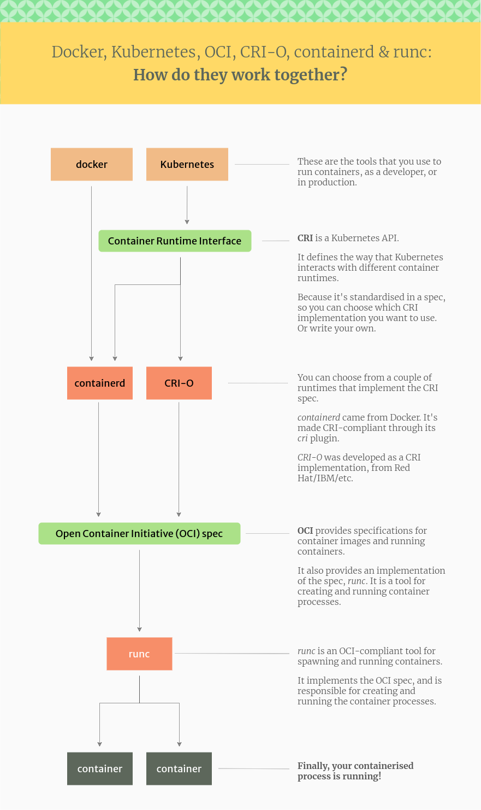

自 Docker 开启了使用容器的爆发式增长，有越来越多的工具和标准来帮助管理和使用这项容器化技术，与此同时也造成了有很多术语让人感到困惑。

比如 Docker, containerd, CRI, CRI-O, OCI, runc 等看起来杂乱无章的概念，本文就对这些概念进行简单地总结整理，了解这些概念对于 Docker 和 k8s 等容器技术能够有更加深入的了解。

<!--more-->

## 总览

容器化技术很早就出现了，但是一直处在比较混乱的状态。而Docker 公司的容器化技术是最先破局的，在生产环境有着重要且广泛的应用。虽然 Docker 在容器化技术领域无疑处在领先地位，但是这一领域实际上也有很多大公司在竞争，比如 CoreOS 的 rkt，Google 的 gVisor，微软的 WSL2 等，多方竞争也使得容器化技术的发展呈现出百花齐放的状态，好在这些公司会在一起商定一些容器化技术的行业标准，使得容器生态在不同平台之间具有较高的可移植性，作为技术人员，这些统一的标准也减轻了我们学习容器技术的负担。

容器技术在生产环境中的标准架构如下：

## Docker 架构

从 Docker 1.11 版本开始，Docker 容器运行就不是简单通过 Docker Daemon 来启动了，而是通过集成 `containerd`、`runc` 等多个组件来完成的。虽然 Docker Daemon 守护进程模块在不停的重构，但是基本功能和定位没有太大的变化，一直都是 CS 架构，守护进程负责和 Docker Client 端交互，并管理 Docker 镜像和容器。现在的架构中组件 containerd 就会负责集群节点上容器的生命周期管理，并向上为 Docker Daemon 提供 `gRPC` 接口。

>gRPC是一种高性能、开源的远程过程调用（RPC）框架，由Google开发并开源。它基于HTTP/2协议，使用Protocol Buffers作为接口定义语言（IDL），支持多种编程语言（如C++, Java, Python等），旨在简化跨网络的服务通信。

当我们要创建一个容器的时候，现在 Docker Daemon 并不能直接帮我们创建了，而是请求 `containerd` 来创建一个容器，`containerd` 收到请求后，也并不会直接去操作容器，而是创建一个叫做 `containerd-shim` 的进程，让这个进程去操作容器，我们指定容器进程是需要一个父进程来做状态收集、维持 `stdi`n 等 `fd` 打开等工作的，假如这个父进程就是 `containerd`，那如果 `containerd` 挂掉的话，整个宿主机上所有的容器都得退出了，而引入 `containerd-shim` 这个垫片就可以来规避这个问题了。

要知道容器化技术依赖于 `namespace` 和 `cgroups` 配置，还有挂在 `root` 文件系统等一系列操作，这些操作在 Docker 中都会交给 `runc` 组件，在完成这些操作后它就会退出。

所以真正启动容器是通过 `containerd-shim` 去调用 `runc` 来启动容器的，`runc` 启动完容器后本身会直接退出，`containerd-shim` 则会成为容器进程的父进程, 负责收集容器进程的状态, 上报给 `containerd`，并在容器中 `pid` 为 `1` 的进程退出后接管容器中的子进程进行清理, 确保不会出现僵尸进程。

上面提到的比较核心的几个组件是：`containerd`、`runc`。

## containerd

Docker 将容器操作都迁移到 `containerd` 中去是因为当前做 Swarm，想要进军 PaaS 市场，就将容器运行时与 Docker Daemon解耦，从 Docker Engine 中分离出来，让 Docker Daemon 专门去负责上层的封装编排。后来 Swarm 在容器编排技术竞争中不敌 Kubernetes，可以说是惨败，于是 Docker 公司就把 `containerd` 项目捐献给了 CNCF 基金会，这个也是现在的 Docker 架构。

## Container Runtime Interface (CRI)

CRI（容器运行时接口）是 Kubernetes 用来控制创建和管理容器的不同运行时的 API，它使 Kubernetes 更容易使用不同的容器运行时。它一个插件接口，这意味着任何符合该标准实现的容器运行时都可以被 Kubernetes 所使用。

早期 Docker 实在是太火了，所以 Kubernetes 最初是通过硬编码的方式直接调用 Docker API。后面随着容器技术的不断发展，在 Google 的主导下，出现了更多容器运行时，为了支持更多更精简的容器运行时，Google 就和 RedHat 主导推出了 CRI 标准，用于将 Kubernetes 平台和特定的容器运行时解耦。现在的 Kubernetes 项目已经完全移除了对 Docker 的直接支持，转而支持 CRI 标准，这样就可以支持更多的容器运行时。

从本质上讲，CRI 标准就是 k8s 定义的一套与容器运行时进行交互的接口，所以只要实现了这套接口的容器运行时都可以对接到 k8s 平台上来。最开始这套标准出来时很多运行时并不支持这套标准，因此就出现了 `CRI shim`，它相当于容器运行时的适配器，将运行时的接口适配到 k8s 的接口上，这样容器运行时就可以对接到 k8s 平台上了。

Kubelet 通过 `gRPC` 框架与容器运行时或 `shim` 进行通信，其中 kubelet 作为客户端，`CRI shim`（也可能是容器运行时本身，只要这个运行时支持 CRI 标准）作为服务器。

早期 Docker 占主宰地位时，k8s 是直接使用的实现了CRI标准的 `dockershim` 来直接支持Docker，而不与Docker运行时通信。此时的 Kubelet 就相当于一个 Docker Client，而 `dockershim` 相当于一个 Docker Server，两者通过 gRPC 进行通信，不过这些对于用户都是隐藏的。

可以看到这个结构下调用链比较长，对性能当然有所损耗。后来 k8s 就取消了 `dockershim` 来调用Docker，转而直接使用 `containerd`，由于 `containerd` 不满足 CRI 标准，所以在二者之间还加入了一层 `CRI-Containerd`。随着 k8s 的发展壮大，话语权不断提升，`containerd` 最终也支持 CRI 标准。此时的调用链就十分精简了。

## Open Container Initiative (OCI)

OCI 开放容器倡议，是一个由科技公司组成的团体，其目的是围绕容器镜像和运行时创建开放的行业标准。他们维护容器镜像格式的规范，以及容器应该如何运行。可以选择符合规范的不同运行时，这些运行时都有不同的底层实现。

前面提到，容器化技术依赖于 `namespace` 和 `cgroups` 配置，还有挂在 `root` 文件系统等一系列操作，而这一套操作已经有了标准的规范，那就是 OCI。这是个行业标准，要融入这个行业的生态的容器运行时就会实现这个规范，虽然实现的底层细节不尽相同。

这个标准其实就是一个文档，主要规定了容器镜像的结构、以及容器需要接收哪些操作指令，比如 `create`、`start`、`stop`、`delete` 等这些命令。可以想见，Docker 使用的运行时 `runc` 也满足这个标准，它可以按照这个 OCI 文档来创建一个符合规范的容器。既然是标准肯定就有其他 OCI 实现，比如 Kata、gVisor 这些容器运行时都是符合 OCI 标准的。

实际上，`runc` 最早就是 Docker 公司开发的，原名 `libcontainer`，在容器化技术竞争中，Google 等公司为了防止一家独大的局面，联合施压Docker，最终 Docker 被逼无耐，将 `libcontainer` 捐献出来改名为 `runc` 的，而且这个名字甚至看不到 Docker 公司的痕迹。

## CRI-O

Kubernetes 社区也做了一个专门用于 Kubernetes 的 CRI 运行时 CRI-O，直接兼容 CRI 和 OCI 规范，其默认的运行时就是 `runc`。

这个方案和 containerd 的方案显然比默认的 `dockershim` 简洁很多，不过在早期，由于大部分用户都比较习惯使用 Docker，所以大家还是更喜欢使用 `dockershim` 方案。

后来就是随着 k8s 的发展，其话语权不断加强，`dockershim` 最终被 k8s 官方移除了。

现在容器化技术门槛也相对降低了很多，容器运行时也有很多实现。而这些运行时只要符合 CRI 和 OCI 规范，就可以直接被 k8s 调用。而在容器编排层面，仍然是 k8s 一家独大的局面。

## 总结

至此我们就大致理清了 Docker 大致框架，以及 k8s 在容器管理环境的大致结构，对于容器化技术有了一定层次的了解，在今后的应用中也一定会发挥作用。

参考资料：

- [一文搞定 Containerd 的使用](https://cloud.tencent.com/developer/article/1868071)
- [Docker，containerd，CRI，CRI-O，OCI，runc 分不清？看这一篇就够了](https://cloud.tencent.com/developer/article/1988350)